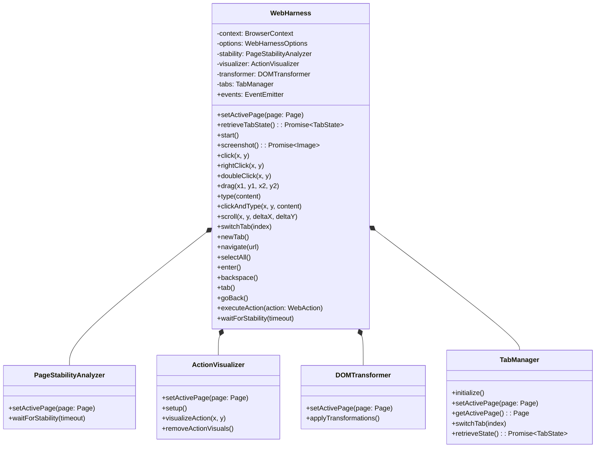
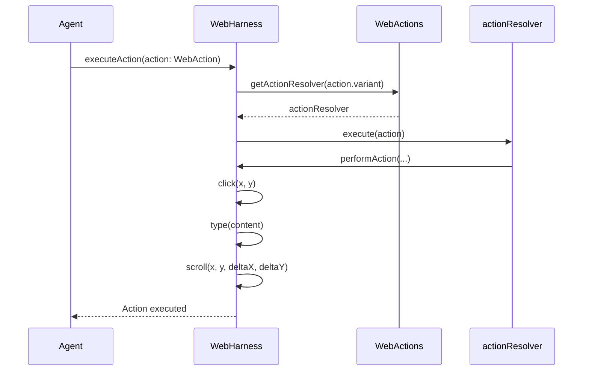
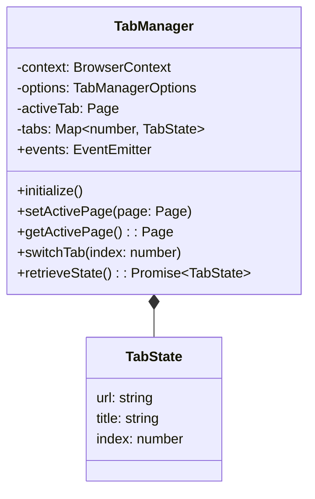

<details>
<summary>Relevant source files</summary>

The following files were used as context for generating this wiki page:

- [packages/magnitude-core/src/actions/webActions.ts](https://github.com/aanickode/magnitude/blob/main/packages/magnitude-core/src/actions/webActions.ts)
- [packages/magnitude-core/src/web/harness.ts](https://github.com/aanickode/magnitude/blob/main/packages/magnitude-core/src/web/harness.ts)
- [docs/core-concepts/browser-interaction.mdx](https://github.com/aanickode/magnitude/blob/main/docs/core-concepts/browser-interaction.mdx)
- [packages/magnitude-core/src/web/tabs.ts](https://github.com/aanickode/magnitude/blob/main/packages/magnitude-core/src/web/tabs.ts)
- [packages/magnitude-core/src/web/types.ts](https://github.com/aanickode/magnitude/blob/main/packages/magnitude-core/src/web/types.ts)

</details>

# Browser Interaction and Navigation

## Introduction

The "Browser Interaction and Navigation" module in the Magnitude project provides a comprehensive set of functionalities for interacting with web browsers and automating various tasks. It allows the agent to perform actions such as clicking, typing, scrolling, navigating between pages, and managing browser tabs. This module serves as a bridge between the agent and the web environment, enabling seamless control and manipulation of web applications.

The key components involved in this module include the `WebHarness` class, which orchestrates the execution of web actions, and the `WebActions` collection, which defines the available actions that the agent can perform. Additionally, the `TabManager` class handles the management of browser tabs, ensuring smooth transitions and efficient tab switching.

## WebHarness

The `WebHarness` class is the central component responsible for executing web actions on a browser page. It provides a unified interface for interacting with the browser, abstracting away the underlying complexities of the Playwright library used for browser automation.

### Architecture

The `WebHarness` class has the following main responsibilities:

1. **Action Execution**: It exposes methods for executing various web actions, such as clicking, typing, scrolling, and navigating. These methods are mapped to the corresponding actions defined in the `WebActions` collection.

2. **Page Stability Analysis**: The `WebHarness` incorporates a `PageStabilityAnalyzer` to ensure that actions are executed only when the page has reached a stable state, preventing potential race conditions or inconsistencies.

3. **Action Visualization**: The `WebHarness` integrates with an `ActionVisualizer` component, which provides visual feedback and highlights the areas of the page being interacted with during action execution.

4. **DOM Transformation**: The `WebHarness` includes a `DOMTransformer` component, which allows for modifying the Document Object Model (DOM) of the web page, enabling advanced manipulation and transformation capabilities.

5. **Tab Management**: The `WebHarness` collaborates with the `TabManager` to handle tab-related operations, such as switching between tabs, opening new tabs, and retrieving the current tab state.



Sources: [packages/magnitude-core/src/web/harness.ts](https://github.com/aanickode/magnitude/blob/main/packages/magnitude-core/src/web/harness.ts)

### Key Methods

The `WebHarness` class exposes the following key methods for interacting with the browser:

- `click(x, y)`: Performs a click action at the specified coordinates.
- `rightClick(x, y)`: Performs a right-click action at the specified coordinates.
- `doubleClick(x, y)`: Performs a double-click action at the specified coordinates.
- `drag(x1, y1, x2, y2)`: Performs a drag action from the starting coordinates `(x1, y1)` to the ending coordinates `(x2, y2)`.
- `type(content)`: Types the specified content into the currently focused input field.
- `clickAndType(x, y, content)`: Clicks at the specified coordinates `(x, y)` and then types the provided content.
- `scroll(x, y, deltaX, deltaY)`: Scrolls the page by the specified horizontal and vertical offsets `(deltaX, deltaY)` at the given coordinates `(x, y)`.
- `switchTab(index)`: Switches to the tab at the specified index.
- `newTab()`: Opens a new tab and navigates to a default URL (e.g., `https://google.com`).
- `navigate(url)`: Navigates to the specified URL in the current tab.
- `selectAll()`: Selects all text in the currently focused input field.
- `enter()`: Simulates pressing the Enter key.
- `backspace()`: Simulates pressing the Backspace key.
- `tab()`: Simulates pressing the Tab key.
- `goBack()`: Navigates to the previous page in the browser history.
- `executeAction(action: WebAction)`: Executes the specified `WebAction` on the current page.
- `waitForStability(timeout)`: Waits for the page to reach a stable state, ensuring that any pending actions or updates have completed before proceeding.

Sources: [packages/magnitude-core/src/web/harness.ts](https://github.com/aanickode/magnitude/blob/main/packages/magnitude-core/src/web/harness.ts)

## WebActions

The `WebActions` collection defines the set of actions that the agent can perform within the browser environment. These actions are implemented as individual functions that encapsulate the logic for executing specific tasks, such as clicking, typing, scrolling, or navigating.

### Action Types

The `WebActions` collection consists of the following action types:

1. **Coordinate-based Actions**: These actions operate on specific coordinates within the browser viewport. Examples include `clickCoordAction`, `mouseDoubleClickAction`, `mouseRightClickAction`, `scrollCoordAction`, and `mouseDragAction`.

2. **Target-based Actions**: These actions target specific elements on the page based on a provided description or identifier. Examples include `clickTargetAction` and `scrollTargetAction`.

3. **Agnostic Actions**: These actions are not tied to specific coordinates or targets and can be executed globally within the browser context. Examples include `newTabAction`, `switchTabAction`, `navigateAction`, `typeAction`, `keyboardEnterAction`, `keyboardTabAction`, `keyboardBackspaceAction`, `keyboardSelectAllAction`, and `waitAction`.

```mermaid
graph TD
    WebActions --> CoordinateActions
    WebActions --> TargetActions
    WebActions --> AgnosticActions

    CoordinateActions --> clickCoordAction
    CoordinateActions --> mouseDoubleClickAction
    CoordinateActions --> mouseRightClickAction
    CoordinateActions --> scrollCoordAction
    CoordinateActions --> mouseDragAction

    TargetActions --> clickTargetAction
    TargetActions --> scrollTargetAction

    AgnosticActions --> newTabAction
    AgnosticActions --> switchTabAction
    AgnosticActions --> navigateAction
    AgnosticActions --> typeAction
    AgnosticActions --> keyboardEnterAction
    AgnosticActions --> keyboardTabAction
    AgnosticActions --> keyboardBackspaceAction
    AgnosticActions --> keyboardSelectAllAction
    AgnosticActions --> waitAction
```



Sources: [packages/magnitude-core/src/actions/webActions.ts](https://github.com/aanickode/magnitude/blob/main/packages/magnitude-core/src/actions/webActions.ts)

### Action Execution

The `WebHarness` class provides the `executeAction` method, which takes a `WebAction` object as input and executes the corresponding action on the current page. The `WebAction` object encapsulates the action variant (e.g., click, type, scroll) and any necessary parameters required for executing the action.



Sources: [packages/magnitude-core/src/web/harness.ts](https://github.com/aanickode/magnitude/blob/main/packages/magnitude-core/src/web/harness.ts), [packages/magnitude-core/src/actions/webActions.ts](https://github.com/aanickode/magnitude/blob/main/packages/magnitude-core/src/actions/webActions.ts)

## TabManager

The `TabManager` class is responsible for managing the browser tabs within the `WebHarness`. It provides functionality for switching between tabs, opening new tabs, and retrieving the current tab state.

### Architecture

The `TabManager` class has the following main responsibilities:

1. **Tab Initialization**: It initializes the tab management system by setting up event listeners and handling the initial tab state.

2. **Tab Switching**: It allows switching to a specific tab by index or creating a new tab if necessary.

3. **Tab State Retrieval**: It provides a method to retrieve the current state of all open tabs, including their URLs and other relevant information.

4. **Tab Activity Monitoring**: Optionally, it can monitor user activity and automatically switch to the active tab when activity is detected.



Sources: [packages/magnitude-core/src/web/tabs.ts](https://github.com/aanickode/magnitude/blob/main/packages/magnitude-core/src/web/tabs.ts)

### Key Methods

The `TabManager` class exposes the following key methods for managing browser tabs:

- `initialize()`: Initializes the tab management system by setting up event listeners and handling the initial tab state.
- `setActivePage(page: Page)`: Sets the provided `Page` object as the active tab and updates the internal state accordingly.
- `getActivePage(): Page`: Returns the currently active `Page` object.
- `switchTab(index: number)`: Switches to the tab at the specified index.
- `retrieveState(): Promise<TabState>`: Retrieves the current state of all open tabs, including their URLs, titles, and indices.

Sources: [packages/magnitude-core/src/web/tabs.ts](https://github.com/aanickode/magnitude/blob/main/packages/magnitude-core/src/web/tabs.ts)

## WebAction Types

The `WebAction` interface defines the structure of web actions that can be executed by the `WebHarness`. It consists of several variants, each representing a specific type of action.

```typescript
interface WebAction {
    variant: 'click' | 'type' | 'scroll' | 'tab';
    // Additional properties specific to each variant
}

interface ClickWebAction extends WebAction {
    variant: 'click';
    x: number;
    y: number;
}

interface TypeWebAction extends WebAction {
    variant: 'type';
    x: number;
    y: number;
    content: string;
}

interface ScrollWebAction extends WebAction {
    variant: 'scroll';
    x: number;
    y: number;
    deltaX: number;
    deltaY: number;
}

interface SwitchTabWebAction extends WebAction {
    variant: 'tab';
    index: number;
}
```

Sources: [packages/magnitude-core/src/web/types.ts](https://github.com/aanickode/magnitude/blob/main/packages/magnitude-core/src/web/types.ts)

The `WebAction` interface has the following variants:

1. **Click**: Represents a click action at specific coordinates `(x, y)`.
2. **Type**: Represents a typing action at specific coordinates `(x, y)` with the provided `content`.
3. **Scroll**: Represents a scrolling action at specific coordinates `(x, y)` with the specified horizontal and vertical offsets `(deltaX, deltaY)`.
4. **Tab**: Represents a tab switching action to the tab at the specified `index`.

These variants are used by the `WebHarness` to execute the corresponding actions on the browser page.

## Conclusion

The "Browser Interaction and Navigation" module in the Magnitude project provides a comprehensive set of functionalities for interacting with web browsers and automating various tasks. It allows the agent to perform actions such as clicking, typing, scrolling, navigating between pages, and managing browser tabs. The `WebHarness` class serves as the central component for executing web actions, while the `WebActions` collection defines the available actions that the agent can perform. The `TabManager` class handles the management of browser tabs, ensuring smooth transitions and efficient tab switching. Together, these components enable seamless control and manipulation of web applications, empowering the agent to accomplish complex tasks within the browser environment.