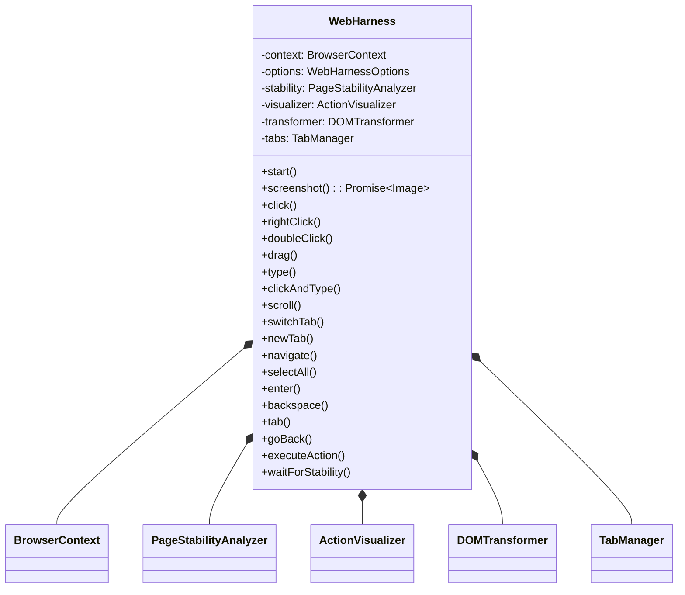
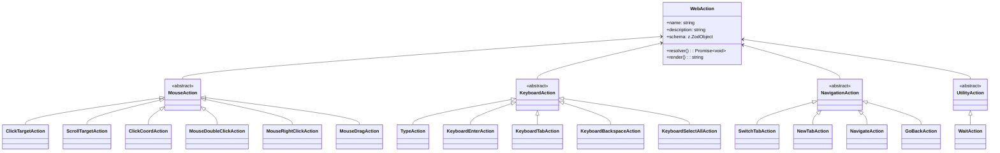
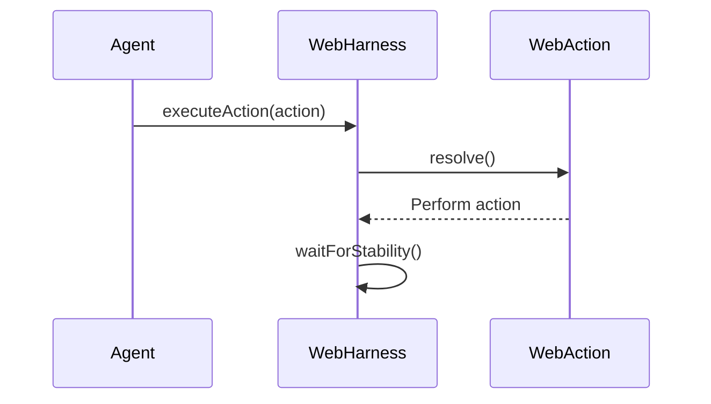
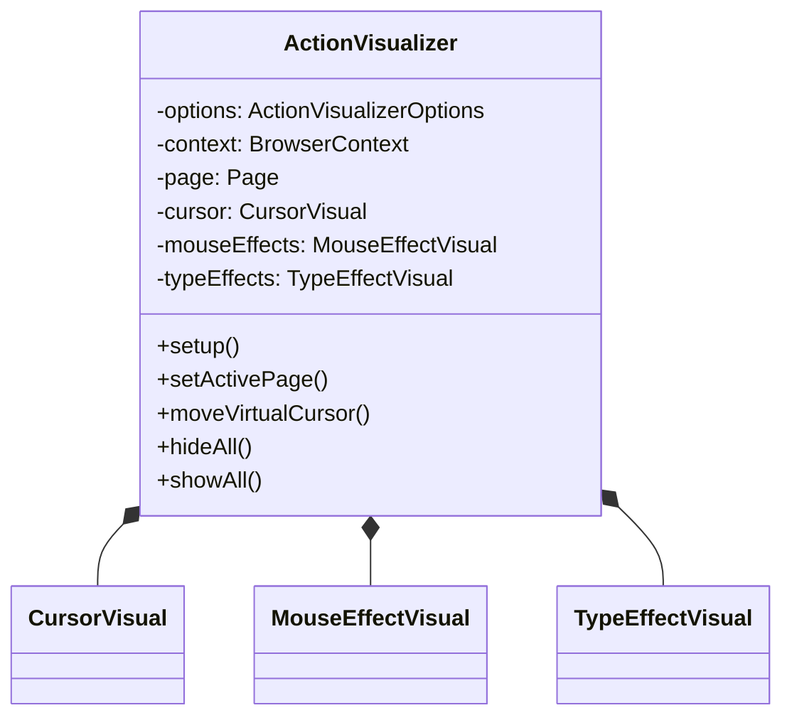
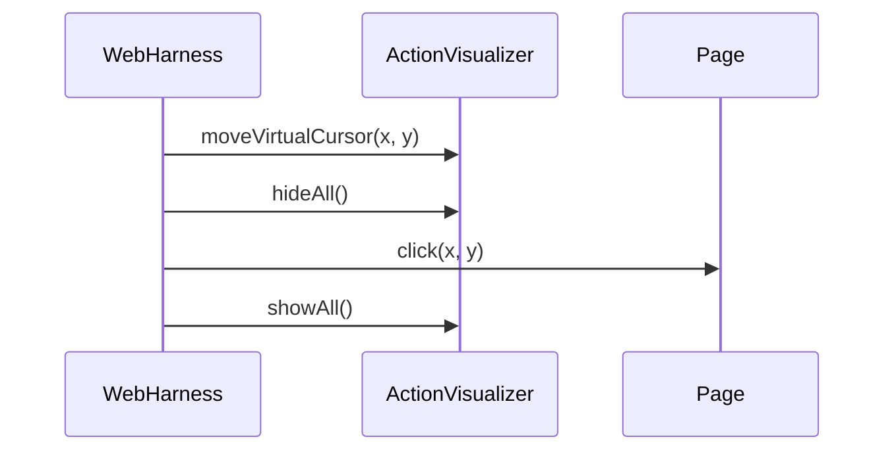
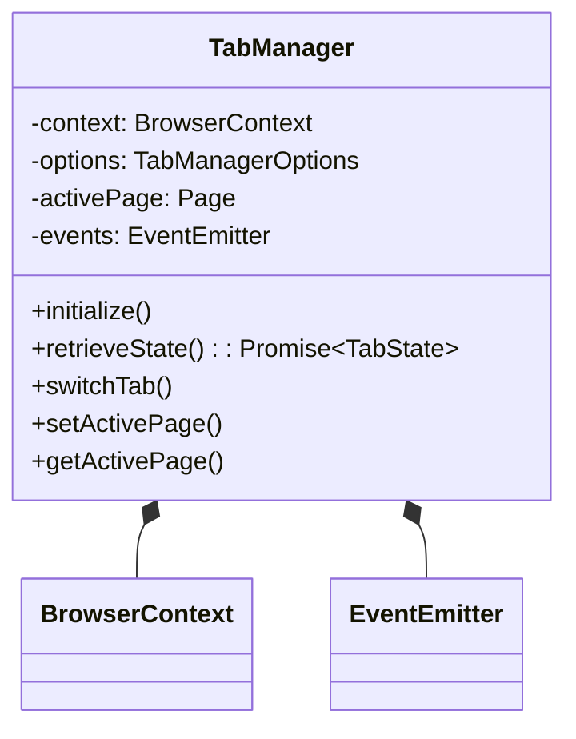
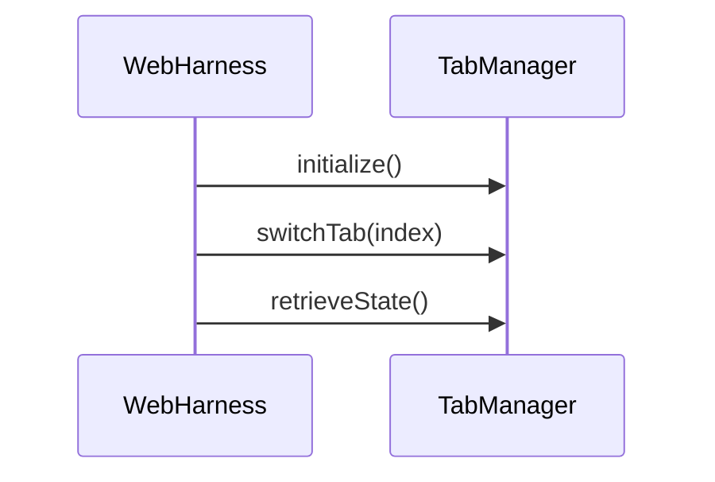
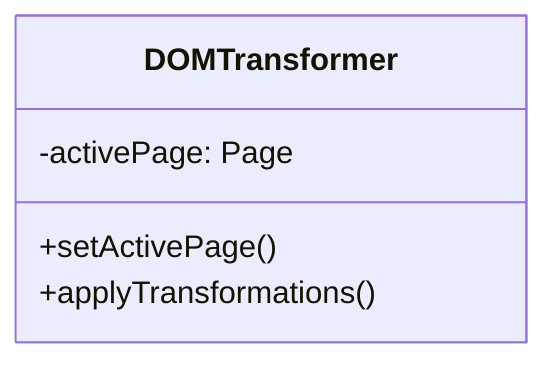
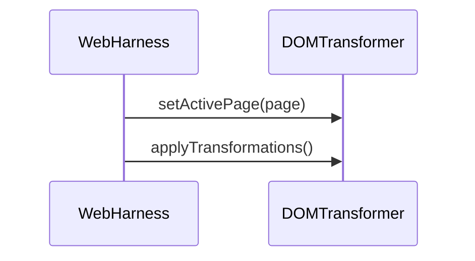

Relevant source files

The following files were used as context for generating this wiki page:

- [packages/magnitude-core/src/actions/webActions.ts](https://github.com/aanickode/magnitude/blob/main/packages/magnitude-core/src/actions/webActions.ts)
- [packages/magnitude-core/src/web/harness.ts](https://github.com/aanickode/magnitude/blob/main/packages/magnitude-core/src/web/harness.ts)
- [packages/magnitude-core/src/web/visualizer/index.ts](https://github.com/aanickode/magnitude/blob/main/packages/magnitude-core/src/web/visualizer/index.ts)
- [packages/magnitude-core/src/web/tabs.ts](https://github.com/aanickode/magnitude/blob/main/packages/magnitude-core/src/web/tabs.ts)
- [packages/magnitude-core/src/web/transformer.ts](https://github.com/aanickode/magnitude/blob/main/packages/magnitude-core/src/web/transformer.ts)

# Browser Interaction

## Introduction

The "Browser Interaction" module in the Magnitude project provides a comprehensive set of functionalities to interact with web browsers programmatically. It allows for simulating user actions such as clicking, typing, scrolling, navigating, and managing browser tabs. This module serves as a crucial component for automating web-based tasks and enabling intelligent agents to interact with web applications.

The primary components involved in browser interaction are the `WebHarness` class, which orchestrates the execution of web actions, and the `webActions` module, which defines a set of reusable actions that can be performed on a web page. Additionally, the `ActionVisualizer` class provides visual feedback and effects during the execution of web actions.

## WebHarness

The `WebHarness` class is the central component responsible for executing web actions on a browser page. It encapsulates the functionality of the Playwright browser automation library and provides a higher-level interface for interacting with web pages.

### Architecture

The `WebHarness` class has the following key components:

1. **BrowserContext**: Represents the browser context in which web pages are loaded and actions are executed.
2. **PageStabilityAnalyzer**: Monitors the stability of the web page after executing actions to ensure the page has fully loaded and rendered.
3. **ActionVisualizer**: Provides visual feedback and effects during the execution of web actions.
4. **DOMTransformer**: Responsible for applying transformations to the Document Object Model (DOM) of the web page.
5. **TabManager**: Manages the lifecycle and switching of browser tabs.

Sources: [packages/magnitude-core/src/web/harness.ts](https://github.com/aanickode/magnitude/blob/main/packages/magnitude-core/src/web/harness.ts)

### Key Methods

- `start()`: Initializes the `WebHarness` by setting up the `TabManager` and `ActionVisualizer`.
- `screenshot()`: Captures a screenshot of the current web page and returns an `Image` object.
- `click()`, `rightClick()`, `doubleClick()`, `drag()`: Simulate mouse actions on the web page.
- `type()`, `clickAndType()`: Simulate keyboard input and typing into web elements.
- `scroll()`: Scroll the web page horizontally or vertically.
- `switchTab()`, `newTab()`: Manage and switch between browser tabs.
- `navigate()`: Navigate to a specified URL.
- `selectAll()`, `enter()`, `backspace()`, `tab()`, `goBack()`: Perform various keyboard actions.
- `executeAction()`: Execute a specific `WebAction` on the web page.
- `waitForStability()`: Wait for the web page to become stable after executing an action.

Sources: [packages/magnitude-core/src/web/harness.ts](https://github.com/aanickode/magnitude/blob/main/packages/magnitude-core/src/web/harness.ts)

## WebActions

The `webActions` module defines a set of reusable actions that can be performed on a web page. These actions are implemented as functions that encapsulate the logic for executing specific interactions with the browser.

### Action Types

The `webActions` module provides the following types of actions:

1. **Mouse Actions**: `clickTargetAction`, `scrollTargetAction`, `clickCoordAction`, `mouseDoubleClickAction`, `mouseRightClickAction`, `mouseDragAction`
2. **Keyboard Actions**: `typeAction`, `keyboardEnterAction`, `keyboardTabAction`, `keyboardBackspaceAction`, `keyboardSelectAllAction`
3. **Browser Navigation Actions**: `switchTabAction`, `newTabAction`, `navigateAction`, `goBackAction`
4. **Utility Actions**: `waitAction`

Each action is defined using the `createAction` function, which specifies the action's name, description, input schema, resolver function, and optional rendering function.

Sources: [packages/magnitude-core/src/actions/webActions.ts](https://github.com/aanickode/magnitude/blob/main/packages/magnitude-core/src/actions/webActions.ts)

### Action Execution

The `WebHarness` class provides the `executeAction` method, which takes a `WebAction` object and executes its corresponding resolver function. This method handles the different action variants (e.g., click, type, scroll, tab) and invokes the appropriate method on the `WebHarness` instance.

Sources: [packages/magnitude-core/src/web/harness.ts](https://github.com/aanickode/magnitude/blob/main/packages/magnitude-core/src/web/harness.ts)

## ActionVisualizer

The `ActionVisualizer` class provides visual feedback and effects during the execution of web actions. It consists of three main components:

1. **CursorVisual**: Renders a virtual cursor on the web page.
2. **MouseEffectVisual**: Displays visual effects for mouse actions, such as hover circles, click ripples, and drag lines.
3. **TypeEffectVisual**: Provides visual effects for typing actions.

Sources: [packages/magnitude-core/src/web/visualizer/index.ts](https://github.com/aanickode/magnitude/blob/main/packages/magnitude-core/src/web/visualizer/index.ts)

The `ActionVisualizer` is used by the `WebHarness` to provide visual feedback during the execution of web actions. For example, when the `click` method is called, the `WebHarness` moves the virtual cursor to the click location and displays a click ripple effect using the `ActionVisualizer`.

Sources: [packages/magnitude-core/src/web/harness.ts](https://github.com/aanickode/magnitude/blob/main/packages/magnitude-core/src/web/harness.ts)

## TabManager

The `TabManager` class is responsible for managing the lifecycle and switching of browser tabs. It provides methods for retrieving the current tab state, switching to a specific tab index, and initializing the tab manager.

Sources: [packages/magnitude-core/src/web/tabs.ts](https://github.com/aanickode/magnitude/blob/main/packages/magnitude-core/src/web/tabs.ts)

The `TabManager` is used by the `WebHarness` to manage tab-related operations, such as switching tabs and retrieving the current tab state.

Sources: [packages/magnitude-core/src/web/harness.ts](https://github.com/aanickode/magnitude/blob/main/packages/magnitude-core/src/web/harness.ts)

## DOMTransformer

The `DOMTransformer` class is responsible for applying transformations to the Document Object Model (DOM) of the web page. It provides a mechanism to modify the structure and content of the web page programmatically.

Sources: [packages/magnitude-core/src/web/transformer.ts](https://github.com/aanickode/magnitude/blob/main/packages/magnitude-core/src/web/transformer.ts)

The `DOMTransformer` is used by the `WebHarness` to apply transformations to the web page after executing certain actions or based on specific conditions.

Sources: [packages/magnitude-core/src/web/harness.ts](https://github.com/aanickode/magnitude/blob/main/packages/magnitude-core/src/web/harness.ts)

## Conclusion

The "Browser Interaction" module in the Magnitude project provides a comprehensive set of tools and functionalities for interacting with web browsers programmatically. The `WebHarness` class serves as the central component, orchestrating the execution of web actions and managing the browser context, tab lifecycle, and visual feedback. The `webActions` module defines a set of reusable actions that can be performed on web pages, while the `ActionVisualizer` provides visual effects and feedback during action execution. Additionally, the `TabManager` and `DOMTransformer` classes handle tab management and DOM transformations, respectively.

By leveraging these components, the Magnitude project can automate web-based tasks, simulate user interactions, and enable intelligent agents to interact with web applications effectively.