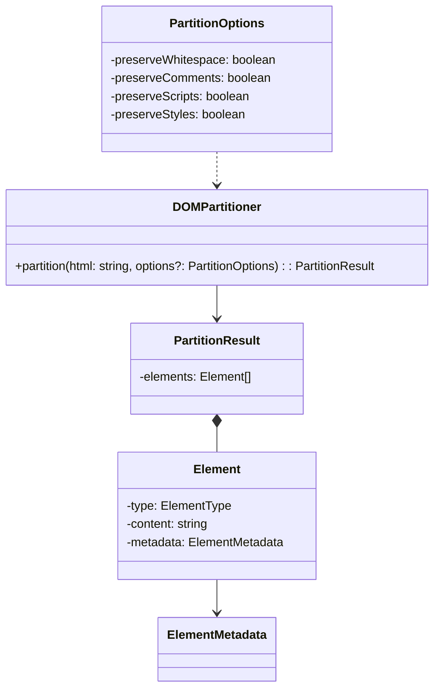
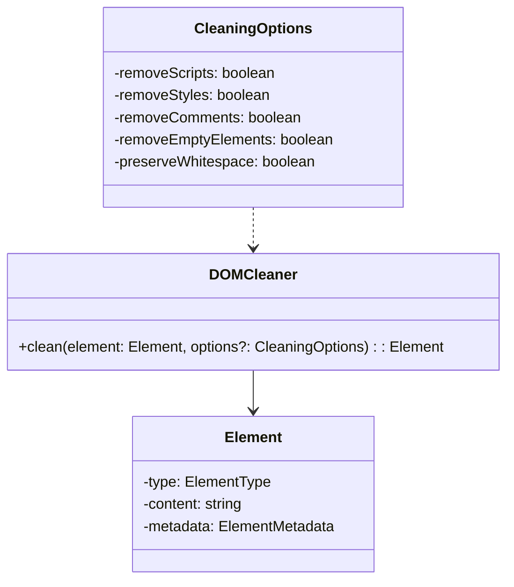
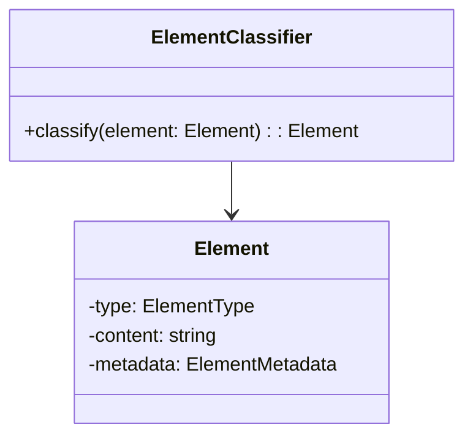
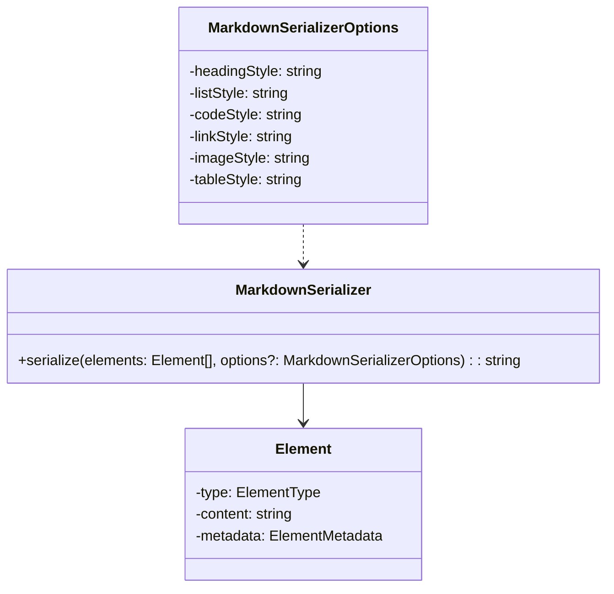
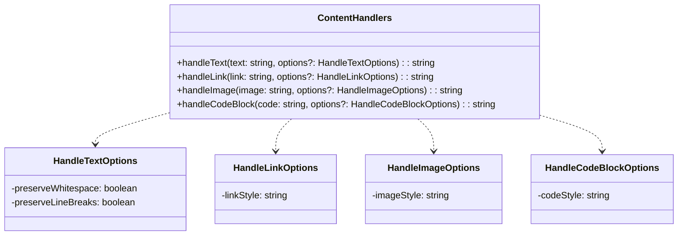

<details>
<summary>Relevant source files</summary>

The following files were used as context for generating this wiki page:

- [packages/magnitude-core/src/actions/webActions.ts](https://github.com/aanickode/magnitude/blob/main/packages/magnitude-core/src/actions/webActions.ts)
- [packages/magnitude-extract/src/index.ts](https://github.com/aanickode/magnitude/blob/main/packages/magnitude-extract/src/index.ts)
- [packages/magnitude-extract/src/partitioner.ts](https://github.com/aanickode/magnitude/blob/main/packages/magnitude-extract/src/partitioner.ts)
- [packages/magnitude-extract/src/cleaner.ts](https://github.com/aanickode/magnitude/blob/main/packages/magnitude-extract/src/cleaner.ts)
- [packages/magnitude-extract/src/classifier.ts](https://github.com/aanickode/magnitude/blob/main/packages/magnitude-extract/src/classifier.ts)
</details>

# Data Extraction

## Introduction

The Data Extraction feature in this project provides functionality for extracting structured data from unstructured HTML content. It involves partitioning the HTML into logical sections, cleaning the content, classifying elements, and serializing the data into a structured format like Markdown.

This feature is likely used in conjunction with other components, such as a web browser connector, to extract and process data from web pages or other HTML sources.

Sources: [packages/magnitude-extract/src/index.ts]()

## HTML Partitioning

The `DOMPartitioner` class is responsible for partitioning the HTML content into logical sections or elements. It analyzes the structure of the HTML and identifies different types of elements, such as headings, paragraphs, lists, tables, and images.



The `partition` method takes the HTML content and an optional `PartitionOptions` object, which allows configuring how the partitioning process handles whitespace, comments, scripts, and styles.

Sources: [packages/magnitude-extract/src/index.ts](), [packages/magnitude-extract/src/partitioner.ts](), [packages/magnitude-extract/src/types.ts]()

## Content Cleaning

The `DOMCleaner` class is responsible for cleaning the content of the partitioned elements. It removes unwanted elements, such as scripts, styles, and comments, and performs additional cleaning operations based on the provided options.



The `clean` method takes an `Element` object and an optional `CleaningOptions` object, which allows configuring the cleaning behavior, such as removing scripts, styles, comments, empty elements, and preserving whitespace.

Sources: [packages/magnitude-extract/src/cleaner.ts](), [packages/magnitude-extract/src/types.ts]()

## Element Classification

The `ElementClassifier` class is responsible for classifying the partitioned and cleaned elements based on their content and structure. It identifies different types of elements, such as headings, paragraphs, lists, tables, and images.



The `classify` method takes an `Element` object and updates its `type` property based on the element's content and structure.

Sources: [packages/magnitude-extract/src/classifier.ts](), [packages/magnitude-extract/src/types.ts]()

## Markdown Serialization

The `MarkdownSerializer` class is responsible for serializing the partitioned, cleaned, and classified elements into Markdown format.



The `serialize` method takes an array of `Element` objects and an optional `MarkdownSerializerOptions` object, which allows configuring the styling of different element types in the generated Markdown.

Sources: [packages/magnitude-extract/src/markdown-serializer.ts](), [packages/magnitude-extract/src/types.ts]()

## Content Handlers

The `ContentHandlers` module provides utility functions for handling different types of content, such as text, links, images, and code blocks.



These functions are likely used by the `MarkdownSerializer` to handle different types of content when generating the Markdown output.

Sources: [packages/magnitude-extract/src/content-handlers.ts]()

## Usage

The Data Extraction feature can be used by importing the necessary modules and classes from the `magnitude-extract` package. Here's an example of how it might be used:

```typescript
import { partitionHtml, DOMCleaner, ElementClassifier, MarkdownSerializer } from 'magnitude-extract';

const html = '<!-- HTML content -->';
const partitionResult = partitionHtml(html);

const cleaner = new DOMCleaner();
const classifier = new ElementClassifier();
const serializer = new MarkdownSerializer();

const cleanedElements = partitionResult.elements.map(element => cleaner.clean(element));
const classifiedElements = cleanedElements.map(element => classifier.classify(element));
const markdown = serializer.serialize(classifiedElements);

console.log(markdown);
```

In this example, the HTML content is first partitioned using the `partitionHtml` function. Then, instances of `DOMCleaner`, `ElementClassifier`, and `MarkdownSerializer` are created. The partitioned elements are cleaned, classified, and finally serialized into Markdown format.

Sources: [packages/magnitude-extract/src/index.ts]()

## Conclusion

The Data Extraction feature provides a comprehensive set of tools for extracting structured data from unstructured HTML content. It involves partitioning the HTML, cleaning the content, classifying elements, and serializing the data into a structured format like Markdown. This feature can be integrated with other components, such as a web browser connector, to extract and process data from web pages or other HTML sources.