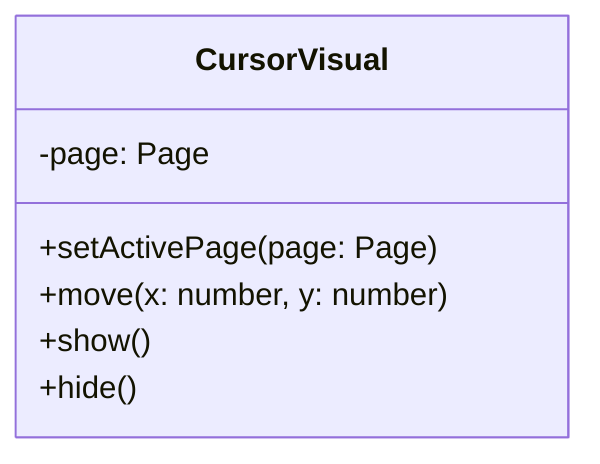
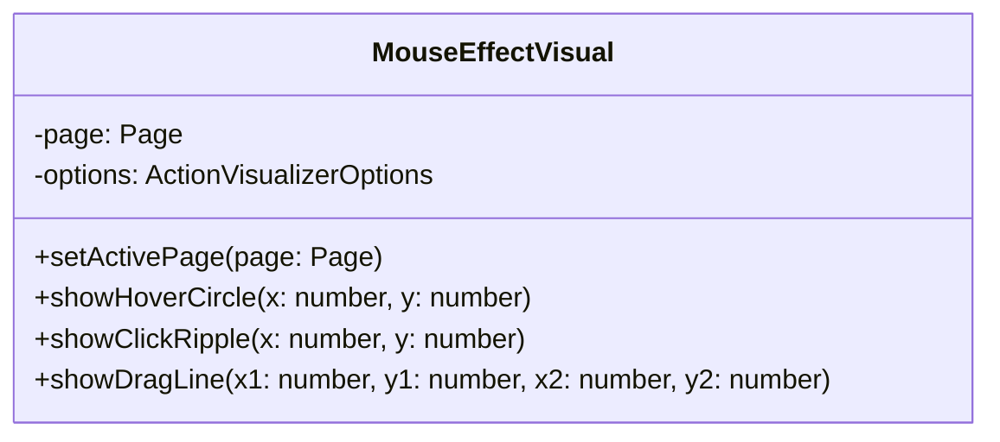
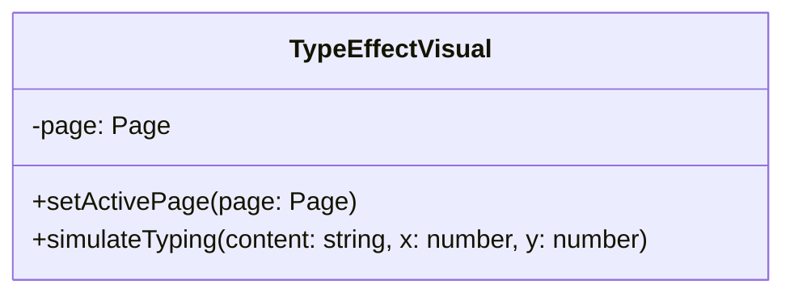
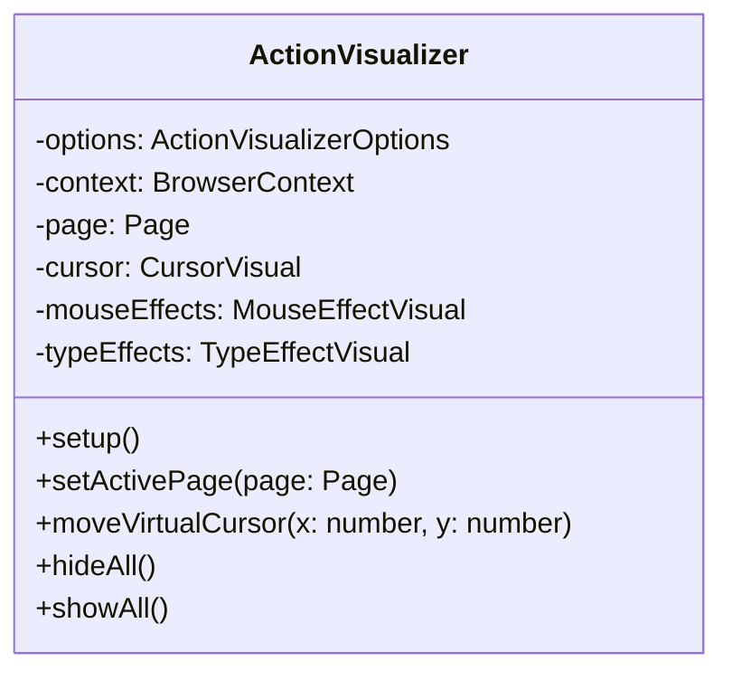

Relevant source files

The following files were used as context for generating this wiki page:

- [packages/magnitude-core/src/actions/webActions.ts](https://github.com/aanickode/magnitude/blob/main/packages/magnitude-core/src/actions/webActions.ts)
- [packages/magnitude-core/src/web/visualizer/index.ts](https://github.com/aanickode/magnitude/blob/main/packages/magnitude-core/src/web/visualizer/index.ts)
- [packages/magnitude-core/src/web/visualizer/cursor.ts](https://github.com/aanickode/magnitude/blob/main/packages/magnitude-core/src/web/visualizer/cursor.ts)
- [packages/magnitude-core/src/web/visualizer/mouseEffects.ts](https://github.com/aanickode/magnitude/blob/main/packages/magnitude-core/src/web/visualizer/mouseEffects.ts)
- [packages/magnitude-core/src/web/visualizer/typeEffects.ts](https://github.com/aanickode/magnitude/blob/main/packages/magnitude-core/src/web/visualizer/typeEffects.ts)

# Navigation and Interaction

## Introduction

The "Navigation and Interaction" module in the Magnitude project provides a set of actions and utilities for interacting with web browsers and simulating user interactions such as mouse movements, clicks, scrolling, typing, and navigation. It also includes a visualizer component that renders visual effects to enhance the user experience during these interactions.

The primary components involved in this module are:

- `webActions.ts`: Defines a collection of actions for various browser interactions, including clicking, scrolling, typing, and navigation.
- `ActionVisualizer`: A class responsible for rendering visual effects during user interactions, such as cursor movements, mouse effects (hover circles, click ripples, drag lines), and typing effects.

Sources: [packages/magnitude-core/src/actions/webActions.ts](), [packages/magnitude-core/src/web/visualizer/index.ts]()

## Web Actions

The `webActions.ts` file defines several action creators using the `createAction` utility. These actions encapsulate different types of browser interactions and are categorized into three groups:

1. **Coordinate-based Actions**: Actions that operate on specific screen coordinates, such as `clickCoordAction`, `mouseDoubleClickAction`, `mouseRightClickAction`, `scrollCoordAction`, and `mouseDragAction`.
2. **Target-based Actions**: Actions that interact with specific targets on the screen, identified by a string description, such as `clickTargetAction` and `scrollTargetAction`.
3. **Agnostic Actions**: Actions that are not tied to specific coordinates or targets, such as `newTabAction`, `switchTabAction`, `navigateAction`, `typeAction`, and various keyboard actions like `keyboardEnterAction`, `keyboardTabAction`, and `keyboardBackspaceAction`.

Each action is defined with a name, description, schema (input parameters), and a resolver function that performs the actual interaction with the browser. The resolver functions typically require an instance of the `BrowserConnector` and a `BrowserHarness` to execute the desired actions.

Sources: [packages/magnitude-core/src/actions/webActions.ts]()

## Action Visualizer

The `ActionVisualizer` class is responsible for rendering visual effects during user interactions with the browser. It consists of the following components:

### 1. CursorVisual

The `CursorVisual` class handles the rendering and animation of the virtual cursor on the browser page.

Sources: [packages/magnitude-core/src/web/visualizer/cursor.ts]()

### 2. MouseEffectVisual

The `MouseEffectVisual` class renders visual effects related to mouse interactions, such as hover circles, click ripples, and drag lines.

Sources: [packages/magnitude-core/src/web/visualizer/mouseEffects.ts]()

### 3. TypeEffectVisual

The `TypeEffectVisual` class renders visual effects related to typing interactions, such as simulating the typing of characters on the page.

Sources: [packages/magnitude-core/src/web/visualizer/typeEffects.ts]()

The `ActionVisualizer` class orchestrates these components and provides methods to set up the visualizer, move the virtual cursor, show/hide visual effects, and manage the active browser page.

Sources: [packages/magnitude-core/src/web/visualizer/index.ts]()

## Conclusion

The "Navigation and Interaction" module in the Magnitude project provides a comprehensive set of actions and utilities for simulating user interactions with web browsers. It includes actions for clicking, scrolling, typing, and navigation, as well as a visualizer component that enhances the user experience by rendering visual effects during these interactions. The module is designed to be extensible and configurable, allowing developers to customize the behavior and appearance of the interactions as needed.