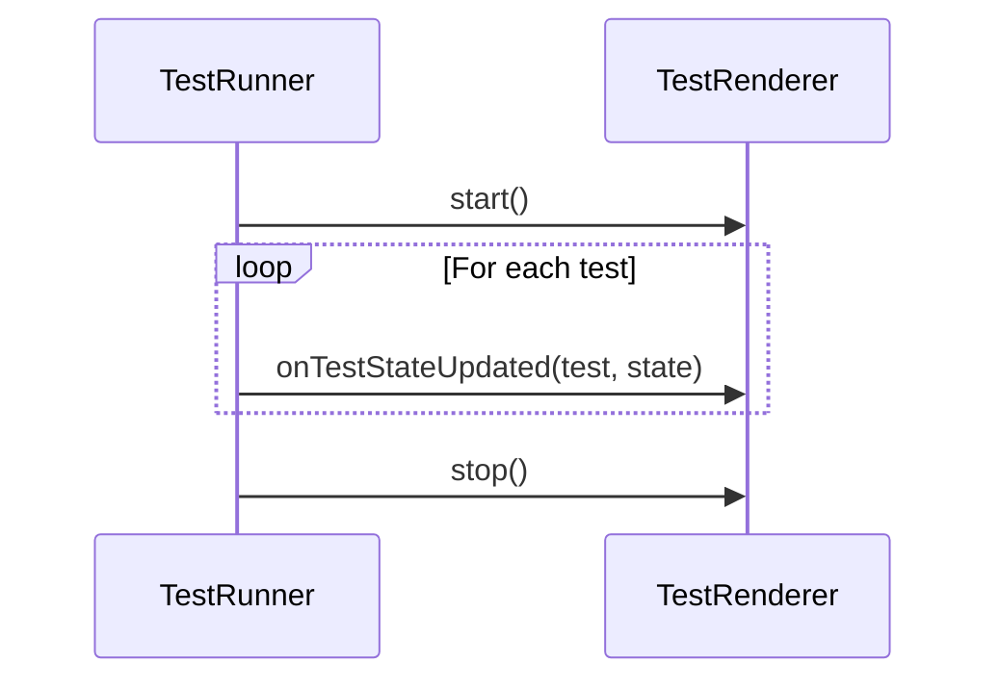

<details>
<summary>Relevant source files</summary>

The following files were used as context for generating this wiki page:

- [packages/magnitude-core/src/actions/webActions.ts](https://github.com/aanickode/magnitude/blob/main/packages/magnitude-core/src/actions/webActions.ts)
- [packages/magnitude-test/src/renderer/index.ts](https://github.com/aanickode/magnitude/blob/main/packages/magnitude-test/src/renderer/index.ts)
</details>

# Visual Verification

## Introduction

Visual Verification is a critical component of the Magnitude project, responsible for rendering and updating the visual state of tests during execution. It provides a visual representation of the test progress, allowing developers to monitor and understand the test execution flow. This feature is implemented through the `TestRenderer` interface, which defines the contract for rendering test states.

Sources: [packages/magnitude-test/src/renderer/index.ts](https://github.com/aanickode/magnitude/blob/main/packages/magnitude-test/src/renderer/index.ts)

## TestRenderer Interface

The `TestRenderer` interface defines the contract for rendering test states in the Magnitude project. It consists of the following methods:

### start()

This optional method is called when the test renderer starts.

```typescript
start?(): void
```

Sources: [packages/magnitude-test/src/renderer/index.ts:4](https://github.com/aanickode/magnitude/blob/main/packages/magnitude-test/src/renderer/index.ts#L4)

### stop()

This optional method is called when the test renderer stops.

```typescript
stop?(): void
```

Sources: [packages/magnitude-test/src/renderer/index.ts:5](https://github.com/aanickode/magnitude/blob/main/packages/magnitude-test/src/renderer/index.ts#L5)

### onTestStateUpdated(test, state)

This method is called whenever the state of a test is updated during execution. It receives two parameters:

- `test`: An instance of `RegisteredTest`, representing the test whose state has changed.
- `state`: An instance of `TestState`, representing the new state of the test.

```typescript
onTestStateUpdated(test: RegisteredTest, state: TestState): void
```

The `onTestStateUpdated` method is responsible for rendering the updated test state visually, allowing developers to monitor the test execution progress.

Sources: [packages/magnitude-test/src/renderer/index.ts:6-7](https://github.com/aanickode/magnitude/blob/main/packages/magnitude-test/src/renderer/index.ts#L6-L7)

## Sequence Diagram

The following sequence diagram illustrates the interaction between the test runner and the `TestRenderer` interface during test execution:



The `TestRunner` initiates the rendering process by calling the `start()` method on the `TestRenderer`. Then, for each test being executed, the `TestRunner` calls the `onTestStateUpdated` method, passing the test instance and its current state. Finally, after all tests have been executed, the `TestRunner` calls the `stop()` method to signal the end of the rendering process.

Sources: [packages/magnitude-test/src/renderer/index.ts](https://github.com/aanickode/magnitude/blob/main/packages/magnitude-test/src/renderer/index.ts)

## Summary

The Visual Verification feature in the Magnitude project is implemented through the `TestRenderer` interface, which defines the contract for rendering test states during execution. This interface provides methods for starting and stopping the rendering process, as well as a method for updating the visual representation of a test's state. By implementing this interface, developers can create custom renderers to visualize test execution progress in various ways, such as in a terminal, web UI, or other visual environments.