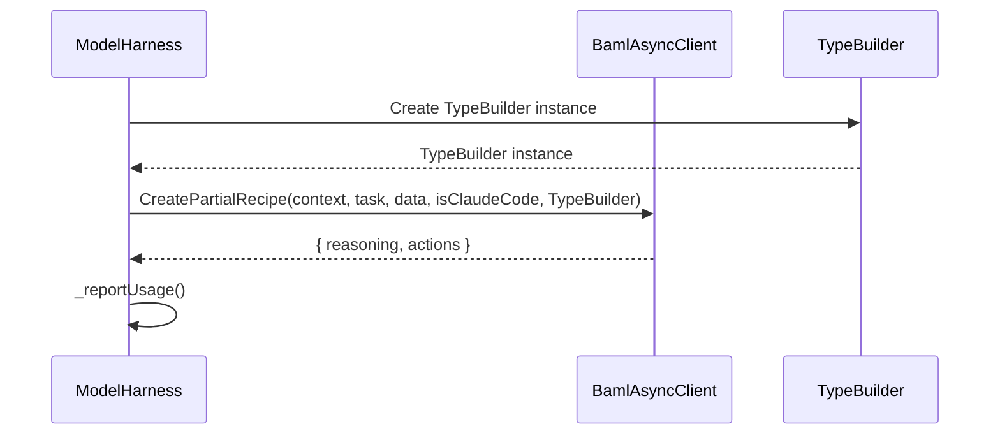
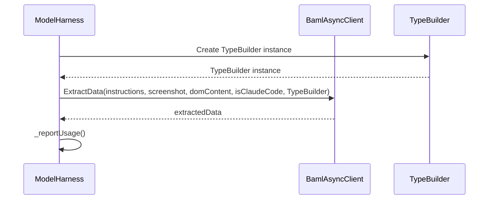
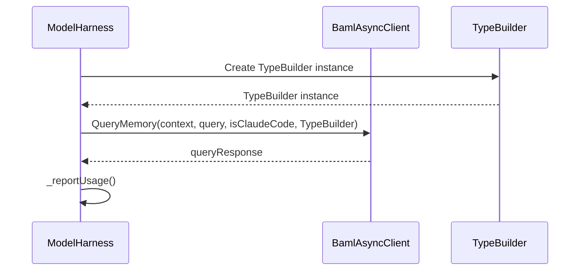
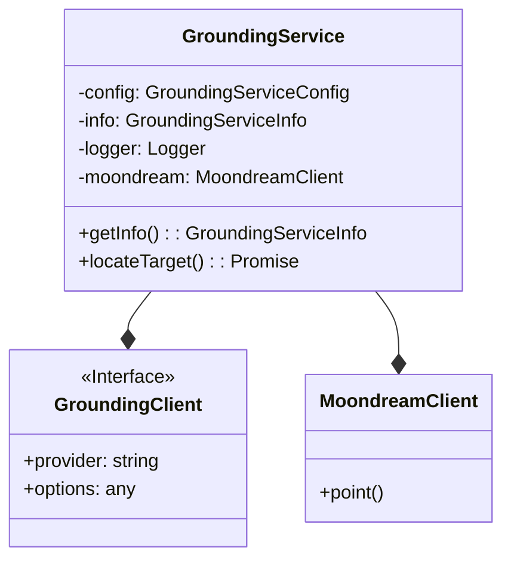
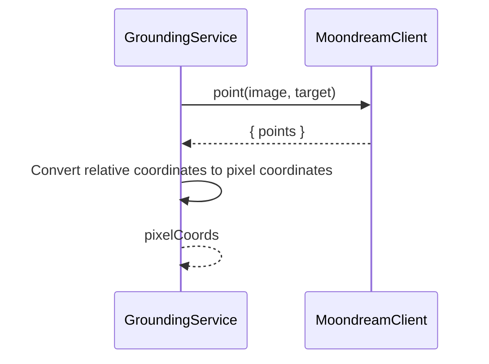

<details>
<summary>Relevant source files</summary>

The following files were used as context for generating this wiki page:

- [packages/magnitude-core/src/ai/modelHarness.ts](https://github.com/aanickode/magnitude/blob/main/packages/magnitude-core/src/ai/modelHarness.ts)
- [packages/magnitude-core/src/ai/grounding.ts](https://github.com/aanickode/magnitude/blob/main/packages/magnitude-core/src/ai/grounding.ts)
- [packages/magnitude-core/src/ai/baml_client/async_client.ts](https://github.com/aanickode/magnitude/blob/main/packages/magnitude-core/src/ai/baml_client/async_client.ts)
- [packages/magnitude-core/src/ai/baml_client/type_builder.ts](https://github.com/aanickode/magnitude/blob/main/packages/magnitude-core/src/ai/baml_client/type_builder.ts)
- [packages/magnitude-core/src/ai/baml_client/index.ts](https://github.com/aanickode/magnitude/blob/main/packages/magnitude-core/src/ai/baml_client/index.ts)
</details>

# AI Model Integration

## Introduction

The "AI Model Integration" module in the Magnitude project is responsible for integrating and managing large language models (LLMs) and computer vision models for various tasks such as generating partial recipes, extracting data, querying memory, and locating targets on web pages. It serves as a high-level interface for interacting with these AI models, abstracting away the complexities of model providers, configurations, and usage tracking.

This module consists of two main components: `ModelHarness` and `GroundingService`. The `ModelHarness` class handles the integration and utilization of LLMs, while the `GroundingService` class focuses on computer vision tasks, specifically locating targets on web pages using the Moondream vision model.

Sources: [modelHarness.ts](https://github.com/aanickode/magnitude/blob/main/packages/magnitude-core/src/ai/modelHarness.ts), [grounding.ts](https://github.com/aanickode/magnitude/blob/main/packages/magnitude-core/src/ai/grounding.ts)

## ModelHarness

The `ModelHarness` class is responsible for managing the integration and usage of large language models (LLMs) from various providers. It provides a unified interface for interacting with these models, abstracting away the complexities of different providers and configurations.

### Architecture

The `ModelHarness` class follows a modular design, allowing for easy integration of different LLM providers and configurations. The core components of the `ModelHarness` architecture are:

1. **LLMClient**: An abstraction representing the LLM provider and its configuration options.
2. **ClientRegistry**: A registry that manages and stores the available LLM clients.
3. **BamlAsyncClient**: A client that interacts with the Boundary AI Modeling Language (BAML) library, which provides a unified interface for working with LLMs.
4. **TypeBuilder**: A utility class for defining and converting data types between BAML and the application's type system.

```mermaid
classDiagram
    class ModelHarness {
        -options: ModelHarnessOptions
        -collector: Collector
        -cr: ClientRegistry
        -baml: BamlAsyncClient
        -logger: Logger
        +setup()
        +describeModel(): string
        +partialAct(): Promise<{reasoning: string, actions: Action[]}>
        +extract(): Promise<T>
        +query(): Promise<T>
    }
    class LLMClient {
        <<Interface>>
        +provider: string
        +options: any
    }
    class ClientRegistry {
        +addLlmClient()
        +setPrimary()
    }
    class BamlAsyncClient {
        +CreatePartialRecipe()
        +ExtractData()
        +QueryMemory()
    }
    class TypeBuilder {
        +addProperty()
        +convertActionDefinitionsToBaml()
        +convertZodToBaml()
    }
    ModelHarness --* LLMClient
    ModelHarness --* ClientRegistry
    ModelHarness --* BamlAsyncClient
    ModelHarness --* TypeBuilder
```

Sources: [modelHarness.ts](https://github.com/aanickode/magnitude/blob/main/packages/magnitude-core/src/ai/modelHarness.ts), [async_client.ts](https://github.com/aanickode/magnitude/blob/main/packages/magnitude-core/src/ai/baml_client/async_client.ts), [type_builder.ts](https://github.com/aanickode/magnitude/blob/main/packages/magnitude-core/src/ai/baml_client/type_builder.ts)

### Key Methods

#### `setup()`

This method initializes the `ModelHarness` by setting up the necessary components, such as the `Collector`, `ClientRegistry`, and `BamlAsyncClient`. It also adds the configured LLM client to the registry and sets it as the primary client.

#### `partialAct()`

This method generates a partial recipe (a set of actions) for a given task, context, and data using the configured LLM. It utilizes the `BamlAsyncClient` to interact with the BAML library and generate the partial recipe.



Sources: [modelHarness.ts:120-143](https://github.com/aanickode/magnitude/blob/main/packages/magnitude-core/src/ai/modelHarness.ts#L120-L143)

#### `extract()`

This method extracts data from a given set of instructions, a screenshot, and DOM content using the configured LLM. It utilizes the `BamlAsyncClient` to interact with the BAML library and extract the data according to the provided schema.



Sources: [modelHarness.ts:146-173](https://github.com/aanickode/magnitude/blob/main/packages/magnitude-core/src/ai/modelHarness.ts#L146-L173)

#### `query()`

This method queries the memory context using the configured LLM and a provided schema. It utilizes the `BamlAsyncClient` to interact with the BAML library and retrieve the query response according to the provided schema.



Sources: [modelHarness.ts:176-194](https://github.com/aanickode/magnitude/blob/main/packages/magnitude-core/src/ai/modelHarness.ts#L176-L194)

### Usage Tracking

The `ModelHarness` class tracks the usage of the LLM, including input and output tokens, cache usage, and cost (if available). This information is emitted through the `tokensUsed` event, which can be subscribed to for monitoring or logging purposes.

Sources: [modelHarness.ts:48-102](https://github.com/aanickode/magnitude/blob/main/packages/magnitude-core/src/ai/modelHarness.ts#L48-L102)

## GroundingService

The `GroundingService` class is responsible for integrating and utilizing computer vision models, specifically the Moondream vision model, for locating targets on web pages.

### Architecture

The `GroundingService` class follows a simple architecture, with the main components being:

1. **GroundingClient**: An abstraction representing the computer vision model provider and its configuration options.
2. **MoondreamClient**: A client that interacts with the Moondream vision model API.



Sources: [grounding.ts](https://github.com/aanickode/magnitude/blob/main/packages/magnitude-core/src/ai/grounding.ts)

### Key Method

#### `locateTarget()`

This method takes a screenshot and a target description as input, and returns the pixel coordinates of the target on the screenshot using the Moondream vision model.



Sources: [grounding.ts:53-94](https://github.com/aanickode/magnitude/blob/main/packages/magnitude-core/src/ai/grounding.ts#L53-L94)

### Usage Tracking

The `GroundingService` class tracks the number of calls made to the Moondream vision model, which can be retrieved using the `getInfo()` method.

Sources: [grounding.ts:35-37](https://github.com/aanickode/magnitude/blob/main/packages/magnitude-core/src/ai/grounding.ts#L35-L37)

## Conclusion

The "AI Model Integration" module in the Magnitude project provides a unified interface for integrating and utilizing large language models and computer vision models from various providers. It abstracts away the complexities of different providers and configurations, allowing for easy integration and usage tracking. The `ModelHarness` class handles the integration and usage of LLMs, while the `GroundingService` class focuses on computer vision tasks, specifically locating targets on web pages using the Moondream vision model.

Sources: [modelHarness.ts](https://github.com/aanickode/magnitude/blob/main/packages/magnitude-core/src/ai/modelHarness.ts), [grounding.ts](https://github.com/aanickode/magnitude/blob/main/packages/magnitude-core/src/ai/grounding.ts)