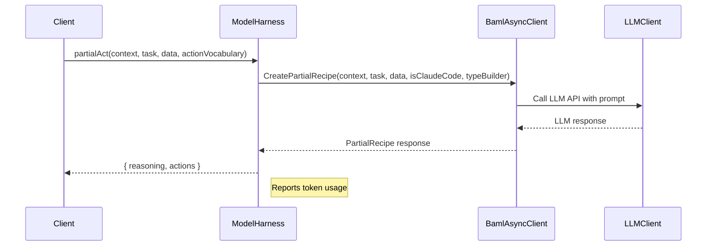
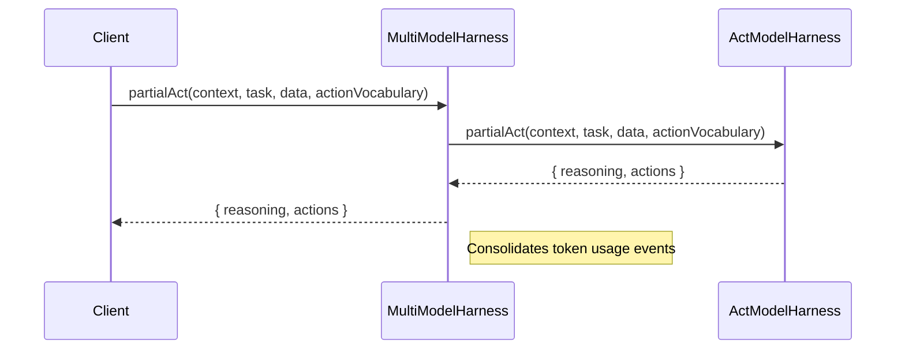

<details>
<summary>Relevant source files</summary>

The following files were used as context for generating this wiki page:

- [packages/magnitude-core/src/ai/modelHarness.ts](https://github.com/aanickode/magnitude/blob/main/packages/magnitude-core/src/ai/modelHarness.ts)
- [packages/magnitude-core/src/ai/multiModelHarness.ts](https://github.com/aanickode/magnitude/blob/main/packages/magnitude-core/src/ai/multiModelHarness.ts)
- [docs/core-concepts/compatible-llms.mdx](https://github.com/aanickode/magnitude/blob/main/docs/core-concepts/compatible-llms.mdx)

</details>

# AI Model Integration

## Introduction

AI Model Integration is a crucial aspect of the Magnitude project, enabling the seamless integration of large language models (LLMs) for various tasks such as instruction following, planning, and visual grounding. This feature allows Magnitude to leverage the capabilities of state-of-the-art LLMs to automate and test web applications effectively.

The core components responsible for AI Model Integration are the `ModelHarness` and `MultiModelHarness` classes, which provide a unified interface for interacting with different LLM providers and models. These classes handle tasks such as partial action planning, data extraction, memory querying, and failure diagnosis.

## Model Harness

The `ModelHarness` class serves as a wrapper around a single LLM client, providing methods for various AI-related tasks within the Magnitude project. It is responsible for setting up the LLM client, managing token usage tracking, and exposing methods for tasks like partial action planning, data extraction, and memory querying.

### Architecture

The `ModelHarness` class follows a straightforward architecture, consisting of the following key components:

1. **LLM Client**: The `ModelHarness` encapsulates a single LLM client, which can be configured with different providers and models. The LLM client is responsible for communicating with the LLM API and handling the actual inference tasks.

2. **BAML Integration**: Magnitude utilizes the Boundary AI Modeling Language (BAML) to define and execute AI tasks. The `ModelHarness` class integrates with BAML through the `BamlAsyncClient` and other BAML-related utilities, enabling the execution of BAML tasks such as `CreatePartialRecipe`, `ExtractData`, and `QueryMemory`.

3. **Token Usage Tracking**: The `ModelHarness` keeps track of the token usage for each LLM call, allowing for accurate cost estimation and reporting. It calculates the input and output tokens consumed, as well as any cache-related token usage, and emits events with the usage details.

### Key Methods

The `ModelHarness` class exposes the following key methods for AI-related tasks:

#### `partialAct`

```typescript
async partialAct<T>(
    context: AgentContext,
    task: string,
    data: MultiMediaContentPart[],
    actionVocabulary: ActionDefinition<T>[]
): Promise<{ reasoning: string, actions: Action[] }>
```

This method is responsible for generating a partial action plan based on the provided task, data, and action vocabulary. It leverages the BAML `CreatePartialRecipe` task to generate a set of actions and reasoning for the given context.

#### `extract`

```typescript
async extract<T extends Schema>(
    instructions: string,
    schema: T,
    screenshot: Image,
    domContent: string
): Promise<z.infer<T>>
```

The `extract` method is used for extracting structured data from a given set of instructions, a screenshot, and DOM content. It utilizes the BAML `ExtractData` task to extract the data according to the provided schema.

#### `query`

```typescript
async query<T extends Schema>(
    context: AgentContext,
    query: string,
    schema: T
): Promise<z.infer<T>>
```

The `query` method allows querying the agent's memory based on the provided context and query string. It returns the query response structured according to the provided schema, leveraging the BAML `QueryMemory` task.

### Sequence Diagrams

The following sequence diagram illustrates the high-level flow of the `partialAct` method:



Sources: [packages/magnitude-core/src/ai/modelHarness.ts:143-158](https://github.com/aanickode/magnitude/blob/main/packages/magnitude-core/src/ai/modelHarness.ts#L143-L158)

The `extract` and `query` methods follow a similar flow, where the respective BAML tasks (`ExtractData` and `QueryMemory`) are executed through the `BamlAsyncClient`, and the LLM client is called to perform the actual inference.

## Multi Model Harness

The `MultiModelHarness` class is responsible for managing multiple LLM clients and delegating tasks to the appropriate clients based on their roles and capabilities. It acts as a coordinator, ensuring that the right LLM is used for each task while consolidating token usage tracking across all LLM clients.

### Architecture

The `MultiModelHarness` class follows a simple architecture:

1. **LLM Client Management**: The class maintains a list of unique `ModelHarness` instances, each representing a different LLM client. It also keeps track of the roles associated with each `ModelHarness` instance, allowing for role-based delegation of tasks.

2. **Task Delegation**: The `MultiModelHarness` exposes methods similar to the `ModelHarness` class, such as `partialAct`, `extract`, and `query`. These methods delegate the task to the appropriate `ModelHarness` instance based on the configured roles.

3. **Token Usage Consolidation**: The `MultiModelHarness` consolidates token usage events from all `ModelHarness` instances and re-emits them, providing a unified view of the overall token usage across all LLM clients.

### Key Methods

The `MultiModelHarness` class exposes the following key methods, which delegate tasks to the appropriate `ModelHarness` instances:

#### `partialAct`

```typescript
async partialAct<T>(
    context: AgentContext,
    task: string,
    data: MultiMediaContentPart[],
    actionVocabulary: ActionDefinition<T>[]
): Promise<{ reasoning: string, actions: Action[] }>
```

This method delegates the `partialAct` task to the `ModelHarness` instance associated with the `'act'` role.

#### `extract`

```typescript
async extract<T extends z.Schema>(
    instructions: string,
    schema: T,
    screenshot: Image,
    domContent: string
): Promise<z.infer<T>>
```

The `extract` method delegates the data extraction task to the `ModelHarness` instance associated with the `'extract'` role.

#### `query`

```typescript
async query<T extends z.Schema>(
    context: AgentContext,
    query: string,
    schema: T
): Promise<z.infer<T>>
```

The `query` method delegates the memory querying task to the `ModelHarness` instance associated with the `'query'` role.

### Sequence Diagram

The following sequence diagram illustrates the high-level flow of the `partialAct` method in the `MultiModelHarness` class:



Sources: [packages/magnitude-core/src/ai/multiModelHarness.ts:30-34](https://github.com/aanickode/magnitude/blob/main/packages/magnitude-core/src/ai/multiModelHarness.ts#L30-L34)

The `extract` and `query` methods follow a similar flow, where the respective tasks are delegated to the `ModelHarness` instances associated with the `'extract'` and `'query'` roles.

## Key Data Structures

### `ModelUsage`

The `ModelUsage` interface represents the usage information for a single LLM call, including the provider, model, input tokens, output tokens, and the number of calls made.

```typescript
export interface ModelUsage {
    llm: {
        provider: string,
        model: string
    },
    inputTokens: number,
    outputTokens: number,
    cacheWriteInputTokens?: number,
    cacheReadInputTokens?: number,
    inputCost?: number,
    outputCost?: number
}
```

This data structure is used to track and report the token usage and cost for each LLM call, enabling accurate cost estimation and billing.

### `ActionDefinition`

The `ActionDefinition` interface represents the definition of an action that can be performed by the agent. It includes the action's schema, which defines the structure of the action's input and output data.

```typescript
export interface ActionDefinition<T extends z.Schema> {
    name: string;
    description: string;
    schema: T;
    // ...
}
```

This data structure is used in the `partialAct` method to provide the action vocabulary to the LLM, allowing it to generate a partial action plan based on the available actions.

## Tables

### Key Features and Components

| Feature/Component | Description |
| --- | --- |
| `ModelHarness` | A wrapper around a single LLM client, providing methods for AI-related tasks like partial action planning, data extraction, and memory querying. |
| `MultiModelHarness` | Manages multiple LLM clients and delegates tasks to the appropriate clients based on their roles and capabilities. |
| `partialAct` | Generates a partial action plan based on the provided task, data, and action vocabulary. |
| `extract` | Extracts structured data from instructions, screenshots, and DOM content according to a provided schema. |
| `query` | Queries the agent's memory based on the provided context and query string, returning the response structured according to a provided schema. |
| `ModelUsage` | Represents the usage information for a single LLM call, including the provider, model, input tokens, output tokens, and the number of calls made. |
| `ActionDefinition` | Defines the structure of an action that can be performed by the agent, including its schema. |

Sources: [packages/magnitude-core/src/ai/modelHarness.ts](https://github.com/aanickode/magnitude/blob/main/packages/magnitude-core/src/ai/modelHarness.ts), [packages/magnitude-core/src/ai/multiModelHarness.ts](https://github.com/aanickode/magnitude/blob/main/packages/magnitude-core/src/ai/multiModelHarness.ts)

## Conclusion

The AI Model Integration in Magnitude is a crucial component that enables the seamless integration of large language models for various tasks, such as instruction following, planning, and visual grounding. The `ModelHarness` and `MultiModelHarness` classes provide a unified interface for interacting with different LLM providers and models, allowing Magnitude to leverage the capabilities of state-of-the-art LLMs for automating and testing web applications effectively.

By encapsulating the complexity of LLM integration and providing a clear separation of concerns, Magnitude's AI Model Integration architecture promotes code maintainability, extensibility, and the ability to easily swap out or add new LLM providers and models as needed.

Sources: [docs/core-concepts/compatible-llms.mdx](https://github.com/aanickode/magnitude/blob/main/docs/core-concepts/compatible-llms.mdx)