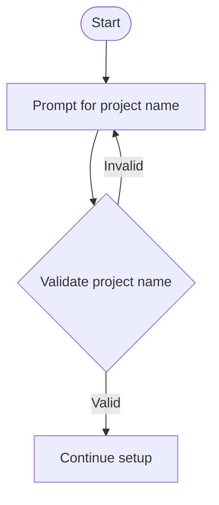
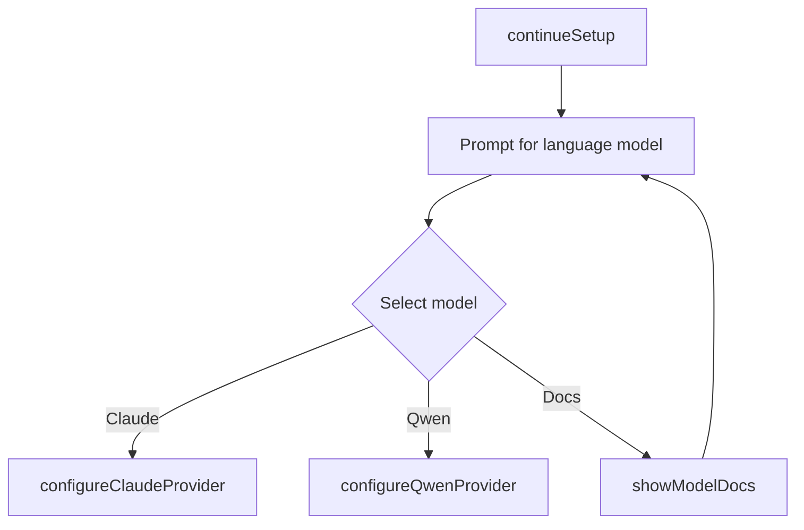
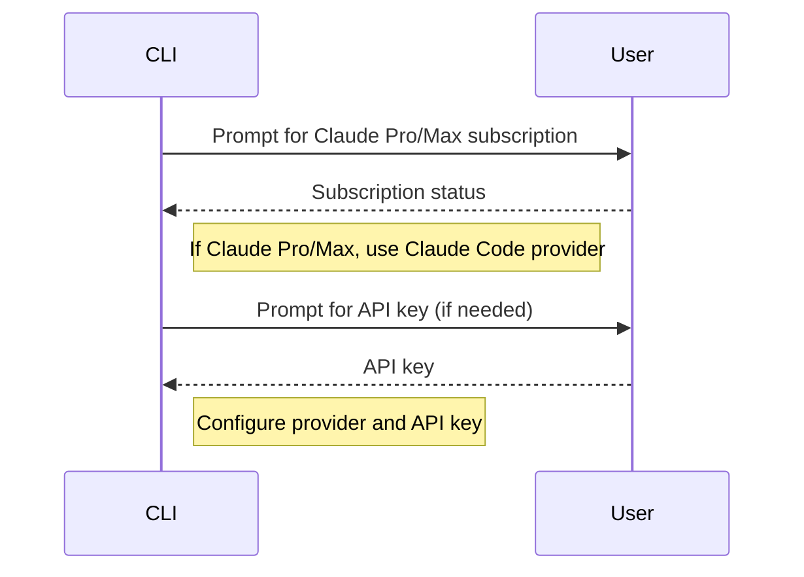
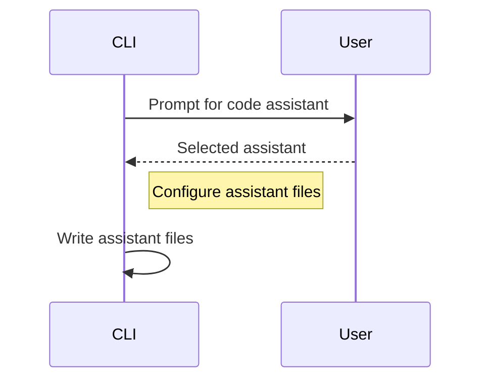
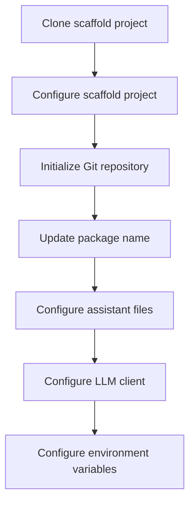
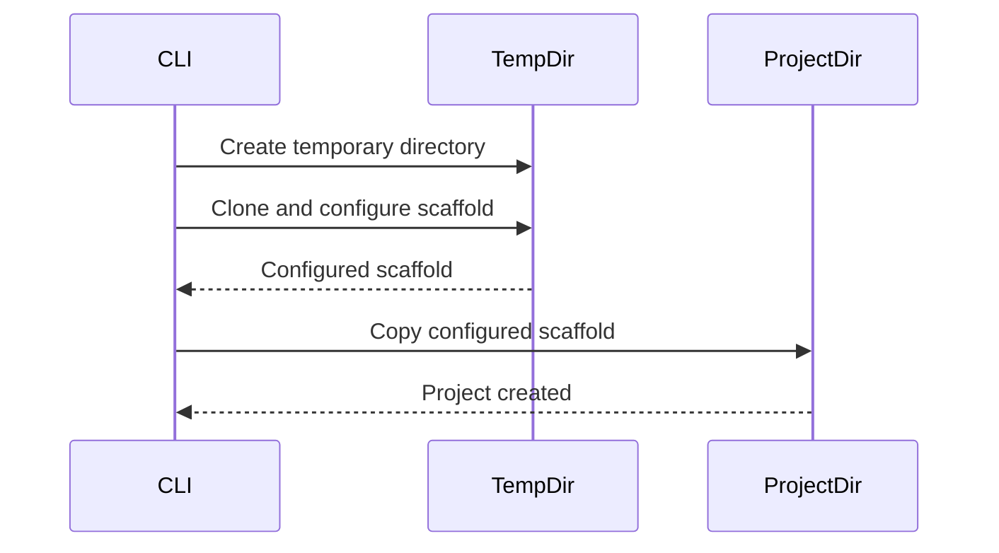
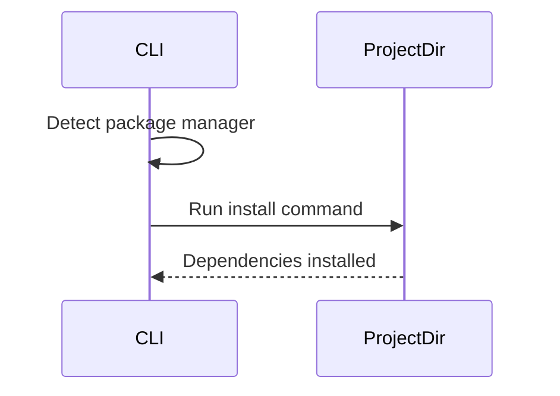
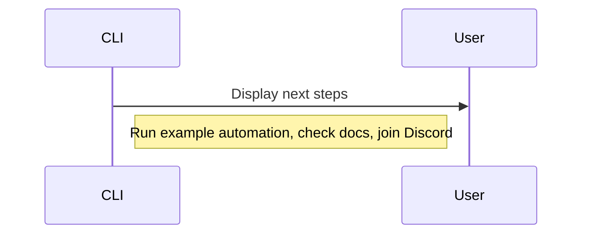
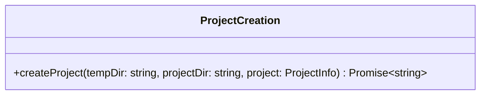

<details>
<summary>Relevant source files</summary>

The following files were used as context for generating this wiki page:

- [packages/create-magnitude-app/src/cli.ts](https://github.com/aanickode/magnitude/blob/main/packages/create-magnitude-app/src/cli.ts)
- [packages/create-magnitude-app/src/claudeCode.ts](https://github.com/aanickode/magnitude/blob/main/packages/create-magnitude-app/src/claudeCode.ts)
- [packages/create-magnitude-app/src/version.ts](https://github.com/aanickode/magnitude/blob/main/packages/create-magnitude-app/src/version.ts)
- [packages/create-magnitude-app/package.json](https://github.com/aanickode/magnitude/blob/main/packages/create-magnitude-app/package.json)
- [packages/create-magnitude-app/README.md](https://github.com/aanickode/magnitude/blob/main/packages/create-magnitude-app/README.md)
</details>

# Getting Started

The `create-magnitude-app` is a command-line interface (CLI) tool that helps developers create a new Magnitude project from a template. It guides users through a series of prompts to configure the project's name, language model, provider, API key (if required), and code assistant. The tool then clones a scaffold project, customizes it based on the user's selections, and sets up the project with the necessary dependencies.

## Introduction

Magnitude is a platform for building browser automations using large language models (LLMs) and visual interfaces. The `create-magnitude-app` CLI is the starting point for creating a new Magnitude project, which serves as a foundation for developing browser automations.

The CLI tool is designed to simplify the project setup process by handling the initial configuration and scaffolding. It provides a user-friendly interface for specifying project details and ensures that the project is properly configured with the selected LLM provider and code assistant.

## Project Setup

The `create-magnitude-app` CLI follows a series of steps to set up a new Magnitude project:

1. **Project Name**: The user is prompted to enter a name for the new project. The CLI validates the input to ensure that the project name is valid and that a directory with the same name does not already exist in the current working directory.



Sources: [packages/create-magnitude-app/src/cli.ts:58-78]()

2. **Language Model Selection**: The user is asked to choose a language model for the project. Currently, the available options are "Claude Sonnet 4" (recommended) and "Qwen 2.5 VL 72B". The CLI provides a link to the documentation for more information on supported models.



Sources: [packages/create-magnitude-app/src/cli.ts:87-105]()

3. **Provider Configuration**: Based on the selected language model, the CLI determines the appropriate provider (Anthropic, Claude Code, or OpenRouter) and prompts the user for the necessary API key or authentication flow.



Sources: [packages/create-magnitude-app/src/cli.ts:106-190]()

4. **Code Assistant Selection**: The user is prompted to choose a code assistant for the project. The available options are "Claude Code", "Cline", "Cursor", "Gemini CLI", "Windsurf", or "None". The selected code assistant's configuration files are added to the project.



Sources: [packages/create-magnitude-app/src/cli.ts:191-214]()

5. **Project Scaffolding**: The CLI clones the Magnitude scaffold project from a GitHub repository into a temporary directory. It then configures the project based on the user's selections, such as updating the package name, adding the LLM client configuration, and setting up the environment variables.



Sources: [packages/create-magnitude-app/src/cli.ts:217-292]()

6. **Project Creation**: After configuring the scaffold project, the CLI copies the contents of the temporary directory to the desired project directory specified by the user.



Sources: [packages/create-magnitude-app/src/cli.ts:294-311]()

7. **Dependency Installation**: The CLI detects the user's package manager (npm, yarn, pnpm, or bun) and runs the appropriate command to install the project dependencies in the newly created project directory.



Sources: [packages/create-magnitude-app/src/cli.ts:314-335]()

8. **Next Steps**: After the project setup is complete, the CLI provides instructions for running the example automation, accessing the documentation, and joining the Magnitude Discord community.



Sources: [packages/create-magnitude-app/src/cli.ts:338-344]()

## Key Components

### Commander.js

The `create-magnitude-app` CLI is built using the [Commander.js](https://github.com/tj/commander.js/) library, which provides a simple way to define and parse command-line arguments and options.

```javascript
import { program } from "commander";

program
    .name("create-magnitude-app")
    .description("Create a new Magnitude project from a template.")
    .argument("[project-name]", "The name for the new project.")
    .action(async (projectName) => {
        // CLI logic...
    })
    .parse(process.argv);
```

Sources: [packages/create-magnitude-app/src/cli.ts:349-354]()

### Prompts

The CLI uses the [@clack/prompts](https://github.com/cloudcmd/prompts) library to provide an interactive user interface for gathering project configuration details.

| Prompt Function | Description |
|-----------------|--------------|
| `intro()` | Displays an introductory message. |
| `outro()` | Displays a concluding message. |
| `spinner()` | Creates a spinner to indicate ongoing operations. |
| `log` | Provides logging utilities for different message types. |
| `text()` | Prompts the user for text input. |
| `select()` | Prompts the user to select an option from a list. |
| `confirm()` | Prompts the user for a yes/no confirmation. |
| `multiselect()` | Prompts the user to select multiple options from a list. |

Sources: [packages/create-magnitude-app/src/cli.ts:25]()

### Project Configuration

The `establishProjectInfo` function is responsible for gathering project configuration details from the user through a series of prompts.

```mermaid
classDiagram
    class ProjectInfo {
        +projectName: string
        +model: 'claude' | 'qwen'
        +provider: 'anthropic' | 'claude-code' | 'openrouter'
        +apiKey: string
        +assistant: 'cursor' | 'claudecode' | 'cline' | 'gemini' | 'windsurf' | 'none'
    }
    ProjectInfo : establishProjectInfo(info: Partial~ProjectInfo~) Promise~ProjectInfo~
```

Sources: [packages/create-magnitude-app/src/cli.ts:33-47, 58-214]()

### Project Creation

The `createProject` function is responsible for cloning the Magnitude scaffold project, configuring it based on the user's selections, and creating the new project directory.



Sources: [packages/create-magnitude-app/src/cli.ts:217-311]()

### Utility Functions

The CLI includes several utility functions to support the project creation process:

- `getMachineId()`: Generates a unique machine ID for analytics purposes.
- `sendEvent()`: Sends an event to the analytics platform when a new project is created.
- `detectRuntime()`: Detects the user's package manager and provides the appropriate install and run commands.

Sources: [packages/create-magnitude-app/src/cli.ts:346-347, 348]()

## Conclusion

The `create-magnitude-app` CLI is a crucial component of the Magnitude platform, providing a streamlined and user-friendly way to set up new projects. By guiding users through a series of prompts and automating the project configuration process, the CLI ensures a consistent and reliable starting point for developing browser automations with Magnitude.