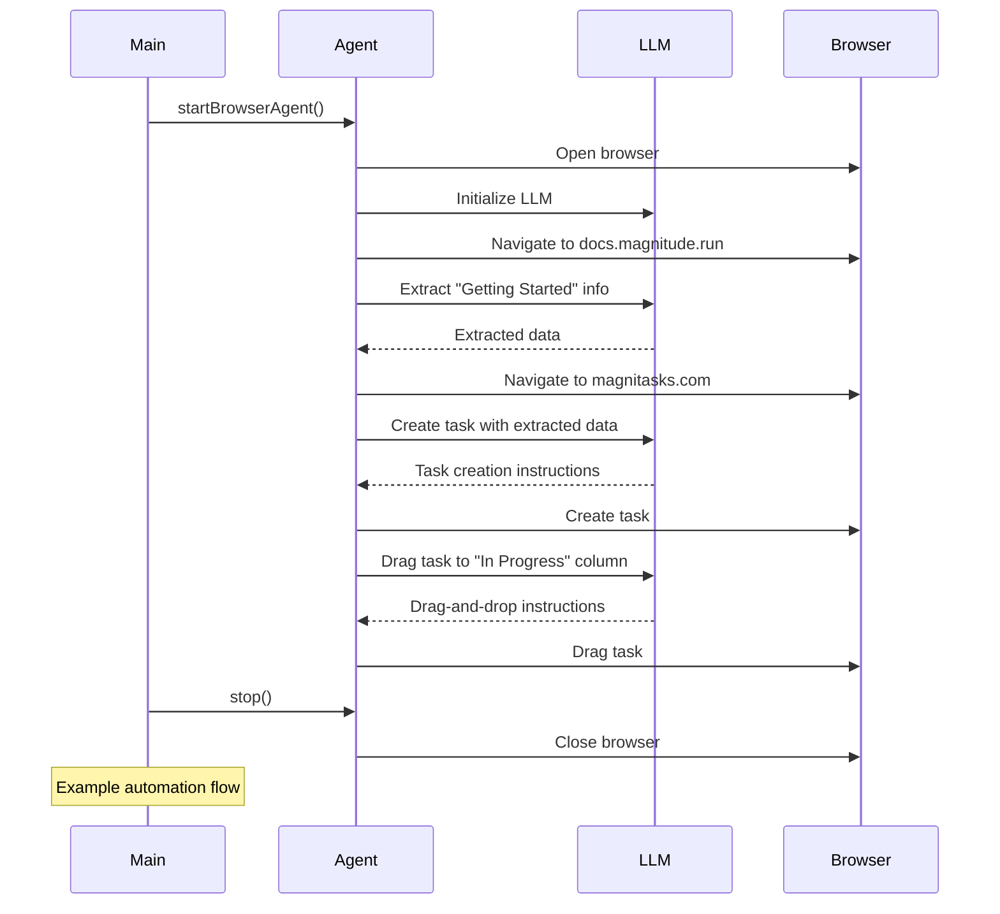
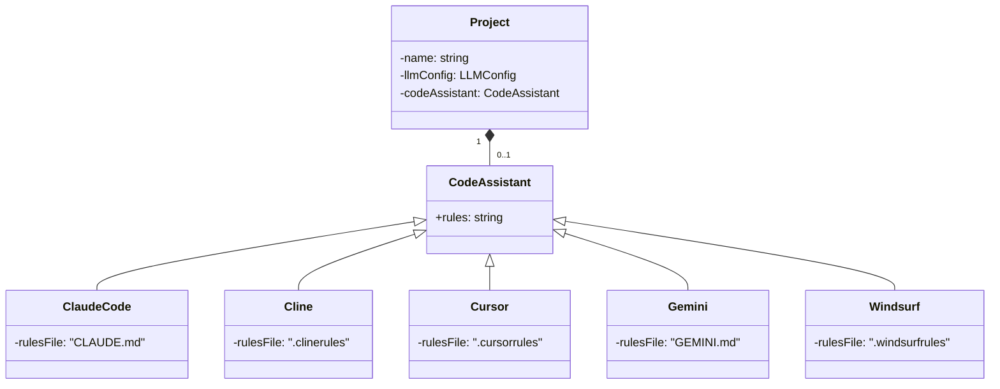

<details>
<summary>Relevant source files</summary>

The following files were used as context for generating this wiki page:

- [packages/create-magnitude-app/src/cli.ts](https://github.com/aanickode/magnitude/blob/main/packages/create-magnitude-app/src/cli.ts)
- [docs/getting-started/quickstart.mdx](https://github.com/aanickode/magnitude/blob/main/docs/getting-started/quickstart.mdx)
- [src/index.ts](https://github.com/aanickode/magnitude/blob/main/src/index.ts)
- [packages/magnitude-core/src/agent.ts](https://github.com/aanickode/magnitude/blob/main/packages/magnitude-core/src/agent.ts)
- [packages/magnitude-core/src/providers/llm.ts](https://github.com/aanickode/magnitude/blob/main/packages/magnitude-core/src/providers/llm.ts)
</details>

# Getting Started

## Introduction

Magnitude is a powerful framework that allows developers to create browser automations using large language models (LLMs) and natural language instructions. The "Getting Started" process is the initial step to set up a new Magnitude project and run a basic example automation.

The key aspects of getting started with Magnitude include:

1. Creating a new project using the `create-magnitude-app` CLI tool.
2. Configuring the project with the desired LLM provider and model.
3. Running the example automation script included in the project template.
4. Exploring and modifying the example code to understand Magnitude's capabilities.

Magnitude provides a seamless integration with various LLM providers, such as Anthropic, OpenRouter, and Claude Code, allowing developers to leverage the power of state-of-the-art language models for their browser automations. [Link Text](#customizing-llm-configuration)

## Project Creation

The `create-magnitude-app` CLI tool is the entry point for creating a new Magnitude project. It guides the user through a series of prompts to configure the project's name, LLM model, provider, and optional code assistant.

```mermaid
flowchart TD
    start[Start] --> prompt1[Prompt for project name]
    prompt1 --> prompt2[Prompt for LLM model]
    prompt2 --> prompt3[Prompt for LLM provider]
    prompt3 --> prompt4[Prompt for code assistant]
    prompt4 --> clone[Clone project template]
    clone --> configure[Configure project]
    configure --> install[Install dependencies]
    install --> end[Project ready]
```

Sources: [packages/create-magnitude-app/src/cli.ts:26-346](), [packages/create-magnitude-app/src/cli.ts:349-420]()

## Example Automation

The project template includes an example automation script (`src/index.ts`) that demonstrates the basic usage of Magnitude. This script performs the following actions:

1. Starts a browser agent and navigates to the Magnitude documentation website.
2. Extracts information about "Getting Started with Magnitude" based on a provided schema.
3. Navigates to the MagniTasks website.
4. Creates a new task with the extracted "Getting Started" information.
5. Performs a drag-and-drop action on the created task.
6. Stops the browser agent.



Sources: [src/index.ts:1-36](), [packages/magnitude-core/src/agent.ts]()

## Customizing LLM Configuration

Magnitude supports various LLM providers and models, allowing developers to choose the best option for their use case. The LLM configuration is set during the project creation process and can be customized later if needed.

| Provider    | Supported Models                     | Configuration                                                |
|--------------|---------------------------------------|---------------------------------------------------------------|
| Anthropic   | Claude Sonnet 4                      | `provider: 'anthropic', options: { model, apiKey }`           |
| OpenRouter  | Claude Sonnet 4, Qwen 2.5 VL 72B     | `provider: 'openai-generic', options: { baseUrl, model, apiKey }` |
| Claude Code | Claude Sonnet 4 (with Pro/Max subs)  | `provider: 'claude-code', options: { model }`                  |

Sources: [packages/create-magnitude-app/src/cli.ts:195-253](), [packages/magnitude-core/src/providers/llm.ts]()

## Code Assistant Integration

Magnitude supports integrating with various code assistants, such as Claude Code, Cline, Cursor, Gemini CLI, and Windsurf. During the project creation process, users can choose to include rules and configurations for a specific code assistant, which will be added to the project template.



Sources: [packages/create-magnitude-app/src/cli.ts:113-136](), [packages/create-magnitude-app/src/cli.ts:283-299]()

## Conclusion

Getting started with Magnitude involves creating a new project, configuring the LLM provider and model, and running the example automation script. The project template provides a solid foundation for developers to explore Magnitude's capabilities and build their own browser automations using natural language instructions and state-of-the-art language models.

Sources: [docs/getting-started/quickstart.mdx]()