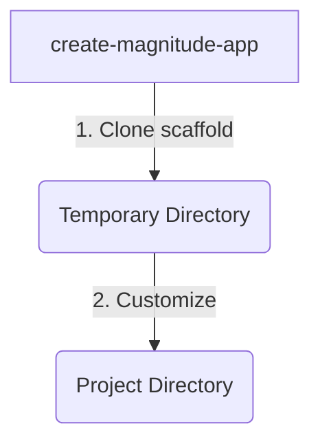
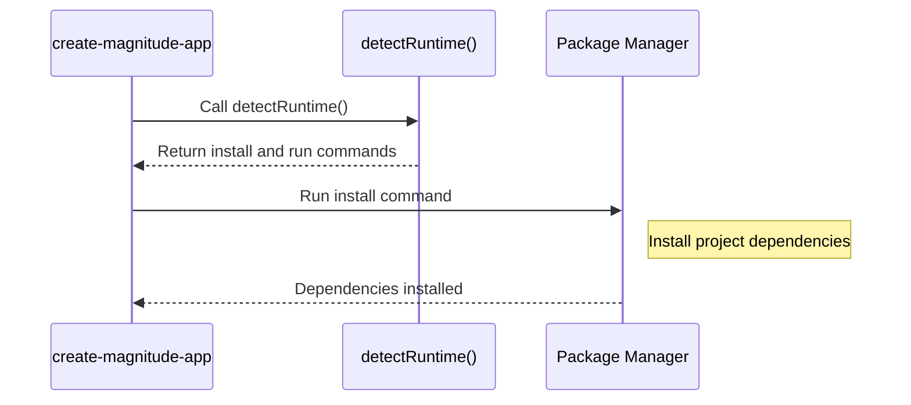

<details>
<summary>Relevant source files</summary>

The following files were used as context for generating this wiki page:

- [packages/create-magnitude-app/src/cli.ts](https://github.com/aanickode/magnitude/blob/main/packages/create-magnitude-app/src/cli.ts)
- [packages/create-magnitude-app/src/claudeCode.ts](https://github.com/aanickode/magnitude/blob/main/packages/create-magnitude-app/src/claudeCode.ts)
- [packages/create-magnitude-app/src/version.ts](https://github.com/aanickode/magnitude/blob/main/packages/create-magnitude-app/src/version.ts)
- [packages/create-magnitude-app/package.json](https://github.com/aanickode/magnitude/blob/main/packages/create-magnitude-app/package.json)
- [packages/create-magnitude-app/README.md](https://github.com/aanickode/magnitude/blob/main/packages/create-magnitude-app/README.md)
</details>

# Getting Started

The `create-magnitude-app` is a command-line interface (CLI) tool for creating new Magnitude projects from a template. It guides users through a series of prompts to configure the project's name, language model, provider, API key (if required), and code assistant. The tool then clones a scaffold project from a GitHub repository, customizes it based on the user's selections, and sets up the project directory with the necessary files and dependencies.

## Introduction

Magnitude is a platform for building browser automations using large language models (LLMs) and code assistants. The `create-magnitude-app` CLI tool provides a streamlined way to set up a new Magnitude project, allowing developers to quickly start building their automations.

The tool supports various language models, including Claude (Sonnet 4) and Qwen (2.5 VL 72B), and providers like Anthropic, Claude Code, and OpenRouter. It also integrates with different code assistants, such as Claude Code, Cline, Cursor, Gemini CLI, and Windsurf, to enhance the development experience.

## Project Setup

The `create-magnitude-app` CLI tool follows a step-by-step process to set up a new Magnitude project:

1. **Project Name**: The user is prompted to enter a name for the new project. The tool validates the input and ensures that the chosen directory does not already exist.

2. **Language Model Selection**: The user selects the language model they want to use for the project, either Claude (Sonnet 4) or Qwen (2.5 VL 72B). Additional information about the models is provided if needed.

3. **Provider and API Key Configuration**: Based on the selected language model, the tool guides the user through configuring the provider (Anthropic, Claude Code, or OpenRouter) and obtaining the necessary API key, if required.

4. **Code Assistant Selection**: The user chooses a code assistant (Claude Code, Cline, Cursor, Gemini CLI, Windsurf, or none) to integrate with the project.

After gathering the required information, the tool performs the following steps:

1. **Clone Scaffold Project**: The tool clones the Magnitude scaffold project from a GitHub repository into a temporary directory.

2. **Project Customization**: The cloned project is customized based on the user's selections, including configuring the package name, setting up the code assistant files, and generating the LLM client configuration.

3. **Environment Setup**: If an API key is provided, the tool creates an `.env` file in the project directory and adds the API key to it.

4. **Project Creation**: The customized project is copied from the temporary directory to the specified project directory.

5. **Dependency Installation**: The tool detects the user's package manager (npm, yarn, pnpm, or bun) and runs the appropriate command to install the project dependencies.

6. **Next Steps**: Finally, the tool provides instructions on how to run the example automation, access the documentation, and join the Magnitude Discord community.

Sources: [cli.ts:1-424](https://github.com/aanickode/magnitude/blob/main/packages/create-magnitude-app/src/cli.ts#L1-L424)

## Command-Line Interface

The `create-magnitude-app` CLI is built using the `commander` library, which provides a simple way to define and parse command-line arguments and options.

```javascript
program
    .name("create-magnitude-app")
    .description("Create a new Magnitude project from a template.")
    .argument("[project-name]", "The name for the new project.")
    .action(async (projectName) => {
        // ... (implementation omitted for brevity)
    })
    .parse(process.argv);
```

The CLI accepts an optional `project-name` argument, which is used as the name for the new project. If no argument is provided, the user is prompted to enter a project name during the setup process.

Sources: [cli.ts:343-351](https://github.com/aanickode/magnitude/blob/main/packages/create-magnitude-app/src/cli.ts#L343-L351)

## Project Information Gathering

The `establishProjectInfo` function is responsible for gathering information from the user through a series of prompts. It returns an object containing the project's name, language model, provider, API key (if applicable), and code assistant.

```javascript
async function establishProjectInfo(info: Partial<ProjectInfo>): Promise<ProjectInfo> {
    // ... (implementation omitted for brevity)
}
```

The function uses the `@clack/prompts` library to display prompts and collect user input. It handles various scenarios, such as validating the project name, providing additional information about language models, detecting and using existing API keys, and guiding the user through the API key setup process if necessary.

Sources: [cli.ts:37-212](https://github.com/aanickode/magnitude/blob/main/packages/create-magnitude-app/src/cli.ts#L37-L212)

## Project Creation

The `createProject` function is responsible for creating the new Magnitude project based on the user's selections.

```javascript
async function createProject(tempDir: string, projectDir: string, project: ProjectInfo) {
    // ... (implementation omitted for brevity)
}
```

Here's a high-level overview of the steps performed by this function:

1. **Clone Scaffold Project**: The function clones the Magnitude scaffold project from a GitHub repository into a temporary directory using Git.



2. **Project Customization**: The cloned project is customized based on the user's selections:
   - Remove the existing Git repository from the scaffold.
   - Initialize a new Git repository in the temporary directory.
   - Update the `package.json` file with the project name.
   - Configure the code assistant files based on the selected assistant.
   - Generate the LLM client configuration based on the selected language model and provider.
   - Create an `.env` file with the API key if provided.

3. **Project Creation**: The customized project is copied from the temporary directory to the specified project directory.

Sources: [cli.ts:215-313](https://github.com/aanickode/magnitude/blob/main/packages/create-magnitude-app/src/cli.ts#L215-L313)

## Dependency Installation

After creating the project, the `create-magnitude-app` CLI detects the user's package manager (npm, yarn, pnpm, or bun) and runs the appropriate command to install the project dependencies.

```javascript
function detectRuntime(): { installCommand: string, runCommand: string } {
    // ... (implementation omitted for brevity)
}
```

The `detectRuntime` function analyzes the `npm_config_user_agent` environment variable to determine the package manager being used and returns the corresponding installation and run commands.



Sources: [cli.ts:316-339](https://github.com/aanickode/magnitude/blob/main/packages/create-magnitude-app/src/cli.ts#L316-L339)

## Next Steps

After the project is created and dependencies are installed, the `create-magnitude-app` CLI provides instructions on how to run the example automation, access the documentation, and join the Magnitude Discord community.

```javascript
outro('Project is ready!');

console.log(bold(blueBright`Next steps:`));
console.log(`◆ Run the example automation: ` + cyanBright`cd ${projectInfo.projectName} && ${runCommand}`);
console.log(`◆ Check out our docs: ${blueBright('https://docs.magnitude.run')}`);
console.log(`◆ Join our Discord: ${blueBright('https://discord.gg/VcdpMh9tTy')}`);
console.log();
```

Sources: [cli.ts:388-394](https://github.com/aanickode/magnitude/blob/main/packages/create-magnitude-app/src/cli.ts#L388-L394)

## Utility Functions

The `create-magnitude-app` CLI includes several utility functions to support the project creation process:

### `getMachineId`

This function generates a unique identifier for the user's machine, which is used for analytics purposes. It attempts to read an existing ID from a local file (`~/.magnitude/user.json`). If the file does not exist, it generates a new ID and stores it in the file.

```javascript
export function getMachineId(): string {
    // ... (implementation omitted for brevity)
}
```

Sources: [cli.ts:325-341](https://github.com/aanickode/magnitude/blob/main/packages/create-magnitude-app/src/cli.ts#L325-L341)

### `sendEvent`

This function sends an analytics event to the PostHog service, indicating that a new Magnitude project has been created. It uses the machine ID generated by `getMachineId` to identify the user.

```javascript
async function sendEvent() {
    // ... (implementation omitted for brevity)
}
```

Sources: [cli.ts:342-367](https://github.com/aanickode/magnitude/blob/main/packages/create-magnitude-app/src/cli.ts#L342-L367)

## Dependencies

The `create-magnitude-app` CLI relies on the following dependencies:

| Dependency | Description |
| --- | --- |
| `commander` | Command-line interface library for Node.js |
| `execa` | Utility for executing shell commands |
| `fs-extra` | Enhanced file system operations |
| `ansis` | ANSI escape codes for terminal styling |
| `@clack/prompts` | Interactive command-line prompts |
| `@paralleldrive/cuid2` | Collision-resistant unique identifier generator |

Sources: [package.json](https://github.com/aanickode/magnitude/blob/main/packages/create-magnitude-app/package.json)

## Conclusion

The `create-magnitude-app` CLI is a crucial tool for setting up new Magnitude projects. It provides a user-friendly interface for configuring project settings, integrating with language models and code assistants, and automating the project creation and dependency installation processes. By streamlining the initial setup, developers can quickly start building their browser automations using the Magnitude platform.