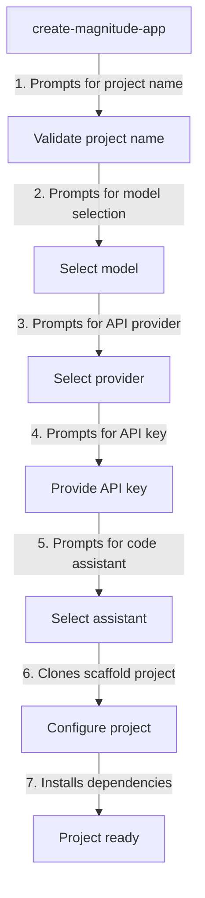
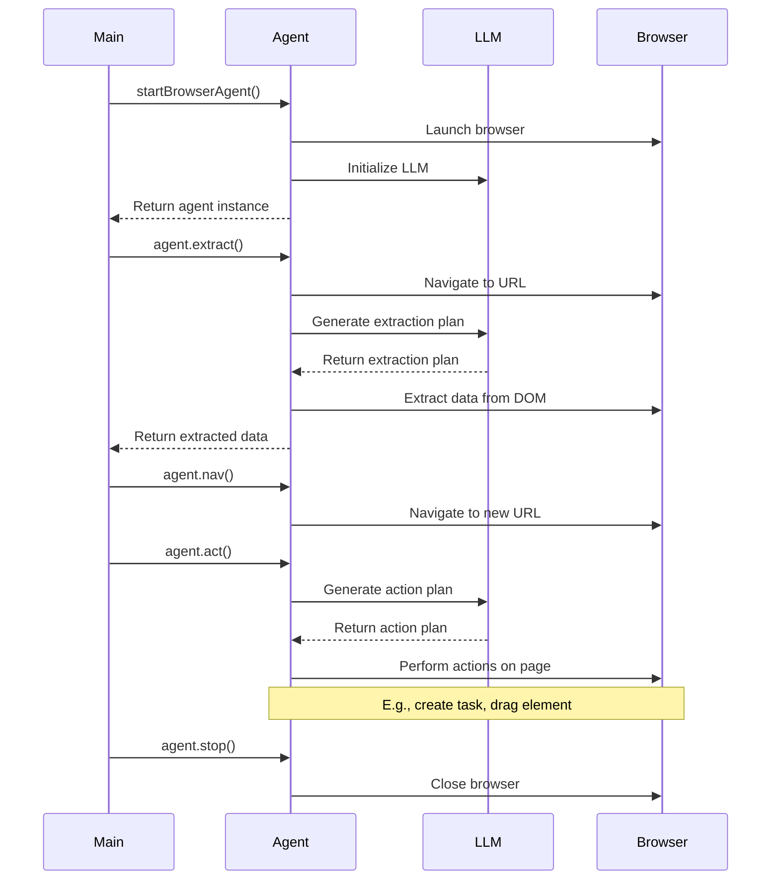
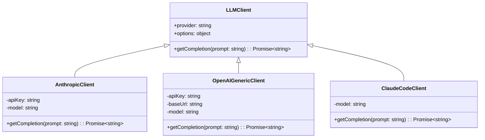

Relevant source files

The following files were used as context for generating this wiki page:

- [packages/create-magnitude-app/src/cli.ts](https://github.com/aanickode/magnitude/blob/main/packages/create-magnitude-app/src/cli.ts)
- [docs/getting-started/quickstart.mdx](https://github.com/aanickode/magnitude/blob/main/docs/getting-started/quickstart.mdx)
- [src/index.ts](https://github.com/aanickode/magnitude/blob/main/src/index.ts)
- [packages/magnitude-core/src/agent.ts](https://github.com/aanickode/magnitude/blob/main/packages/magnitude-core/src/agent.ts)
- [packages/magnitude-core/src/llm.ts](https://github.com/aanickode/magnitude/blob/main/packages/magnitude-core/src/llm.ts)
- [packages/magnitude-core/src/utils.ts](https://github.com/aanickode/magnitude/blob/main/packages/magnitude-core/src/utils.ts)

# Getting Started

## Introduction

Magnitude is a powerful browser automation framework that allows developers to create intelligent agents capable of interacting with web applications and performing complex tasks. The "Getting Started" process is designed to help users quickly set up a new Magnitude project and run an example automation to get a feel for the framework's capabilities.

The process involves creating a new project using the `create-magnitude-app` command-line tool, which guides users through a series of prompts to configure the project's name, language model, and other settings. Once the project is created, users can run the provided example automation, which demonstrates how to navigate to a website, extract data based on a defined schema, and perform various actions on the page.

Sources: [packages/create-magnitude-app/src/cli.ts](https://github.com/aanickode/magnitude/blob/main/packages/create-magnitude-app/src/cli.ts), [docs/getting-started/quickstart.mdx](https://github.com/aanickode/magnitude/blob/main/docs/getting-started/quickstart.mdx)

## Project Creation

The `create-magnitude-app` command-line tool is the entry point for creating a new Magnitude project. It guides users through a series of prompts to configure the project's settings, such as the project name, language model, and API provider.

The tool first prompts the user for a project name and validates that the chosen name is valid and does not conflict with an existing directory. It then prompts the user to select a language model (e.g., Claude Sonnet 4 or Qwen 2.5) and an API provider (e.g., Anthropic, Claude Code, or OpenRouter). Depending on the selected provider, the user may be prompted to provide an API key or complete an authentication flow.

After configuring the project settings, the tool clones a scaffold project from a GitHub repository, configures the project based on the user's selections, and installs the required dependencies using the appropriate package manager (e.g., npm, yarn, or pnpm).

Sources: [packages/create-magnitude-app/src/cli.ts:28-372](https://github.com/aanickode/magnitude/blob/main/packages/create-magnitude-app/src/cli.ts#L28-L372)

## Example Automation

The created project includes an example automation that demonstrates some of Magnitude's core features. The example is located in the `src/index.ts` file and can be run using the `npm start` command (or the appropriate command for the detected package manager).

The example automation demonstrates the following features:

1. **Initializing the Agent**: The `startBrowserAgent` function is used to create a new agent instance, which launches a browser and initializes the configured language model.
2. **Data Extraction**: The `agent.extract` method is used to extract data from the page's DOM based on a provided Zod schema. The language model generates a plan for extracting the required data, which the agent then executes in the browser.
3. **Navigation**: The `agent.nav` method is used to navigate the browser to a new URL.
4. **High-Level Actions**: The `agent.act` method is used to perform high-level actions, such as creating a task on a web application. The language model generates a plan for completing the action, which the agent then executes in the browser.
5. **Low-Level Actions**: The `agent.act` method can also be used to perform low-level actions, such as dragging an element on the page.
6. **Stopping the Agent**: The `agent.stop` method is used to stop the agent and close the browser.

Sources: [src/index.ts](https://github.com/aanickode/magnitude/blob/main/src/index.ts), [packages/magnitude-core/src/agent.ts](https://github.com/aanickode/magnitude/blob/main/packages/magnitude-core/src/agent.ts)

## Language Model Integration

Magnitude integrates with various language models, such as Claude Sonnet 4 and Qwen 2.5, to provide intelligent automation capabilities. The language model is configured during the project creation process and is used by the agent to generate plans for data extraction, navigation, and other actions.

The `LLMClient` class is an abstract class that defines the interface for interacting with language models. Concrete implementations of this class, such as `AnthropicClient`, `OpenAIGenericClient`, and `ClaudeCodeClient`, handle the communication with the respective language model providers (e.g., Anthropic, OpenRouter, or Claude Code).

The `getCompletion` method is used to send prompts to the language model and receive completions (i.e., generated text) in response. The agent uses this method to generate plans for various tasks, such as data extraction, navigation, and actions.

Sources: [packages/magnitude-core/src/llm.ts](https://github.com/aanickode/magnitude/blob/main/packages/magnitude-core/src/llm.ts)

## Utility Functions

Magnitude provides several utility functions to assist with various tasks, such as generating unique IDs, sending events, and detecting the runtime environment.

| Function | Description |
| --- | --- |
| `getMachineId` | Generates a unique machine ID for tracking purposes. The ID is stored in a local file (`~/.magnitude/user.json`) and reused on subsequent runs. If the file cannot be accessed, a temporary ID is generated. |
| `sendEvent` | Sends an event to a third-party analytics service (PostHog) to track project creation. The event includes the machine ID generated by `getMachineId`. |
| `detectRuntime` | Detects the current runtime environment (e.g., Bun, pnpm, yarn, deno, or npm) based on the `npm_config_user_agent` environment variable. It returns the appropriate install and run commands for the detected runtime. |

Sources: [packages/create-magnitude-app/src/cli.ts:384-451](https://github.com/aanickode/magnitude/blob/main/packages/create-magnitude-app/src/cli.ts#L384-L451), [packages/magnitude-core/src/utils.ts](https://github.com/aanickode/magnitude/blob/main/packages/magnitude-core/src/utils.ts)

## Conclusion

The "Getting Started" process in Magnitude is designed to be straightforward and user-friendly. By following the prompts in the `create-magnitude-app` command-line tool, users can quickly set up a new project with their desired configuration. The provided example automation serves as a starting point for understanding Magnitude's core features and capabilities, such as data extraction, navigation, and intelligent actions. With this foundation, users can begin building their own browser automations and leveraging the power of language models to tackle complex tasks.

Sources: [packages/create-magnitude-app/src/cli.ts](https://github.com/aanickode/magnitude/blob/main/packages/create-magnitude-app/src/cli.ts), [docs/getting-started/quickstart.mdx](https://github.com/aanickode/magnitude/blob/main/docs/getting-started/quickstart.mdx)