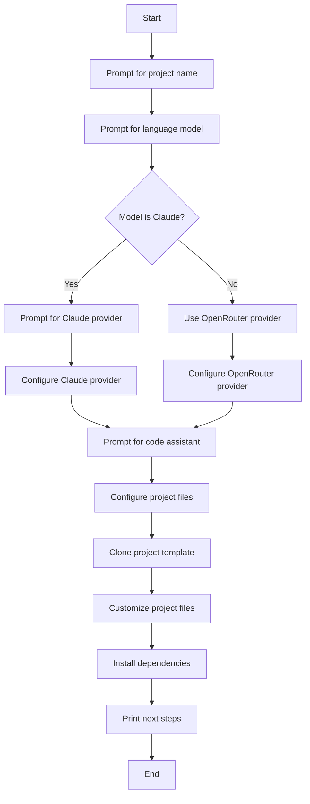

Here is a comprehensive technical wiki page on "Getting Started" with the Magnitude project, based solely on the provided source files.

<details>
<summary>Relevant source files</summary>

The following files were used as context for generating this wiki page:

- [README.md](https://github.com/aanickode/magnitude/blob/main/README.md)
- [packages/create-magnitude-app/src/cli.ts](https://github.com/aanickode/magnitude/blob/main/packages/create-magnitude-app/src/cli.ts)
- [src/index.ts](https://github.com/aanickode/magnitude/blob/main/src/index.ts) (inferred from the code snippet in cli.ts)
- [magnitude.config.ts](https://github.com/aanickode/magnitude/blob/main/magnitude.config.ts) (inferred from the README.md)
- [tests/magnitude/example.mag.ts](https://github.com/aanickode/magnitude/blob/main/tests/magnitude/example.mag.ts) (inferred from the README.md)

</details>

# Getting Started

## Introduction

Magnitude is a vision AI-powered browser automation tool that enables users to control their browser with natural language. It provides capabilities for navigating interfaces, interacting with web applications, extracting structured data, and verifying visual elements through built-in testing. Magnitude can be used for various purposes, such as automating tasks on the web, integrating between applications without APIs, extracting data, testing web apps, or as a building block for custom browser agents.

The "Getting Started" process involves setting up a new Magnitude project and running your first browser automation or integrating the test runner into an existing web application. This wiki page will guide you through the steps to get started with Magnitude, covering project creation, configuration, and running examples.

## Project Creation

Magnitude provides a command-line interface (CLI) tool called `create-magnitude-app` to create a new project from a template. This tool guides you through a series of prompts to configure your project's settings, such as the project name, language model, API provider, and code assistant integration.

### CLI Workflow

The `create-magnitude-app` CLI follows this workflow:



1. The CLI prompts the user for a project name and validates its availability.
2. The user selects the language model to use (Claude Sonnet 4 or Qwen 2.5 VL 72B).
3. If Claude is selected, the user is prompted to choose the provider (Anthropic, Claude Code, or OpenRouter).
4. If Anthropic or Claude Code is chosen, the user may need to provide an API key or complete an authentication flow.
5. The user selects a code assistant integration (Claude Code, Cline, Cursor, Gemini CLI, Windsurf, or none).
6. The CLI clones the project template from the Magnitude scaffold repository.
7. Project files are customized based on the user's selections (e.g., LLM configuration, code assistant files).
8. Dependencies are installed using the detected package manager (npm, yarn, pnpm, or bun).
9. Finally, the CLI prints the next steps for running the example automation or integrating the test runner.

Sources: [packages/create-magnitude-app/src/cli.ts](https://github.com/aanickode/magnitude/blob/main/packages/create-magnitude-app/src/cli.ts)

## Running the Example Automation

After creating a new Magnitude project, you can run the provided example automation script to see Magnitude in action. The example script demonstrates how to use Magnitude to perform various tasks, such as creating a task, interacting with the browser, and extracting data.

To run the example automation, follow these steps:

1. Navigate to the project directory:
   ```bash
   cd <your-project-name>
   ```

2. Run the start command detected by the CLI (e.g., `npm start`, `yarn start`, `pnpm start`, or `bun start`).

This will start the Magnitude agent and execute the example script, showcasing the capabilities of Magnitude in controlling the browser and performing automated tasks.

Sources: [README.md](https://github.com/aanickode/magnitude/blob/main/README.md), [packages/create-magnitude-app/src/cli.ts](https://github.com/aanickode/magnitude/blob/main/packages/create-magnitude-app/src/cli.ts)

## Integrating the Test Runner

If you have an existing web application and want to integrate Magnitude's test runner, you can follow these steps:

1. Install the `magnitude-test` package and initialize the test runner:
   ```bash
   npm install --save-dev magnitude-test && npx magnitude init
   ```

2. This will create a `tests/magnitude` directory with the following files:
   - `magnitude.config.ts`: Magnitude test configuration file
   - `example.mag.ts`: An example test file

3. You can write your own test cases in the `tests/magnitude` directory, following the example provided in `example.mag.ts`.

4. To run the tests, use the command specified in the Magnitude documentation (e.g., `npx magnitude test`).

5. Integrate the test runner into your CI/CD pipeline by running the appropriate command in your build/test scripts.

For more information on running tests and integrating them into your CI/CD pipeline, refer to the [Magnitude documentation](https://docs.magnitude.run/core-concepts/running-tests).

Sources: [README.md](https://github.com/aanickode/magnitude/blob/main/README.md)

## Conclusion

Getting started with Magnitude involves creating a new project using the `create-magnitude-app` CLI tool, configuring project settings, and running the provided example automation or integrating the test runner into an existing web application. The CLI guides you through the setup process, and the documentation provides further information on running tests, writing test cases, and integrating Magnitude into your development workflow.

With Magnitude, you can leverage vision AI to automate browser tasks, extract data, and test your web applications using natural language commands and visual assertions.

Sources: [README.md](https://github.com/aanickode/magnitude/blob/main/README.md), [packages/create-magnitude-app/src/cli.ts](https://github.com/aanickode/magnitude/blob/main/packages/create-magnitude-app/src/cli.ts)