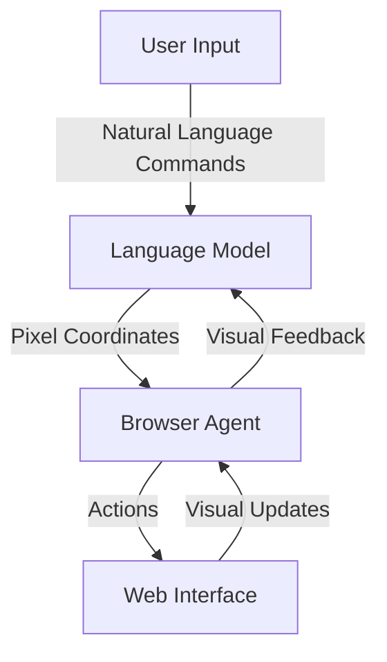

<details>
<summary>Relevant source files</summary>

The following file was used as context for generating this wiki page:

- [README.md](https://github.com/aanickode/magnitude/blob/main/README.md)
</details>

# Introduction to Magnitude

Magnitude is a vision AI-powered browser automation tool that enables users to control their browsers using natural language commands. It is designed to navigate, interact, extract data, and verify web interfaces efficiently and accurately.

## Overview

Magnitude leverages visually grounded language models to understand and interact with web interfaces. Its key features include:

1. **Navigation**: Magnitude can understand and navigate any interface by analyzing its visual elements.
2. **Interaction**: It can execute precise actions using mouse and keyboard inputs based on the user's natural language commands.
3. **Data Extraction**: Magnitude can intelligently extract structured data from web pages.
4. **Verification**: It includes a built-in test runner with powerful visual assertions for testing web applications.

Magnitude can be used for various purposes, such as automating tasks on the web, integrating between applications without APIs, extracting data, testing web apps, or as a building block for creating custom browser agents.

## Architecture

Magnitude's architecture is vision-first, meaning it relies on visually grounded language models to understand and interact with web interfaces. This approach allows for true generalization independent of the DOM structure, making it future-proof for desktop applications, virtual machines, and other environments.

### Vision-first Architecture

The vision-first architecture consists of the following components:



1. **User Input**: The user provides natural language commands to the system.
2. **Language Model**: A visually grounded language model processes the user's commands and generates pixel coordinates for the desired actions.
3. **Browser Agent**: The browser agent executes the specified actions using mouse and keyboard inputs based on the pixel coordinates provided by the language model.
4. **Web Interface**: The web interface receives the actions from the browser agent and updates its visual state accordingly.
5. **Visual Feedback**: The updated visual state of the web interface is fed back to the language model, allowing it to understand the current state and plan subsequent actions.

Sources: [README.md](https://github.com/aanickode/magnitude/blob/main/README.md)

### Controllable and Repeatable Automation

Magnitude addresses the limitations of traditional browser agents that rely on numbered boxes around page elements or follow a "high-level prompt + tools = work until done" approach. Instead, Magnitude offers:

1. **Flexible Abstraction Levels**: Users can specify granular actions or higher-level flows.
2. **Custom Actions and Prompts**: Magnitude allows customizing actions and prompts at the agent and action levels.
3. **Deterministic Runs**: Magnitude includes a native caching system (in progress) to ensure deterministic and repeatable runs.

Sources: [README.md](https://github.com/aanickode/magnitude/blob/main/README.md)

## Getting Started

Magnitude provides two main ways to get started:

1. **Running Browser Automation**:

```bash
npx create-magnitude-app
```

This command creates a new project and guides users through setting up Magnitude. It also generates an example script that can be run immediately.

Sources: [README.md](https://github.com/aanickode/magnitude/blob/main/README.md)

2. **Using the Test Runner**:

For existing web applications, users can install the test runner with the following command:

```bash
npm i --save-dev magnitude-test && npx magnitude init
```

This command creates a `tests/magnitude` directory with the following files:

- `magnitude.config.ts`: Magnitude test configuration file
- `example.mag.ts`: An example test file

Users can refer to the [documentation](https://docs.magnitude.run/core-concepts/running-tests) for information on running tests and integrating them into CI/CD pipelines.

Sources: [README.md](https://github.com/aanickode/magnitude/blob/main/README.md)

## Language Model Requirements

Magnitude requires a large visually grounded language model for optimal performance. The recommended model is Claude Sonnet 4, but Magnitude is also compatible with Qwen-2.5VL 72B. Users can find more information about language model configuration in the [documentation](https://docs.magnitude.run/customizing/llm-configuration).

Sources: [README.md](https://github.com/aanickode/magnitude/blob/main/README.md)

## Additional Resources

- [Magnitude Documentation](https://docs.magnitude.run): Comprehensive documentation on building Magnitude automations and test cases.
- [Discord Community](https://discord.gg/VcdpMh9tTy): Join the Magnitude Discord community for help, suggestions, and discussions.
- [Contact Magnitude Team](mailto:founders@magnitude.run): Enterprises can reach out to the Magnitude team for additional features or support.

Sources: [README.md](https://github.com/aanickode/magnitude/blob/main/README.md)

In summary, Magnitude is a powerful vision AI-powered browser automation tool that enables users to control their browsers using natural language commands. Its vision-first architecture and flexible automation capabilities make it a versatile solution for various web-related tasks, including automation, data extraction, and testing.