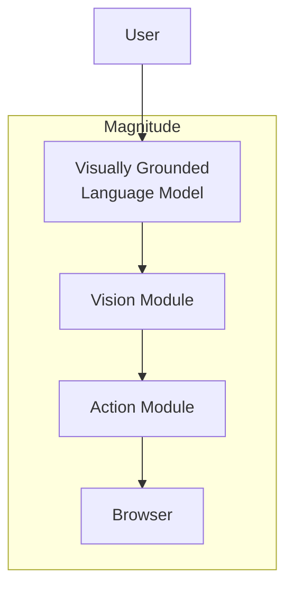
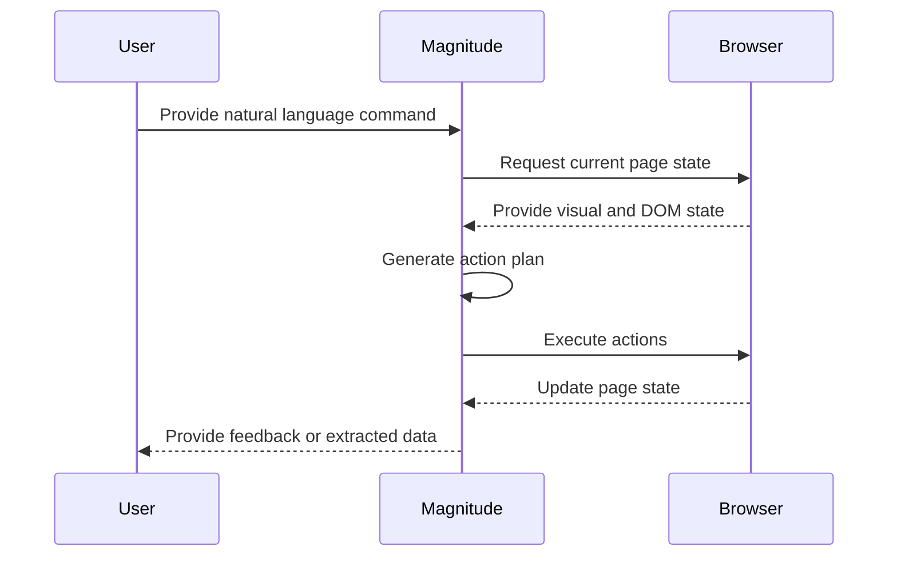

<details>
<summary>Relevant source files</summary>

The following file was used as context for generating this wiki page:

- [README.md](https://github.com/aanickode/magnitude/blob/main/README.md)
</details>

# Introduction to Magnitude

Magnitude is a vision AI-powered browser automation tool that enables users to control their browsers with natural language commands. It leverages visually grounded language models to understand and interact with web interfaces, allowing for seamless navigation, interaction, data extraction, and verification tasks.

## Overview

Magnitude aims to revolutionize browser automation by addressing two key problems:

1. **Vision-first Architecture**: Unlike traditional browser agents that rely on numbered boxes around page elements, Magnitude employs a vision-first approach. It uses visually grounded language models to specify pixel coordinates, enabling true generalization independent of DOM structure. This future-proof architecture can be extended to desktop applications, virtual machines, and other environments.

2. **Controllable and Repeatable Automation**: Magnitude moves away from the "high-level prompt + tools = work until done" approach, which can be suitable for demos but not production environments. Instead, it offers a flexible abstraction level, allowing for both granular actions and high-level flows. Users can define custom actions and prompts at the agent and action levels, enabling deterministic and repeatable automation runs through a native caching system (in progress).

## Key Features

### Navigation

Magnitude can understand and navigate any interface by visually comprehending the user interface and planning out actions accordingly.

```ts
await agent.act('Go to the homepage');
```

### Interaction

The tool can execute precise actions using mouse and keyboard inputs, enabling seamless interaction with web applications.

```ts
await agent.act('Click the "Sign Up" button');
```

### Data Extraction

Magnitude can intelligently extract structured data from web pages based on provided data schemas.

```ts
const tasks = await agent.extract(
    'List in progress tasks',
    z.array(z.object({
        title: z.string(),
        description: z.string(),
        difficulty: z.number().describe('Rate the difficulty between 1-5')
    })),
);
```

### Verification

Magnitude includes a built-in test runner with powerful visual assertions, allowing users to verify the correctness of their web applications.

```ts
await agent.assertVisible('The task should be visible in the "In Progress" column');
```

## Architecture

Magnitude's architecture revolves around a vision-first approach, leveraging visually grounded language models to understand and interact with web interfaces.



Sources: [README.md:1-54]()

1. **User**: The user provides natural language commands or prompts to the visually grounded language model.
2. **Visually Grounded Language Model**: The language model, trained on visual and textual data, understands the user's intent and generates a plan of action based on the current state of the web interface.
3. **Vision Module**: This module processes the visual information from the browser and provides it to the language model for understanding and decision-making.
4. **Action Module**: Based on the plan generated by the language model, the action module executes precise mouse and keyboard actions within the browser.
5. **Browser**: The browser renders the web interface and responds to the actions performed by the action module.

### Workflow



Sources: [README.md:55-72]()

1. The user provides a natural language command to Magnitude.
2. Magnitude requests the current state of the web page from the browser, including visual and DOM information.
3. The browser sends the requested information to Magnitude.
4. Magnitude's visually grounded language model generates an action plan based on the user's command and the current page state.
5. Magnitude executes the planned actions within the browser.
6. The browser updates its state based on the executed actions.
7. Magnitude provides feedback or extracted data to the user based on the updated page state.

## Getting Started

Magnitude provides two main ways to get started:

### Running Browser Automation

To run your first browser automation script, you can use the `create-magnitude-app` command:

```bash
npx create-magnitude-app
```

This command will create a new project and guide you through the setup process for Magnitude. It will also generate an example script that you can run immediately.

### Using the Test Runner

If you have an existing web application, you can install the Magnitude test runner by running:

```bash
npm i --save-dev magnitude-test && npx magnitude init
```

This will create a `tests/magnitude` directory with the following files:

- `magnitude.config.ts`: Magnitude test configuration file
- `example.mag.ts`: An example test file

For more information on running tests and integrating with CI/CD, refer to the [official documentation](https://docs.magnitude.run/core-concepts/running-tests).

## Requirements

Magnitude requires a large visually grounded language model for optimal performance. The recommended model is Claude Sonnet 4, but Magnitude is also compatible with Qwen-2.5VL 72B. For more information on configuring the language model, please refer to the [official documentation](https://docs.magnitude.run/customizing/llm-configuration).

## Additional Resources

- [Official Documentation](https://docs.magnitude.run)
- [Discord Community](https://discord.gg/VcdpMh9tTy)
- [Follow Tom Greenwald](https://x.com/tgrnwld)
- [Follow Anders Sørkål](https://x.com/ndrsrkl)

For enterprise inquiries or to discuss additional features and support, please contact the Magnitude team at founders@magnitude.run or schedule a call [here](https://cal.com/tom-greenwald/30min).

Sources: [README.md]()