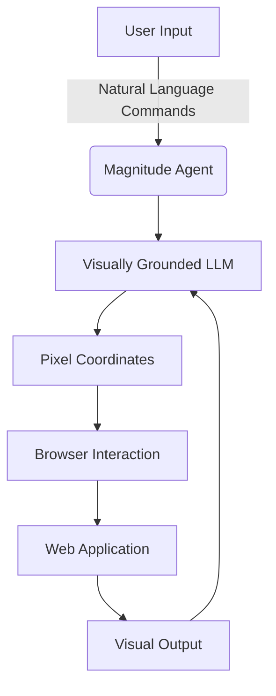

<details>
<summary>Relevant source files</summary>

The following file was used as context for generating this wiki page:

- [README.md](https://github.com/aanickode/magnitude/blob/main/README.md)
</details>

# Introduction to Magnitude

Magnitude is a vision AI-powered browser automation tool that enables users to control their browsers using natural language commands. It leverages visually grounded language models to understand and interact with web interfaces, allowing for seamless navigation, interaction, data extraction, and verification of web applications.

## Overview

Magnitude aims to solve two key problems in the realm of browser automation:

1. **Generalization**: Most browser agents rely on numbered boxes or DOM structures to identify elements, which can be brittle and fail to generalize well on complex modern websites. Magnitude's vision-first architecture uses visually grounded language models to specify pixel coordinates, enabling true generalization independent of DOM structure.

2. **Controllability and Repeatability**: Traditional browser agents often follow a "high-level prompt + tools = work until done" approach, which works well for demonstrations but may not be suitable for production environments. Magnitude offers a solution with flexible abstraction levels (granular actions vs. flows), custom actions and prompts at the agent and action level, and a deterministic run via a native caching system (in progress).

## Key Features

### Navigation

Magnitude can understand and navigate any interface by visually interpreting the user interface and planning out the necessary actions.

Sources: [README.md:16](https://github.com/aanickode/magnitude/blob/main/README.md#L16)

### Interaction

The tool can execute precise actions using mouse and keyboard inputs, enabling seamless interaction with web applications.

Sources: [README.md:17](https://github.com/aanickode/magnitude/blob/main/README.md#L17)

### Data Extraction

Magnitude can intelligently extract useful structured data from web pages, making it easier to gather and process information.

Sources: [README.md:18](https://github.com/aanickode/magnitude/blob/main/README.md#L18)

### Verification

The built-in test runner in Magnitude provides powerful visual assertions, allowing users to verify the correctness of their web applications.

Sources: [README.md:19](https://github.com/aanickode/magnitude/blob/main/README.md#L19)

## Usage

Magnitude can be used for various purposes, including:

- Automating tasks on the web
- Integrating between applications without APIs
- Extracting data from web pages
- Testing web applications
- Serving as a building block for custom browser agents

### Running Browser Automation

To run your first browser automation with Magnitude, you can use the `create-magnitude-app` command:

```bash
npx create-magnitude-app
```

This command will create a new project and guide you through the setup process. It will also generate an example script that you can run immediately.

Sources: [README.md:31-34](https://github.com/aanickode/magnitude/blob/main/README.md#L31-L34)

### Using the Test Runner

To install the test runner for an existing web application, you can run the following commands:

```bash
npm i --save-dev magnitude-test && npx magnitude init
```

This will create a `tests/magnitude` directory with the following files:

- `magnitude.config.ts`: Magnitude test configuration file
- `example.mag.ts`: An example test file

For more information on running tests and integrating with CI/CD, refer to the [documentation](https://docs.magnitude.run/core-concepts/running-tests).

Sources: [README.md:38-45](https://github.com/aanickode/magnitude/blob/main/README.md#L38-L45)

### Language Model Requirements

Magnitude requires a large visually grounded language model. The recommended model for the best performance is Claude Sonnet 4, but Magnitude is also compatible with Qwen-2.5VL 72B. For more information on language model configuration, refer to the [documentation](https://docs.magnitude.run/customizing/llm-configuration).

Sources: [README.md:48-50](https://github.com/aanickode/magnitude/blob/main/README.md#L48-L50)

## Architecture

Magnitude's vision-first architecture is designed to address the limitations of traditional browser agents that rely on numbered boxes or DOM structures for element identification.



The key components of Magnitude's architecture are:

1. **User Input**: Users provide natural language commands to the Magnitude agent.
2. **Magnitude Agent**: The agent processes the user input and coordinates the overall automation process.
3. **Visually Grounded LLM**: A large language model trained on visual data is used to understand the user interface and specify pixel coordinates for interactions.
4. **Pixel Coordinates**: The language model outputs pixel coordinates for the desired actions.
5. **Browser Interaction**: Magnitude executes the specified actions using mouse and keyboard inputs in the browser.
6. **Web Application**: The target web application that Magnitude interacts with.
7. **Visual Output**: The visual output from the web application is fed back into the visually grounded language model for further processing.

By using a vision-first approach, Magnitude can generalize well to complex modern websites and is not limited by DOM structures or numbered boxes. This architecture also allows for future extensibility to desktop applications, virtual machines, and other visual interfaces.

Sources: [README.md:16-19](https://github.com/aanickode/magnitude/blob/main/README.md#L16-L19), [README.md:53-60](https://github.com/aanickode/magnitude/blob/main/README.md#L53-L60)

## Controllability and Repeatability

Magnitude addresses the issue of controllability and repeatability in browser automation by providing flexible abstraction levels, custom actions and prompts, and a deterministic run via a native caching system (in progress).

### Flexible Abstraction Levels

Magnitude allows users to work at different levels of abstraction, ranging from granular actions to high-level flows.

```ts
// Magnitude can handle high-level tasks
await agent.act('Create a task', {
    // Optionally pass data that the agent will use where appropriate
    data: {
        title: 'Use Magnitude',
        description: 'Run "npx create-magnitude-app" and follow the instructions',
    },
});

// It can also handle low-level actions
await agent.act('Drag "Use Magnitude" to the top of the in progress column');
```

Sources: [README.md:22-31](https://github.com/aanickode/magnitude/blob/main/README.md#L22-L31)

### Custom Actions and Prompts

Magnitude allows users to define custom actions and prompts at the agent and action level, enabling fine-grained control over the automation process.

Sources: [README.md:62](https://github.com/aanickode/magnitude/blob/main/README.md#L62)

### Deterministic Runs via Native Caching System

Magnitude is working on a native caching system that will enable deterministic runs, ensuring consistent and repeatable automation across different environments.

Sources: [README.md:63](https://github.com/aanickode/magnitude/blob/main/README.md#L63)

## Data Extraction

Magnitude can intelligently extract structured data from web pages based on provided schemas. The extracted data can include existing information or new insights derived from the content.

```ts
// Intelligently extract data based on the DOM content matching a provided zod schema
const tasks = await agent.extract(
    'List in progress tasks',
    z.array(z.object({
        title: z.string(),
        description: z.string(),
        // Agent can extract existing data or new insights
        difficulty: z.number().describe('Rate the difficulty between 1-5')
    })),
);
```

In this example, Magnitude extracts a list of in-progress tasks from the web page, including their titles, descriptions, and a difficulty rating (a new insight derived by the agent).

Sources: [README.md:24-31](https://github.com/aanickode/magnitude/blob/main/README.md#L24-L31)

## Additional Resources

For more information on building Magnitude automations, running tests, and integrating with CI/CD, refer to the [official documentation](https://docs.magnitude.run).

Sources: [README.md:65](https://github.com/aanickode/magnitude/blob/main/README.md#L65)

## Contact and Support

If you are an enterprise and require additional features or support, you can reach out to the Magnitude team at founders@magnitude.run or schedule a call [here](https://cal.com/tom-greenwald/30min) to discuss your needs.

You can also join the [Magnitude Discord community](https://discord.gg/VcdpMh9tTy) for help, suggestions, or to engage with the community.

Sources: [README.md:67-71](https://github.com/aanickode/magnitude/blob/main/README.md#L67-L71)

In summary, Magnitude is a powerful vision AI-powered browser automation tool that enables users to control their browsers using natural language commands. With its vision-first architecture, flexible abstraction levels, and deterministic runs, Magnitude offers a robust and future-proof solution for automating tasks on the web, integrating between applications, extracting data, and testing web applications.