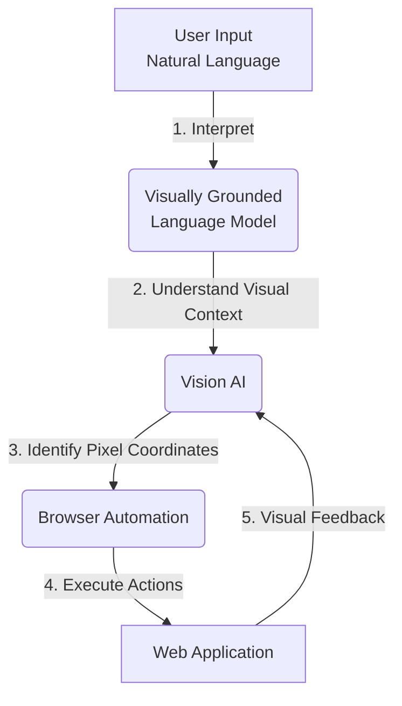
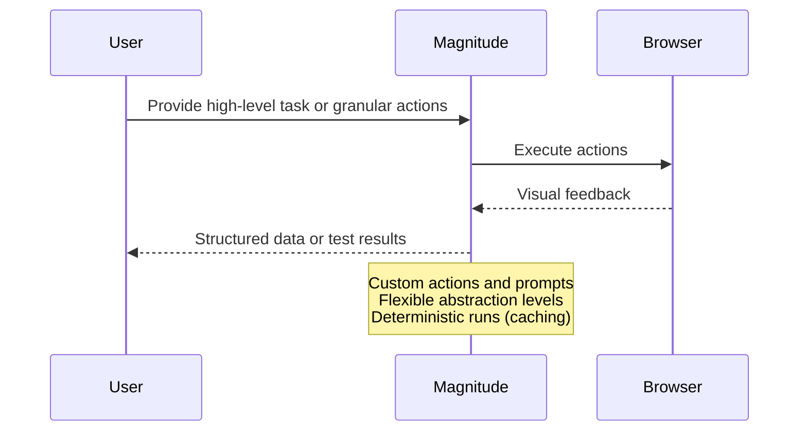
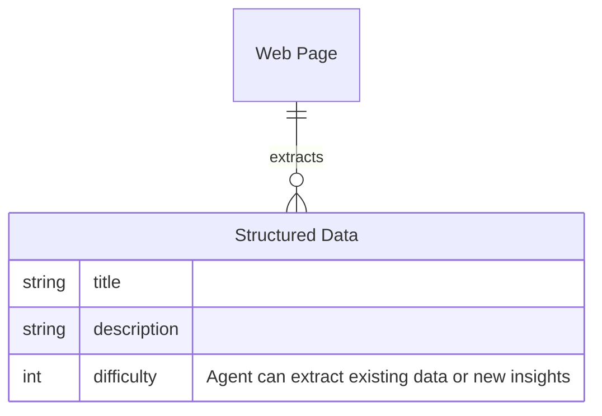

<details>
<summary>Relevant source files</summary>

The following file was used as context for generating this wiki page:

- [README.md](https://github.com/aanickode/magnitude/blob/main/README.md)
</details>

# Introduction to Magnitude

Magnitude is a vision AI-powered browser automation tool that enables users to control their browsers using natural language commands. It leverages visually grounded language models to understand and interact with web interfaces, making it a versatile solution for automating tasks, integrating between applications without APIs, extracting data, and testing web applications.

## Overview

Magnitude's core functionality revolves around four key capabilities:

1. **Navigate**: Magnitude can understand and navigate through any interface by visually analyzing the screen and planning actions accordingly.
2. **Interact**: It can execute precise actions using mouse and keyboard inputs, allowing for seamless interaction with web applications.
3. **Extract**: Magnitude can intelligently extract structured data from web pages based on provided schemas or patterns.
4. **Verify**: It includes a built-in test runner with powerful visual assertions, enabling comprehensive testing of web applications.

Magnitude can be used as a standalone tool for browser automation or as a building block for creating custom browser agents tailored to specific use cases.

## Architecture

Magnitude's architecture is vision-first, meaning it relies on visually grounded language models to understand and interact with web interfaces. This approach allows for true generalization independent of the underlying DOM structure, making it future-proof and capable of handling complex modern websites, desktop applications, and virtual machines.

### Key Components

#### Vision AI
Magnitude leverages state-of-the-art visually grounded language models, such as Claude Sonnet 4 or Qwen-2.5VL 72B, to understand and reason about the visual elements on the screen. These models are trained on large datasets of images and text, enabling them to comprehend the visual context and semantics of web interfaces.

#### Browser Automation
Magnitude integrates with popular browser automation libraries like Puppeteer and Playwright, allowing it to control the browser programmatically. It can execute actions such as clicking, typing, scrolling, and dragging, enabling seamless interaction with web applications.

#### Natural Language Processing
Magnitude's natural language processing capabilities allow users to provide high-level instructions or granular actions in plain English. The system can interpret these commands and translate them into executable browser actions.

#### Data Extraction
Magnitude can intelligently extract structured data from web pages based on provided schemas or patterns. This feature is particularly useful for scraping data from websites or integrating between applications without APIs.

#### Test Runner
Magnitude includes a built-in test runner with powerful visual assertions, enabling comprehensive testing of web applications. Developers can write tests in a declarative manner, specifying the expected visual state of the application, and Magnitude will execute the tests and validate the results.

Sources: [README.md](https://github.com/aanickode/magnitude/blob/main/README.md)

## Getting Started

Magnitude provides two main entry points for users:

1. **Running Browser Automation Scripts**:
   Users can create and run browser automation scripts using the `create-magnitude-app` command, which sets up a new project with an example script. This approach is suitable for automating tasks on the web or integrating between applications without APIs.

```bash
npx create-magnitude-app
```

2. **Using the Test Runner**:
   For existing web applications, users can install the Magnitude test runner and initialize it with the `magnitude init` command. This creates a `tests/magnitude` directory with a configuration file and an example test file, enabling developers to write and run tests for their web applications.

```bash
npm i --save-dev magnitude-test && npx magnitude init
```

Sources: [README.md](https://github.com/aanickode/magnitude/blob/main/README.md)

## Workflow

Magnitude provides a flexible workflow that allows users to work at different abstraction levels, ranging from granular actions to high-level flows. Here's an example of how Magnitude can be used:

```ts
// Magnitude can handle high-level tasks
await agent.act('Create a task', {
    // Optionally pass data that the agent will use where appropriate
    data: {
        title: 'Use Magnitude',
        description: 'Run "npx create-magnitude-app" and follow the instructions',
    },
});

// It can also handle low-level actions
await agent.act('Drag "Use Magnitude" to the top of the in progress column');

// Intelligently extract data based on the DOM content matching a provided zod schema
const tasks = await agent.extract(
    'List in progress tasks',
    z.array(z.object({
        title: z.string(),
        description: z.string(),
        // Agent can extract existing data or new insights
        difficulty: z.number().describe('Rate the difficulty between 1-5')
    })),
);
```

In this example, Magnitude can handle high-level tasks like creating a new task with provided data, as well as low-level actions like dragging a specific task to a different column. Additionally, it can intelligently extract structured data from the web page based on a provided schema, including extracting new insights like task difficulty ratings.

Sources: [README.md](https://github.com/aanickode/magnitude/blob/main/README.md)

## Key Features

### Vision-first Architecture

Magnitude's vision-first architecture is a key differentiator that sets it apart from traditional browser agents. Instead of relying on numbered boxes around page elements, which can be brittle and fail to generalize well, Magnitude uses visually grounded language models to specify pixel coordinates. This approach enables true generalization independent of the underlying DOM structure, making Magnitude future-proof and capable of handling complex modern websites, desktop applications, and virtual machines.



Sources: [README.md](https://github.com/aanickode/magnitude/blob/main/README.md)

### Controllable and Repeatable Automation

Magnitude addresses the common issue of browser agents following a "high-level prompt + tools = work until done" approach, which can work well for demos but may not be suitable for production environments. Instead, Magnitude offers a solution for controllable and repeatable automation:

- **Flexible Abstraction Levels**: Users can work at different levels of abstraction, ranging from granular actions to high-level flows, depending on their needs.
- **Custom Actions and Prompts**: Magnitude allows users to define custom actions and prompts at the agent and action levels, enabling fine-grained control over the automation process.
- **Deterministic Runs via Native Caching System**: Magnitude includes a native caching system (currently in progress) that ensures deterministic runs, making the automation process more reliable and repeatable.



Sources: [README.md](https://github.com/aanickode/magnitude/blob/main/README.md)

## Additional Features

### Data Extraction

Magnitude can intelligently extract structured data from web pages based on provided schemas or patterns. This feature is particularly useful for scraping data from websites or integrating between applications without APIs.



Sources: [README.md](https://github.com/aanickode/magnitude/blob/main/README.md)

### Test Runner

Magnitude includes a built-in test runner with powerful visual assertions, enabling comprehensive testing of web applications. Developers can write tests in a declarative manner, specifying the expected visual state of the application, and Magnitude will execute the tests and validate the results.

| Feature | Description |
| --- | --- |
| Visual Assertions | Validate the visual state of the application |
| Declarative Tests | Write tests in a declarative manner |
| Test Runner | Built-in test runner for executing tests |

Sources: [README.md](https://github.com/aanickode/magnitude/blob/main/README.md)

## Conclusion

Magnitude is a powerful vision AI-powered browser automation tool that offers a unique vision-first architecture and controllable automation capabilities. With its ability to navigate, interact, extract data, and verify web applications, Magnitude provides a versatile solution for a wide range of use cases, from automating tasks on the web to testing and integrating between applications. Its flexible abstraction levels, custom actions and prompts, and deterministic runs via caching make it a reliable and repeatable solution for browser automation.