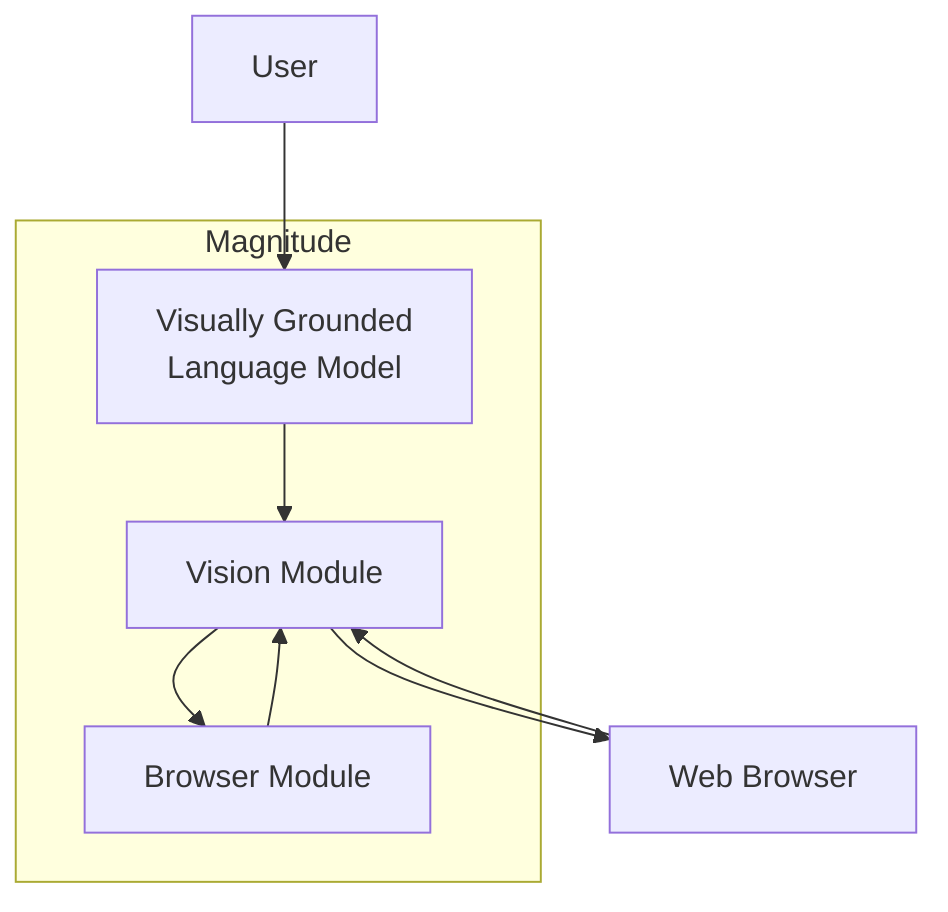
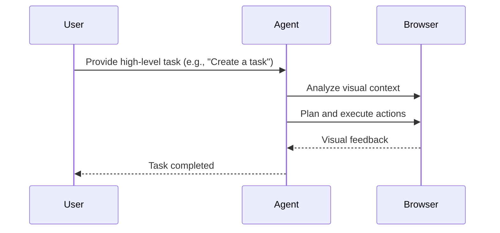
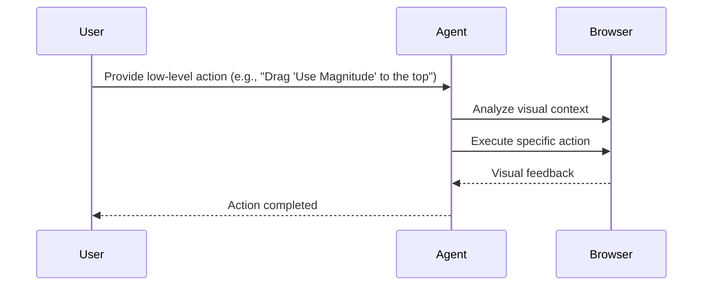
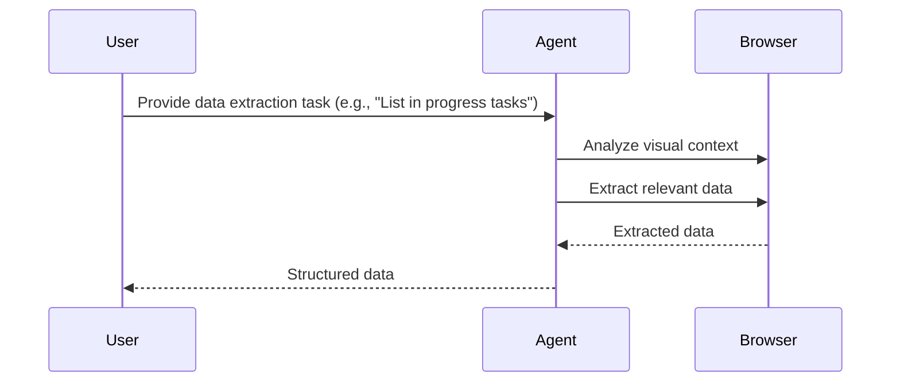

<details>
<summary>Relevant source files</summary>

The following file was used as context for generating this wiki page:

- [README.md](https://github.com/aanickode/magnitude/blob/main/README.md)

</details>

# Introduction

Magnitude is a vision AI-powered browser automation tool that enables users to control their browsers using natural language commands. It leverages visually grounded language models to understand and interact with web interfaces, allowing for navigation, interaction, data extraction, and verification tasks. Magnitude aims to provide a flexible and future-proof solution for automating tasks on the web, integrating between applications without APIs, extracting data, and testing web applications.

## Key Features

### Navigation

Magnitude's vision AI capabilities allow it to understand and navigate any interface by analyzing the visual elements on the page. It can plan out actions based on the visual context, enabling seamless navigation through complex web applications.

### Interaction

In addition to navigation, Magnitude can execute precise actions within the browser, such as mouse clicks, keyboard inputs, and drag-and-drop operations. This allows for comprehensive interaction with web applications, enabling automation of various tasks.

### Data Extraction

Magnitude can intelligently extract structured data from web pages based on the provided schema. It leverages its understanding of the visual elements and their relationships to identify and extract relevant information accurately.

### Verification

Magnitude includes a built-in test runner with powerful visual assertions. This feature enables users to verify the correctness of their web applications by defining expected visual states and asserting against them.

## Architecture

Magnitude's architecture is vision-first, meaning it relies on visually grounded language models to understand and interact with web interfaces. This approach allows for true generalization independent of the underlying DOM structure, making Magnitude future-proof for various applications, including desktop apps and virtual machines.



Sources: [README.md:1-56]()

1. **User**: The user interacts with Magnitude by providing natural language commands or prompts.
2. **Visually Grounded Language Model**: Magnitude utilizes a visually grounded language model, such as Claude Sonnet 4 or Qwen-2.5VL 72B, to understand the user's commands and generate appropriate actions based on the visual context.
3. **Vision Module**: This module captures and processes the visual information from the web browser, enabling the language model to understand the interface and plan actions accordingly.
4. **Browser Module**: The Browser Module executes the planned actions within the web browser, such as mouse clicks, keyboard inputs, and other interactions.

The vision-first architecture allows Magnitude to generalize across different web interfaces and adapt to changes in the DOM structure, making it a robust and future-proof solution for browser automation.

## Workflow

Magnitude's workflow can be divided into two main modes: high-level task automation and low-level action execution.

### High-Level Task Automation



Sources: [README.md:57-64]()

1. The user provides a high-level task or command to Magnitude, such as "Create a task."
2. Magnitude's agent analyzes the visual context of the web application using the Vision Module.
3. Based on the visual understanding, the agent plans and executes the necessary actions within the browser using the Browser Module.
4. The agent receives visual feedback from the browser and updates its understanding accordingly.
5. Once the task is completed, the agent notifies the user.

### Low-Level Action Execution



Sources: [README.md:66-69]()

1. The user provides a low-level action or command to Magnitude, such as "Drag 'Use Magnitude' to the top of the in progress column."
2. Magnitude's agent analyzes the visual context of the web application using the Vision Module.
3. The agent executes the specific action within the browser using the Browser Module.
4. The agent receives visual feedback from the browser and updates its understanding accordingly.
5. Once the action is completed, the agent notifies the user.

### Data Extraction



Sources: [README.md:71-79]()

1. The user provides a data extraction task or command to Magnitude, such as "List in progress tasks."
2. Magnitude's agent analyzes the visual context of the web application using the Vision Module.
3. The agent identifies and extracts the relevant data from the web page based on the provided schema.
4. The extracted data is returned to the agent.
5. The agent provides the structured data to the user.

## Getting Started

Magnitude provides two main ways to get started: running your first browser automation and using the test runner.

### Running Your First Browser Automation

```bash
npx create-magnitude-app
```

This command creates a new project and guides the user through the setup process for Magnitude. It also generates an example script that can be run immediately.

Sources: [README.md:83-86]()

### Using the Test Runner

For existing web applications, Magnitude provides a test runner that can be installed with the following command:

```bash
npm i --save-dev magnitude-test && npx magnitude init
```

This command installs the necessary dependencies and creates a basic tests directory `tests/magnitude` with the following files:

- `magnitude.config.ts`: Magnitude test configuration file
- `example.mag.ts`: An example test file

For more information on running tests and integrating with CI/CD pipelines, refer to the [Magnitude documentation](https://docs.magnitude.run/core-concepts/running-tests).

Sources: [README.md:88-96]()

## Language Model Configuration

Magnitude requires a large visually grounded language model for optimal performance. The recommended model is Claude Sonnet 4, but Magnitude is also compatible with Qwen-2.5VL 72B. For more information on configuring the language model, refer to the [Magnitude documentation](https://docs.magnitude.run/customizing/llm-configuration).

Sources: [README.md:98-100]()

## Why Magnitude?

Magnitude addresses two key problems in browser automation:

1. **Problem #1**: Most browser agents draw numbered boxes around page elements, which does not generalize well due to the complexity of modern websites.

   **Solution: Vision-first architecture**
   - Visually grounded language models specify pixel coordinates for interactions.
   - True generalization independent of DOM structure.
   - Future-proof architecture for desktop applications, virtual machines, etc.

2. **Problem #2**: Most browser agents follow the "high-level prompt + tools = work until done" approach, which works for demos but not for production environments.

   **Solution: Controllable and repeatable automation**
   - Flexible abstraction levels (granular actions vs. flows).
   - Custom actions and prompts at the agent and action levels.
   - Deterministic runs via a native caching system (in progress).

Sources: [README.md:102-117]()

## Additional Information

For more detailed information on building Magnitude automations and test cases, refer to the [Magnitude documentation](https://docs.magnitude.run).

Sources: [README.md:119-120]()

## Contact

If you are an enterprise and require additional features or support, you can reach out to the Magnitude team at founders@magnitude.run or schedule a call [here](https://cal.com/tom-greenwald/30min) to discuss your needs.

You can also join the [Magnitude Discord community](https://discord.gg/VcdpMh9tTy) for help or to provide suggestions.

Sources: [README.md:122-127]()