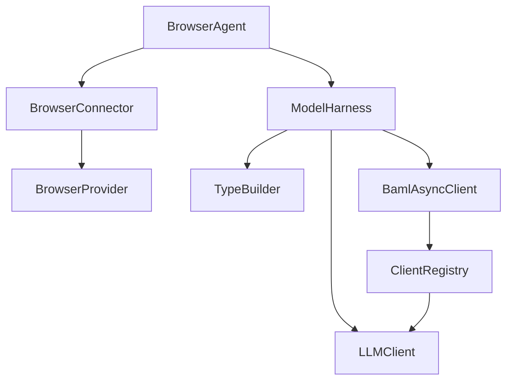
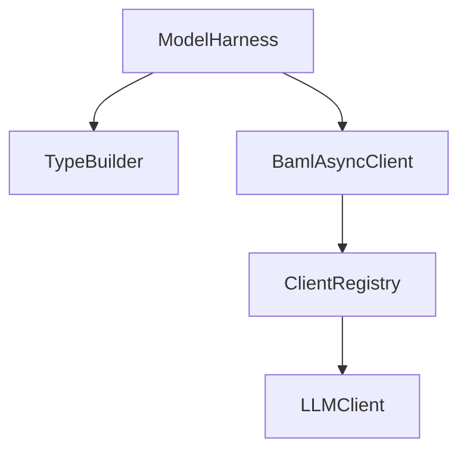
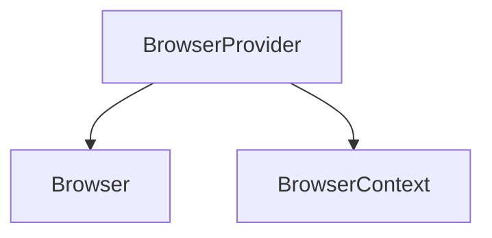
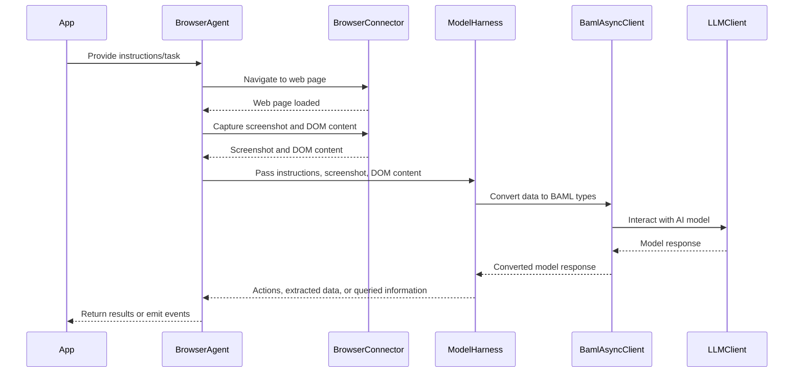

Relevant source files

The following files were used as context for generating this wiki page:

- [packages/magnitude-core/src/agent/browserAgent.ts](https://github.com/aanickode/magnitude/blob/main/packages/magnitude-core/src/agent/browserAgent.ts)
- [packages/magnitude-core/src/ai/modelHarness.ts](https://github.com/aanickode/magnitude/blob/main/packages/magnitude-core/src/ai/modelHarness.ts)
- [packages/magnitude-core/src/web/browserProvider.ts](https://github.com/aanickode/magnitude/blob/main/packages/magnitude-core/src/web/browserProvider.ts)
- [packages/magnitude-core/src/ai/baml_client/async_client.ts](https://github.com/aanickode/magnitude/blob/main/packages/magnitude-core/src/ai/baml_client/async_client.ts)
- [packages/magnitude-core/src/ai/baml_client/type_builder.ts](https://github.com/aanickode/magnitude/blob/main/packages/magnitude-core/src/ai/baml_client/type_builder.ts)

# Architecture Overview

## Introduction

The Magnitude project is a framework for building intelligent agents that can interact with web applications and perform various tasks. The core architecture revolves around the `BrowserAgent` class, which orchestrates the interaction between the web browser, the AI model, and the application logic. This overview will cover the key components and their interactions within the Magnitude architecture.

## Agent Architecture

The `BrowserAgent` class is the central component that manages the overall agent lifecycle and coordinates the interactions between the web browser, AI model, and application logic. It extends the base `Agent` class and incorporates additional functionality specific to web interactions.

### BrowserAgent Class

The `BrowserAgent` class is responsible for the following tasks:

1. **Browser Interaction**: It manages the web browser instance through the `BrowserConnector` class, which provides an interface for navigating to web pages and extracting content from the browser.

2. **AI Model Integration**: The `BrowserAgent` interacts with the `ModelHarness` class, which acts as a wrapper around the AI model. It facilitates tasks such as generating actions, extracting data, and querying the model's memory.

3. **Event Handling**: The `BrowserAgent` class emits events related to navigation, extraction, and other agent activities, allowing for easy integration with external components or logging mechanisms.

4. **Data Extraction**: The `BrowserAgent` provides methods for extracting data from web pages based on predefined schemas. It leverages the `partitionHtml` and `serializeToMarkdown` functions from the `magnitude-extract` library to preprocess the HTML content before passing it to the AI model for extraction.

The `BrowserAgent` class is typically instantiated and started using the `startBrowserAgent` function, which sets up the agent with the provided options and initializes the necessary components.

Sources: [packages/magnitude-core/src/agent/browserAgent.ts](https://github.com/aanickode/magnitude/blob/main/packages/magnitude-core/src/agent/browserAgent.ts)

### ModelHarness Class

The `ModelHarness` class acts as a wrapper around the AI model, providing a unified interface for interacting with the model and managing its usage. It has the following responsibilities:

1. **Model Setup**: The `ModelHarness` initializes the AI model client and configures the necessary settings based on the provided options.

2. **Partial Act**: The `partialAct` method generates a set of actions and reasoning based on the given task, data, and action vocabulary. It leverages the AI model to generate a partial recipe for the task.

3. **Data Extraction**: The `extract` method extracts data from a web page based on the provided instructions, schema, screenshot, and DOM content. It utilizes the AI model to extract the relevant data according to the specified schema.

4. **Memory Querying**: The `query` method allows querying the AI model's memory based on a given context and schema. It retrieves the requested information from the model's memory.

5. **Usage Tracking**: The `ModelHarness` tracks the usage of the AI model, including input and output tokens, and emits events with the usage information. This can be useful for monitoring and cost estimation purposes.

The `ModelHarness` class relies on the `TypeBuilder` and `BamlAsyncClient` classes to facilitate communication with the AI model and handle type conversions between Zod schemas and BAML types.

Sources: [packages/magnitude-core/src/ai/modelHarness.ts](https://github.com/aanickode/magnitude/blob/main/packages/magnitude-core/src/ai/modelHarness.ts), [packages/magnitude-core/src/ai/baml_client/async_client.ts](https://github.com/aanickode/magnitude/blob/main/packages/magnitude-core/src/ai/baml_client/async_client.ts), [packages/magnitude-core/src/ai/baml_client/type_builder.ts](https://github.com/aanickode/magnitude/blob/main/packages/magnitude-core/src/ai/baml_client/type_builder.ts)

### BrowserProvider Class

The `BrowserProvider` class is responsible for managing the lifecycle of web browser instances and contexts. It provides a centralized way to create, reuse, and configure browser instances and contexts based on the provided options. The key responsibilities of the `BrowserProvider` include:

1. **Browser Instance Management**: The `BrowserProvider` launches and manages browser instances based on the provided launch options. It reuses existing browser instances if possible to optimize resource usage.

2. **Browser Context Management**: The class creates and manages browser contexts, which represent separate browsing sessions within a browser instance. It applies the specified context options, such as viewport dimensions and device emulation settings.

3. **Lifecycle Handling**: The `BrowserProvider` handles the lifecycle of browser instances and contexts, ensuring proper cleanup and resource management when they are no longer needed.

The `BrowserProvider` class follows a singleton pattern, ensuring that only one instance exists globally. It provides methods for creating new browser contexts or reusing existing ones based on the provided options.

Sources: [packages/magnitude-core/src/web/browserProvider.ts](https://github.com/aanickode/magnitude/blob/main/packages/magnitude-core/src/web/browserProvider.ts)

## Data Flow

The data flow within the Magnitude architecture involves the following steps:

1. The `BrowserAgent` receives instructions or tasks from the application logic.
2. The `BrowserAgent` navigates to the relevant web page using the `BrowserConnector`.
3. The `BrowserAgent` captures a screenshot and extracts the DOM content from the web page.
4. The `BrowserAgent` passes the instructions, screenshot, and DOM content to the `ModelHarness`.
5. The `ModelHarness` interacts with the AI model through the `BamlAsyncClient` and `TypeBuilder` classes to generate actions, extract data, or query the model's memory.
6. The `ModelHarness` returns the results (actions, extracted data, or queried information) to the `BrowserAgent`.
7. The `BrowserAgent` processes the results and emits relevant events or returns the data to the application logic.

Sources: [packages/magnitude-core/src/agent/browserAgent.ts](https://github.com/aanickode/magnitude/blob/main/packages/magnitude-core/src/agent/browserAgent.ts), [packages/magnitude-core/src/ai/modelHarness.ts](https://github.com/aanickode/magnitude/blob/main/packages/magnitude-core/src/ai/modelHarness.ts), [packages/magnitude-core/src/ai/baml_client/async_client.ts](https://github.com/aanickode/magnitude/blob/main/packages/magnitude-core/src/ai/baml_client/async_client.ts)

## Conclusion

The Magnitude architecture provides a flexible and modular approach to building intelligent agents that can interact with web applications. The `BrowserAgent` class acts as the central orchestrator, coordinating the interactions between the web browser, AI model, and application logic. The `ModelHarness` class abstracts the AI model integration, while the `BrowserProvider` manages the lifecycle of browser instances and contexts. This architecture allows for easy integration of different AI models, web browsers, and application-specific logic, enabling the development of powerful and intelligent web automation solutions.