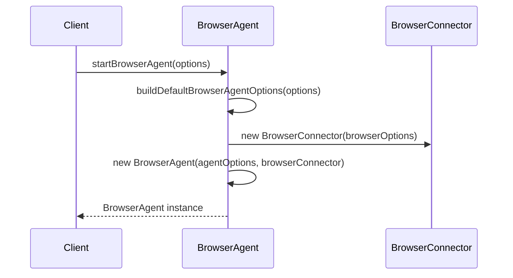
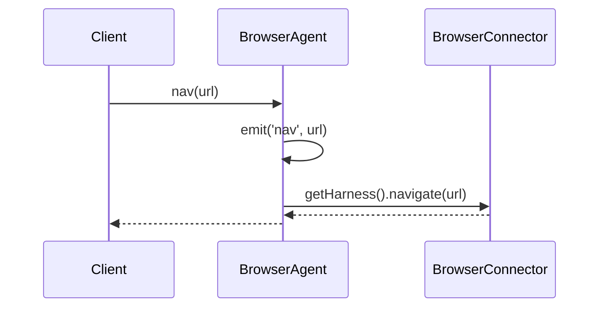
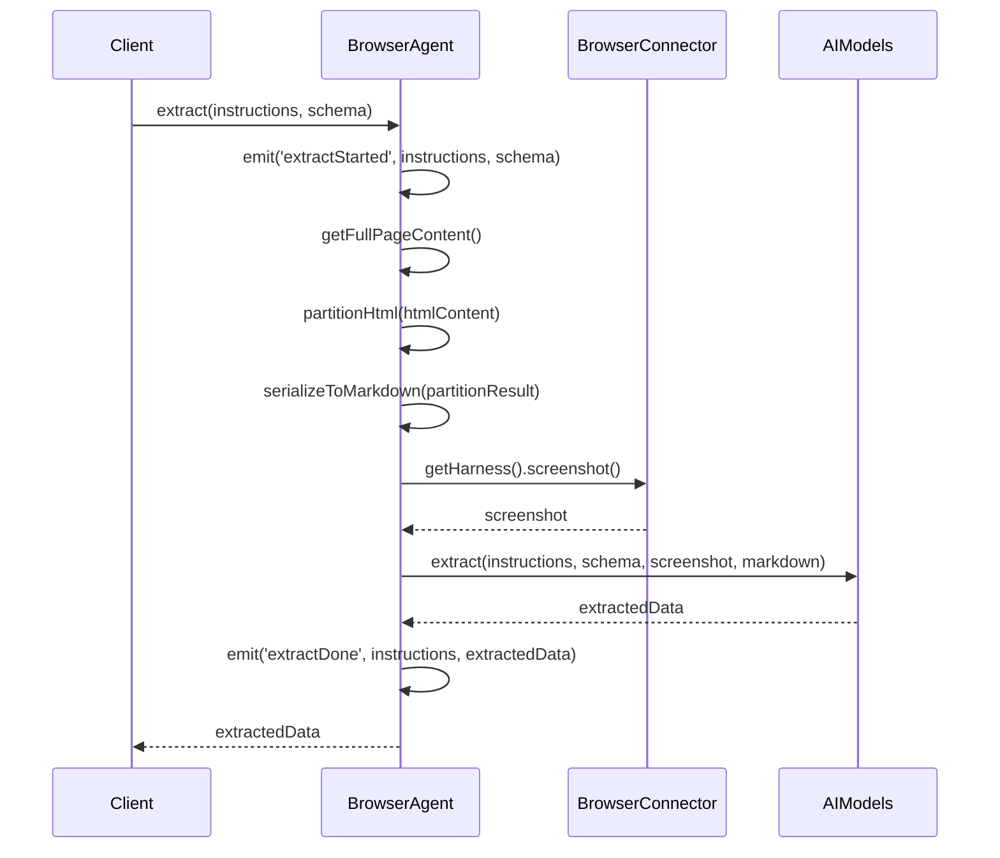
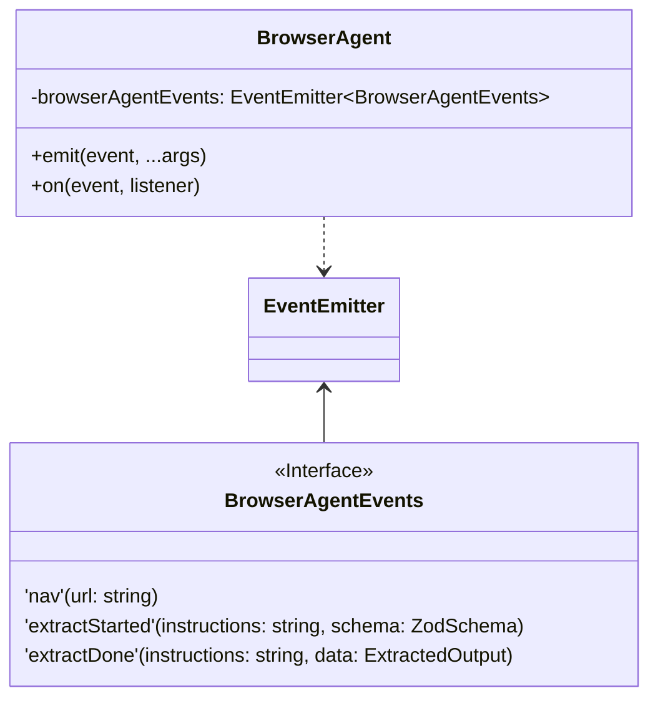

Relevant source files

The following files were used as context for generating this wiki page:

- [packages/magnitude-core/src/index.ts](https://github.com/aanickode/magnitude/blob/main/packages/magnitude-core/src/index.ts)
- [packages/magnitude-core/src/agent/browserAgent.ts](https://github.com/aanickode/magnitude/blob/main/packages/magnitude-core/src/agent/browserAgent.ts)

# Architecture Overview

## Introduction

The Magnitude project is a comprehensive framework designed to facilitate the development and deployment of intelligent agents capable of interacting with web applications. This wiki page focuses on the architectural overview of the project, providing insights into its core components, data flow, and overall structure.

The primary component discussed here is the `BrowserAgent`, which serves as the central entity responsible for managing interactions with web browsers and leveraging AI models for various tasks. The `BrowserAgent` is tightly coupled with the `BrowserConnector`, a crucial component that establishes the connection between the agent and the underlying web browser instance.

## BrowserAgent

The `BrowserAgent` class is an extension of the base `Agent` class and is specifically tailored for web-based operations. It encapsulates the logic for navigating web pages, extracting data from HTML content, and potentially performing additional web-related tasks.

### Initialization and Configuration

The `BrowserAgent` can be initialized using the `startBrowserAgent` function, which accepts various options for configuring the agent's behavior and the underlying browser instance. The function `buildDefaultBrowserAgentOptions` is responsible for merging the provided options with default values, ensuring a consistent and well-defined configuration.

Sources: [packages/magnitude-core/src/agent/browserAgent.ts:17-43]()

### Navigation

The `BrowserAgent` provides a `nav` method that allows navigating to a specified URL. This method emits a `'nav'` event and delegates the actual navigation task to the `BrowserConnector`.

Sources: [packages/magnitude-core/src/agent/browserAgent.ts:68-71]()

### Data Extraction

The `BrowserAgent` provides an `extract` method that facilitates data extraction from the current web page based on a provided schema. This method follows a specific sequence of steps:

1. Emit an `'extractStarted'` event with the instructions and schema.
2. Retrieve the full page content, including the content of iframes.
3. Partition the HTML content using the `partitionHtml` function from the `magnitude-extract` package.
4. Serialize the partitioned HTML to Markdown using the `serializeToMarkdown` function.
5. Capture a screenshot of the current page.
6. Pass the instructions, schema, screenshot, and Markdown content to the AI models for data extraction.
7. Emit an `'extractDone'` event with the instructions and extracted data.

Sources: [packages/magnitude-core/src/agent/browserAgent.ts:74-120]()

### Event Handling

The `BrowserAgent` class extends the `EventEmitter` class from the `eventemitter3` package, allowing it to emit and handle custom events. The `BrowserAgentEvents` interface defines the events that can be emitted by the `BrowserAgent`.

Sources: [packages/magnitude-core/src/agent/browserAgent.ts:27-31, 53-56]()

## Conclusion

The `BrowserAgent` is a crucial component of the Magnitude project, acting as the bridge between the AI models and the web browser environment. It provides a unified interface for navigating web pages, extracting data based on defined schemas, and potentially performing other web-related tasks. The `BrowserAgent` collaborates closely with the `BrowserConnector` to establish the connection with the underlying browser instance and leverages external libraries like `magnitude-extract` for HTML processing and data extraction.