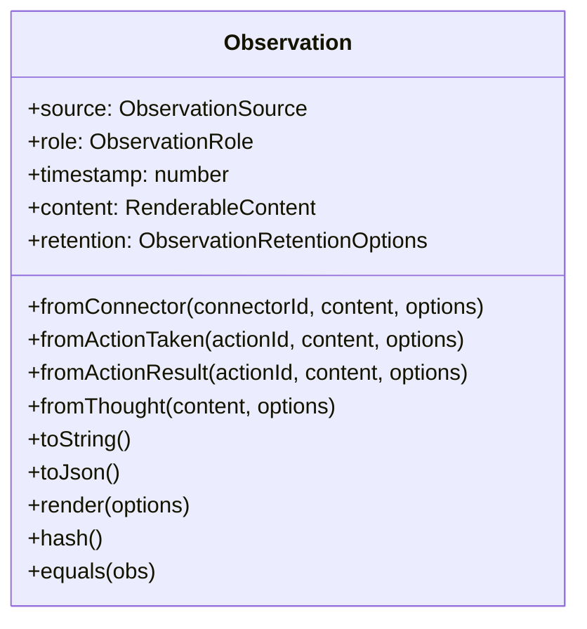
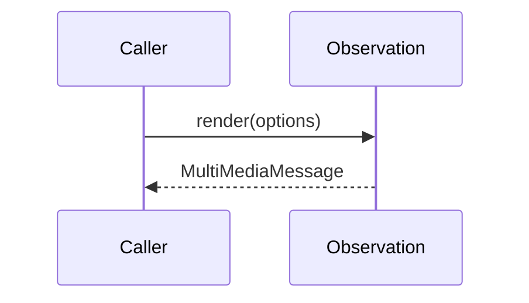

<details>
<summary>Relevant source files</summary>

The following files were used as context for generating this wiki page:

- [packages/magnitude-core/src/memory/agentMemory.ts](https://github.com/aanickode/magnitude/blob/main/packages/magnitude-core/src/memory/agentMemory.ts)
- [packages/magnitude-core/src/memory/observation.ts](https://github.com/aanickode/magnitude/blob/main/packages/magnitude-core/src/memory/observation.ts)
- [packages/magnitude-core/src/memory/rendering/renderJsonParts.ts](https://github.com/aanickode/magnitude/blob/main/packages/magnitude-core/src/memory/rendering/renderJsonParts.ts)
</details>

# Data Flow & State Management

## Introduction

The "Data Flow & State Management" module in this project is responsible for managing the state and memory of an AI agent. It provides a centralized way to record and render observations, thoughts, and actions taken by the agent during its interactions. The module also handles the serialization and deserialization of the agent's memory, allowing it to be persisted and loaded as needed.

The key components of this module are the `AgentMemory` class and the `Observation` class. The `AgentMemory` class acts as a container for all observations made by the agent, while the `Observation` class represents a single observation, including its source, role, timestamp, and content.

Sources: [packages/magnitude-core/src/memory/agentMemory.ts](https://github.com/aanickode/magnitude/blob/main/packages/magnitude-core/src/memory/agentMemory.ts), [packages/magnitude-core/src/memory/observation.ts](https://github.com/aanickode/magnitude/blob/main/packages/magnitude-core/src/memory/observation.ts)

## AgentMemory Class

The `AgentMemory` class is the central component of the data flow and state management system. It provides methods for recording observations, thoughts, and actions, as well as rendering the agent's memory in a structured format.

### Key Features

| Feature | Description |
| --- | --- |
| Recording Observations | Allows recording observations from various sources, such as connectors, actions taken, and action results. |
| Recording Thoughts | Allows recording the agent's thoughts as observations. |
| Memory Rendering | Provides methods for rendering the agent's memory in a structured format, including support for prompt caching and masking. |
| Serialization/Deserialization | Supports serializing and deserializing the agent's memory to and from JSON format. |

Sources: [packages/magnitude-core/src/memory/agentMemory.ts](https://github.com/aanickode/magnitude/blob/main/packages/magnitude-core/src/memory/agentMemory.ts)

### Memory Rendering

The `AgentMemory` class provides two methods for rendering the agent's memory: `render` and `simpleRender`.

#### `render` Method

The `render` method is responsible for rendering the agent's memory in a structured format, taking into account prompt caching and masking. It follows these steps:

1. Checks if prompt caching is enabled and if the cache control limit has been reached. If so, it resets the freeze mask and cache control indices.
2. Applies a mask to the observations to determine which ones should be visible.
3. Iterates over the visible observations and renders each one as a `MultiMediaMessage`.
4. If prompt caching is enabled, updates the freeze mask and cache control indices based on the rendered observations.
5. Returns an array of `MultiMediaMessage` objects representing the rendered memory.

```mermaid
flowchart TD
    start([Start]) --> checkCache{"Prompt Caching Enabled<br>& Cache Control Limit Reached?"}
    checkCache --Yes--> resetCache["Reset Freeze Mask<br>and Cache Control Indices"]
    resetCache --> applyMask
    checkCache --No--> applyMask["Apply Mask to Observations"]
    applyMask --> renderObservations["Render Visible Observations<br>as MultiMediaMessages"]
    renderObservations --> updateCache{"Prompt Caching Enabled?"}
    updateCache --Yes--> updateFreezeAndIndices["Update Freeze Mask<br>and Cache Control Indices"]
    updateCache --No--> end
    updateFreezeAndIndices --> end([Return Rendered Messages])
```

Sources: [packages/magnitude-core/src/memory/agentMemory.ts:47-77](https://github.com/aanickode/magnitude/blob/main/packages/magnitude-core/src/memory/agentMemory.ts#L47-L77)

#### `simpleRender` Method

The `simpleRender` method is a simplified version of the `render` method that renders the agent's memory without any filtering, masking, or cache control. It iterates over all observations and renders their content as a list of `BamlImage` or `string` objects.

Sources: [packages/magnitude-core/src/memory/agentMemory.ts:79-91](https://github.com/aanickode/magnitude/blob/main/packages/magnitude-core/src/memory/agentMemory.ts#L79-L91)

### Serialization and Deserialization

The `AgentMemory` class provides methods for serializing and deserializing the agent's memory to and from JSON format.

#### `toJSON` Method

The `toJSON` method serializes the agent's memory, including the instructions and observations, into a JSON object with the following structure:

```json
{
  "instructions": "...",
  "observations": [
    {
      "source": "...",
      "role": "...",
      "timestamp": 1234567890,
      "data": { ... },
      "options": { ... }
    },
    ...
  ]
}
```

Sources: [packages/magnitude-core/src/memory/agentMemory.ts:117-131](https://github.com/aanickode/magnitude/blob/main/packages/magnitude-core/src/memory/agentMemory.ts#L117-L131)

#### `loadJSON` Method

The `loadJSON` method deserializes the agent's memory from a JSON object in the format produced by the `toJSON` method. It creates `Observation` instances from the JSON data and populates the `observations` array in the `AgentMemory` instance.

Sources: [packages/magnitude-core/src/memory/agentMemory.ts:135-149](https://github.com/aanickode/magnitude/blob/main/packages/magnitude-core/src/memory/agentMemory.ts#L135-L149)

## Observation Class

The `Observation` class represents a single observation made by the agent. It encapsulates the source, role, timestamp, content, and retention options of the observation.

### Key Features

| Feature | Description |
| --- | --- |
| Source | Identifies the source of the observation (e.g., connector, action taken, action result, thought). |
| Role | Specifies the role of the observation (user or assistant). |
| Timestamp | Records the time when the observation was made. |
| Content | Stores the actual content of the observation, which can be of various types (e.g., text, images, objects, arrays). |
| Retention Options | Defines the retention policy for the observation, including deduplication and limiting the number of observations of a certain type. |

Sources: [packages/magnitude-core/src/memory/observation.ts](https://github.com/aanickode/magnitude/blob/main/packages/magnitude-core/src/memory/observation.ts)

### Observation Creation

The `Observation` class provides static methods for creating observations from different sources:

- `fromConnector`: Creates an observation from a connector.
- `fromActionTaken`: Creates an observation from an action taken by the agent.
- `fromActionResult`: Creates an observation from the result of an action taken by the agent.
- `fromThought`: Creates an observation representing a thought of the agent.



Sources: [packages/magnitude-core/src/memory/observation.ts:58-89](https://github.com/aanickode/magnitude/blob/main/packages/magnitude-core/src/memory/observation.ts#L58-L89)

### Observation Rendering

The `Observation` class provides a `render` method that renders the observation's content as a `MultiMediaMessage` object. The method supports adding prefixes and postfixes to the rendered content and enabling cache control.



The `MultiMediaMessage` object has the following structure:

```typescript
interface MultiMediaMessage {
    role: 'user' | 'assistant';
    cacheControl: boolean;
    content: MultiMediaContentPart[];
}
```

Sources: [packages/magnitude-core/src/memory/observation.ts:92-105](https://github.com/aanickode/magnitude/blob/main/packages/magnitude-core/src/memory/observation.ts#L92-L105)

### Observation Hashing and Equality

The `Observation` class provides methods for hashing the observation's content (`hash`) and checking equality between two observations (`equals`). These methods are useful for deduplication and comparison purposes.

Sources: [packages/magnitude-core/src/memory/observation.ts:108-119](https://github.com/aanickode/magnitude/blob/main/packages/magnitude-core/src/memory/observation.ts#L108-L119)

## JSON Rendering

The `renderJsonParts` function is responsible for rendering a `RenderableContent` object (which can be a primitive, array, or object) as a list of `MultiMediaContentPart` objects. This function is used by the `Observation` class to render its content as part of the `MultiMediaMessage` object.

The `renderJsonParts` function recursively traverses the `RenderableContent` object and builds a list of `MultiMediaContentPart` objects that represent the JSON structure. It handles different data types, such as strings, numbers, booleans, arrays, and objects, and ensures that the resulting JSON is properly formatted with indentation.

```mermaid
flowchart TD
    start([Start]) --> checkType{"Check Type of Data"}
    checkType --Image--> renderImage["Render Image"]
    checkType --null--> pushNull["Push 'null'"]
    checkType --undefined--> skip["Skip"]
    checkType --string--> renderString{"Render String<br>(Root: Push as-is<br>Non-root: JSON.stringify)"}
    checkType --number/boolean--> pushValue["Push Value as String"]
    checkType --array--> renderArray{"Render Array<br>(Recursive Call)"}
    checkType --object--> renderObject{"Render Object<br>(Recursive Call)"}
    renderImage --> mergeStringsAndImages
    pushNull --> mergeStringsAndImages
    skip --> mergeStringsAndImages
    renderString --> mergeStringsAndImages
    pushValue --> mergeStringsAndImages
    renderArray --> mergeStringsAndImages
    renderObject --> mergeStringsAndImages
    mergeStringsAndImages([Merge Adjacent Strings<br>and Images]) --> end([Return MultiMediaContentPart[]])
```

The function also handles special cases, such as rendering `Image` and `BamlImage` objects, and merging adjacent strings to improve rendering performance.

Sources: [packages/magnitude-core/src/memory/rendering/renderJsonParts.ts](https://github.com/aanickode/magnitude/blob/main/packages/magnitude-core/src/memory/rendering/renderJsonParts.ts)

## Conclusion

The "Data Flow & State Management" module in this project provides a comprehensive solution for managing the state and memory of an AI agent. It allows recording observations, thoughts, and actions, rendering the agent's memory in a structured format, and serializing/deserializing the memory for persistence. The module also includes features like prompt caching, masking, and deduplication to optimize memory usage and performance.

The key components of this module, the `AgentMemory` and `Observation` classes, work together to provide a flexible and extensible system for managing the agent's state and data flow. The `renderJsonParts` function further enhances the module's capabilities by providing a robust way to render complex data structures as JSON.

Overall, this module plays a crucial role in the project by enabling the agent to maintain and access its memory, facilitating effective decision-making and interaction with the environment.