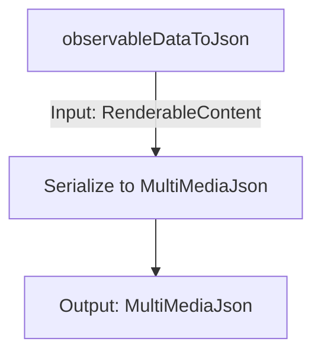
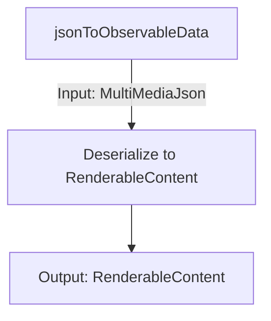

<details>
<summary>Relevant source files</summary>

The following files were used as context for generating this wiki page:

- [packages/magnitude-core/src/memory/agentMemory.ts](https://github.com/aanickode/magnitude/blob/main/packages/magnitude-core/src/memory/agentMemory.ts)
- [packages/magnitude-core/src/memory/observation.ts](https://github.com/aanickode/magnitude/blob/main/packages/magnitude-core/src/memory/observation.ts)
- [packages/magnitude-core/src/memory/serde.ts](https://github.com/aanickode/magnitude/blob/main/packages/magnitude-core/src/memory/serde.ts)
- [packages/magnitude-core/src/memory/masking.ts](https://github.com/aanickode/magnitude/blob/main/packages/magnitude-core/src/memory/masking.ts)
- [packages/magnitude-core/src/memory/rendering.ts](https://github.com/aanickode/magnitude/blob/main/packages/magnitude-core/src/memory/rendering.ts)
</details>

# Data Flow and Memory Management

## Introduction

The "Data Flow and Memory Management" module in the Magnitude project is responsible for managing the agent's memory, which includes storing and retrieving observations, thoughts, and other relevant data. It provides a structured way to handle the flow of information between different components of the system, such as connectors, actions, and the AI assistant.

The key components of this module are the `AgentMemory` class and the `Observation` class. The `AgentMemory` class acts as a container for observations and provides methods for recording, rendering, and serializing/deserializing observations. The `Observation` class represents a single unit of data, such as a thought, an action taken, or a result from a connector.

Sources: [packages/magnitude-core/src/memory/agentMemory.ts](), [packages/magnitude-core/src/memory/observation.ts]()

## AgentMemory

The `AgentMemory` class is the central component for managing the agent's memory. It stores a list of `Observation` objects and provides methods for recording new observations, rendering the memory content, and serializing/deserializing the memory state.

### Initialization and Options

The `AgentMemory` class can be initialized with an optional `AgentMemoryOptions` object, which allows you to configure the following properties:

- `instructions`: A string representing custom instructions related to this memory instance (e.g., agent-level or task-level instructions).
- `promptCaching`: A boolean flag that enables or disables prompt caching, which can improve performance by caching certain observations for reuse.
- `thoughtLimit`: An integer that specifies the maximum number of thought observations to keep in memory.

Sources: [packages/magnitude-core/src/memory/agentMemory.ts:29-42]()

### Recording Observations

The `AgentMemory` class provides two methods for recording observations:

- `recordThought(content: string)`: Records a new thought observation with the given string content.
- `recordObservation(obs: Observation)`: Records a new observation object.

Sources: [packages/magnitude-core/src/memory/agentMemory.ts:85-92]()

### Rendering Memory Content

The `AgentMemory` class provides two methods for rendering the memory content:

1. `render(options?: MemoryRenderOptions)`: This method renders the memory content as an array of `MultiMediaMessage` objects. It applies masking and caching strategies based on the provided options and the `promptCaching` setting.

```mermaid
graph TD
    A[render] -->|If promptCaching| B[Apply masking]
    B --> C[Render visible observations]
    C --> D[Update cache control indices]
    D --> E[Return MultiMediaMessage[]]
```

Sources: [packages/magnitude-core/src/memory/agentMemory.ts:46-80]()

2. `simpleRender()`: This method renders the memory content as an array of `BamlImage` or `string` objects, without applying any filtering, masking, or caching strategies.

Sources: [packages/magnitude-core/src/memory/agentMemory.ts:81-92]()

### Serialization and Deserialization

The `AgentMemory` class provides methods for serializing and deserializing the memory state:

- `toJSON()`: Serializes the memory state, including instructions and observations, to a `SerializedAgentMemory` object.
- `loadJSON(data: SerializedAgentMemory)`: Deserializes the memory state from a `SerializedAgentMemory` object.

Sources: [packages/magnitude-core/src/memory/agentMemory.ts:103-128]()

## Observation

The `Observation` class represents a single unit of data stored in the agent's memory. It encapsulates the following properties:

- `source`: A string representing the source of the observation (e.g., a connector, an action taken, an action result, or a thought).
- `role`: A string indicating whether the observation is from the user or the assistant.
- `timestamp`: A timestamp representing when the observation was made.
- `content`: The actual content of the observation, which can be of various types (e.g., string, number, boolean, image, or complex data structures).
- `retention`: An optional `ObservationRetentionOptions` object that specifies how the observation should be retained in memory (e.g., deduplication, limits).

Sources: [packages/magnitude-core/src/memory/observation.ts:29-40]()

The `Observation` class provides several static methods for creating observations from different sources:

- `fromConnector(connectorId: string, content: RenderableContent, options?: ObservationRetentionOptions)`: Creates an observation from a connector.
- `fromActionTaken(actionId: string, content: RenderableContent, options?: ObservationRetentionOptions)`: Creates an observation for an action taken.
- `fromActionResult(actionId: string, content: RenderableContent, options?: ObservationRetentionOptions)`: Creates an observation for an action result.
- `fromThought(content: RenderableContent, options?: ObservationRetentionOptions)`: Creates a thought observation.

Sources: [packages/magnitude-core/src/memory/observation.ts:42-61]()

The `Observation` class also provides methods for rendering the observation content, serializing/deserializing the observation, and computing a hash for the observation content.

Sources: [packages/magnitude-core/src/memory/observation.ts:63-96]()

## Data Serialization and Deserialization

The `serde` module provides utilities for serializing and deserializing the observable data structures used in the memory management system.

### Serialization

The `observableDataToJson` function takes a `RenderableContent` object and serializes it to a `MultiMediaJson` object, which is a JSON-compatible representation of the data.



Sources: [packages/magnitude-core/src/memory/serde.ts:38-64]()

### Deserialization

The `jsonToObservableData` function takes a `MultiMediaJson` object and deserializes it back to a `RenderableContent` object.



Sources: [packages/magnitude-core/src/memory/serde.ts:66-87]()

## Masking and Filtering

The `masking` module provides utilities for applying visibility masks to observations and filtering out observations based on retention policies.

### Masking Observations

The `maskObservations` function takes a list of `Observation` objects and an optional `freezeMask` (a boolean array representing the visibility of each observation). It returns a new boolean mask that determines which observations should be visible.

```mermaid
graph TD
    A[maskObservations] -->|Input: Observation[], freezeMask?| B[Apply retention policies]
    B --> C[Generate visibility mask]
    C --> D[Output: boolean[]]
```

Sources: [packages/magnitude-core/src/memory/masking.ts:27-59]()

### Applying Mask

The `applyMask` function takes a list of `Observation` objects and a boolean mask, and returns a filtered list of `Observation` objects that are visible according to the mask.

```mermaid
graph TD
    A[applyMask] -->|Input: Observation[], mask| B[Filter observations]
    B --> C[Output: Observation[]]
```

Sources: [packages/magnitude-core/src/memory/masking.ts:61-68]()

## Rendering

The `rendering` module provides utilities for rendering the observable data structures to a format suitable for display or transmission.

### Rendering Content Parts

The `renderContentParts` function takes a `RenderableContent` object and an optional `RenderOptions` object, and returns an array of `MultiMediaContentPart` objects that represent the rendered content.

```mermaid
graph TD
    A[renderContentParts] -->|Input: RenderableContent, RenderOptions?| B[Render content parts]
    B --> C[Output: MultiMediaContentPart[]]
```

Sources: [packages/magnitude-core/src/memory/rendering.ts:19-44]()

## Conclusion

The "Data Flow and Memory Management" module in the Magnitude project provides a comprehensive solution for managing the agent's memory, including recording observations, rendering memory content, serializing/deserializing memory state, and applying retention policies. It also includes utilities for serializing/deserializing observable data structures, masking and filtering observations, and rendering content for display or transmission.

The modular design of this system allows for easy integration with other components of the project, such as connectors, actions, and the AI assistant. The use of well-defined data structures and interfaces facilitates maintainability and extensibility of the codebase.