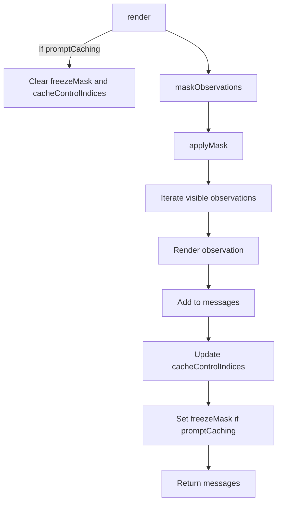
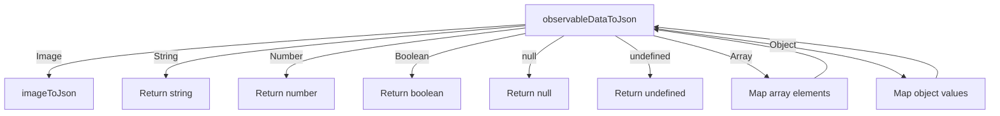
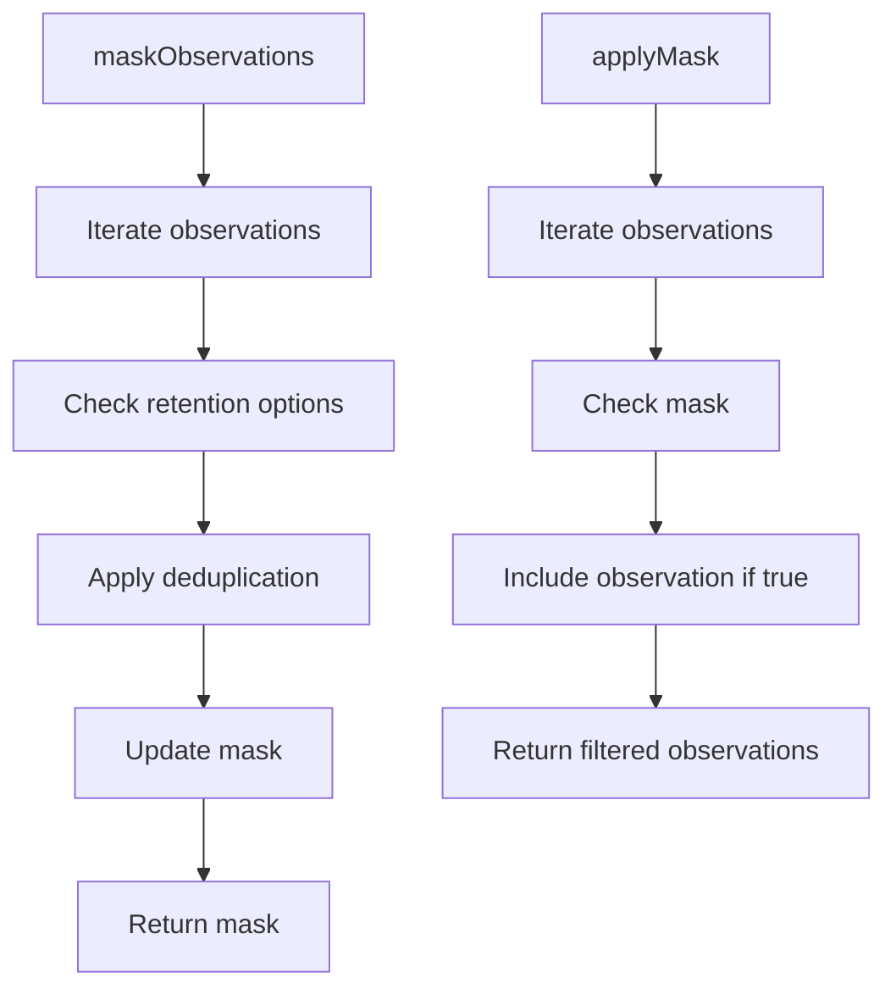
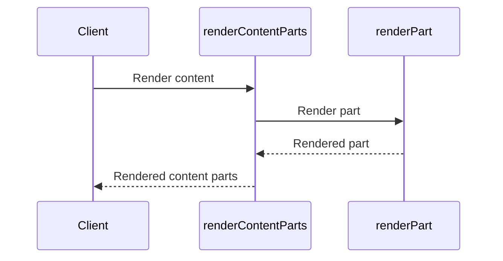

Relevant source files

The following files were used as context for generating this wiki page:

- [packages/magnitude-core/src/memory/agentMemory.ts](https://github.com/aanickode/magnitude/blob/main/packages/magnitude-core/src/memory/agentMemory.ts)
- [packages/magnitude-core/src/memory/observation.ts](https://github.com/aanickode/magnitude/blob/main/packages/magnitude-core/src/memory/observation.ts)
- [packages/magnitude-core/src/memory/serde.ts](https://github.com/aanickode/magnitude/blob/main/packages/magnitude-core/src/memory/serde.ts)
- [packages/magnitude-core/src/memory/masking.ts](https://github.com/aanickode/magnitude/blob/main/packages/magnitude-core/src/memory/masking.ts)
- [packages/magnitude-core/src/memory/rendering.ts](https://github.com/aanickode/magnitude/blob/main/packages/magnitude-core/src/memory/rendering.ts)

# Data Flow and Memory Management

## Introduction

The "Data Flow and Memory Management" system in the Magnitude project is responsible for managing the storage, retrieval, and rendering of observations and data within the agent's memory. It handles various types of observations, including thoughts, actions taken, action results, and connector inputs, and provides mechanisms for filtering, masking, and rendering this data for use in AI model prompts or other purposes.

The core components of this system are the `AgentMemory` class, which manages the overall memory state, and the `Observation` class, which represents individual observations with their source, role, content, and retention options.

Sources: [packages/magnitude-core/src/memory/agentMemory.ts](), [packages/magnitude-core/src/memory/observation.ts]()

## AgentMemory Class

The `AgentMemory` class is the central component for managing the agent's memory. It stores a list of `Observation` objects and provides methods for recording new observations, rendering the memory content, and serializing/deserializing the memory state.

### Key Components

- `observations: Observation[]`: An array that holds all the recorded observations.
- `freezeMask: boolean[]`: An optional mask used for filtering observations during rendering.
- `cacheControlIndices: number[]`: An array of indices for observations that should be cached during rendering.

Sources: [packages/magnitude-core/src/memory/agentMemory.ts:30-39](), [packages/magnitude-core/src/memory/agentMemory.ts:63-67]()

### Recording Observations

The `AgentMemory` class provides two methods for recording new observations:

- `recordThought(content: string)`: Records a new thought observation with the source `'thought'`.
- `recordObservation(obs: Observation)`: Records a new observation object.

Sources: [packages/magnitude-core/src/memory/agentMemory.ts:101-106](), [packages/magnitude-core/src/memory/agentMemory.ts:109-111]()

### Rendering Memory

The `render` method is responsible for rendering the memory content as a list of `MultiMediaMessage` objects. It applies the `freezeMask` (if present) to filter out observations and handles cache control for prompt caching. The rendered messages include prefixes with timestamps for thoughts and actions taken.

Sources: [packages/magnitude-core/src/memory/agentMemory.ts:72-99]()

The `simpleRender` method provides a simplified rendering without filtering, masking, or cache control, returning only the content parts of the observations.

Sources: [packages/magnitude-core/src/memory/agentMemory.ts:100-108]()

### Serialization and Deserialization

The `toJSON` method serializes the memory state, including the instructions and observations, into a `SerializedAgentMemory` object. The `loadJSON` method deserializes the memory state from a `SerializedAgentMemory` object.

Sources: [packages/magnitude-core/src/memory/agentMemory.ts:121-135](), [packages/magnitude-core/src/memory/agentMemory.ts:138-151]()

## Observation Class

The `Observation` class represents individual observations within the agent's memory. It encapsulates the observation's source, role, content, retention options, and timestamp.

### Key Properties

| Property | Type | Description |
|----------|------|-------------|
| `source` | `ObservationSource` | The source of the observation (e.g., `'connector:id'`, `'action:taken:id'`, `'action:result:id'`, `'thought'`). |
| `role` | `ObservationRole` | The role of the observation (`'user'` or `'assistant'`). |
| `content` | `RenderableContent` | The multimedia content of the observation. |
| `retention` | `ObservationRetentionOptions` | Options for retaining the observation in memory. |
| `timestamp` | `number` | The timestamp of when the observation was made. |

Sources: [packages/magnitude-core/src/memory/observation.ts:31-40]()

### Observation Creation

The `Observation` class provides static methods for creating observations from different sources:

- `fromConnector(connectorId: string, content: RenderableContent, options?: ObservationRetentionOptions)`: Creates an observation from a connector input.
- `fromActionTaken(actionId: string, content: RenderableContent, options?: ObservationRetentionOptions)`: Creates an observation for an action taken.
- `fromActionResult(actionId: string, content: RenderableContent, options?: ObservationRetentionOptions)`: Creates an observation for an action result.
- `fromThought(content: RenderableContent, options?: ObservationRetentionOptions)`: Creates a thought observation.

Sources: [packages/magnitude-core/src/memory/observation.ts:42-59]()

### Rendering and Serialization

The `render` method renders the observation's content as a `MultiMediaMessage` object, with optional prefixes, postfixes, and cache control. The `toJson` method serializes the observation's content into a `MultiMediaJson` object.

Sources: [packages/magnitude-core/src/memory/observation.ts:68-76](), [packages/magnitude-core/src/memory/observation.ts:78-80]()

### Hashing and Equality

The `hash` method generates a hash value for the observation's content, which can be used for deduplication or equality checks. The `equals` method compares the hash values of two observations to determine if their content is equal.

Sources: [packages/magnitude-core/src/memory/observation.ts:83-89](), [packages/magnitude-core/src/memory/observation.ts:91-95]()

## Data Serialization and Deserialization

The `serde` module provides functions for serializing and deserializing multimedia data to and from JSON format.

### Key Functions

- `observableDataToJson(data: RenderableContent): Promise<MultiMediaJson>`: Serializes observable data (e.g., images, text, objects) to a JSON-compatible format.
- `jsonToObservableData(json: MultiMediaJson): Promise<RenderableContent>`: Deserializes JSON data into observable data.

Sources: [packages/magnitude-core/src/memory/serde.ts:7-34](), [packages/magnitude-core/src/memory/serde.ts:36-51]()

## Observation Masking

The `masking` module provides functions for masking and filtering observations based on retention options and deduplication rules.

### Key Functions

- `maskObservations(observations: Observation[], mask?: boolean[]): Promise<boolean[]>`: Generates a mask for filtering observations based on their retention options and deduplication rules.
- `applyMask(observations: Observation[], mask: boolean[]): { observation: Observation, index: number }[]`: Applies the given mask to filter the list of observations.

Sources: [packages/magnitude-core/src/memory/masking.ts:7-44](), [packages/magnitude-core/src/memory/masking.ts:46-56]()

## Rendering

The `rendering` module provides functions for rendering multimedia content into JSON or other formats.

### Key Functions

- `renderContentParts(content: RenderableContent, options?: { mode?: 'json' | 'text', indent?: number }): Promise<MultiMediaContentPart[]>`: Renders observable data into an array of multimedia content parts (text, images, etc.).
- `renderPart(part: RenderableContent, options?: { mode?: 'json' | 'text', indent?: number }): Promise<MultiMediaContentPart>`: Renders a single part of observable data.

Sources: [packages/magnitude-core/src/memory/rendering.ts:7-25](), [packages/magnitude-core/src/memory/rendering.ts:27-43]()

## Conclusion

The "Data Flow and Memory Management" system in the Magnitude project provides a comprehensive solution for managing and rendering observations and data within the agent's memory. It handles various types of observations, supports filtering and masking based on retention options, and provides mechanisms for serialization, deserialization, and rendering of multimedia content. The system is designed to be extensible and flexible, allowing for customization of observation sources, retention policies, and rendering formats.