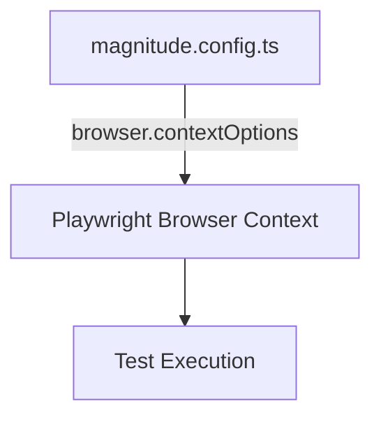
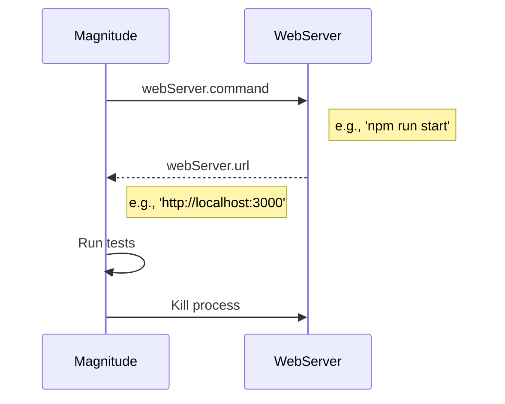
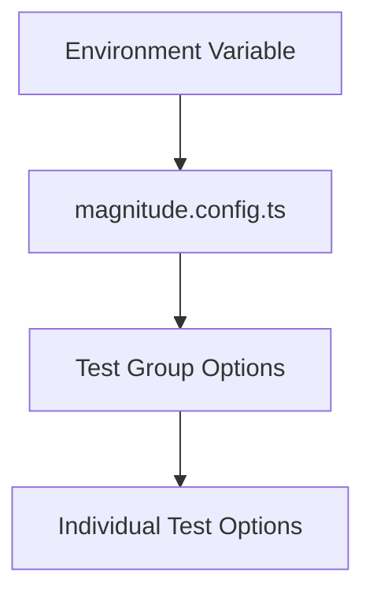

<details>
<summary>Relevant source files</summary>

The following files were used as context for generating this wiki page:

- [packages/magnitude-test/src/worker/readConfig.ts](https://github.com/aanickode/magnitude/blob/main/packages/magnitude-test/src/worker/readConfig.ts)
- [docs/testing/test-configuration.mdx](https://github.com/aanickode/magnitude/blob/main/docs/testing/test-configuration.mdx)

</details>

# Test Configuration and Setup

## Introduction

The Magnitude testing framework provides a comprehensive configuration system to customize various aspects of the testing environment, including browser settings, web server management, and URL resolution. This wiki page covers the essential components and options available for configuring and setting up tests within the Magnitude project.

The primary configuration file is `magnitude.config.ts`, which is automatically generated when running `npx magnitude init`. This file serves as the central location for defining test-related configurations, allowing developers to tailor the testing environment to their specific needs.

## Configuration File

The `magnitude.config.ts` file exports an object that conforms to the `MagnitudeConfig` interface. This configuration object can include various properties to customize the testing environment.

### Base URL

The `url` property specifies the default URL that all test cases will use if not explicitly provided. This URL serves as the base for resolving relative paths specified in individual test cases or test groups.

```typescript
export default {
    url: "http://localhost:5173"
} satisfies MagnitudeConfig;
```

Sources: [docs/testing/test-configuration.mdx:6-10](https://github.com/aanickode/magnitude/blob/main/docs/testing/test-configuration.mdx#L6-L10)

## Browser Options

The `browser` property allows you to customize options passed to each [Playwright browser context](https://playwright.dev/docs/api/class-browser#browser-new-context) created during test execution. Common options you might want to adjust include `viewport` for setting the browser window size or `recordVideo` for capturing test videos.



Example configuration:

```typescript
browser: {
    contextOptions: {
        viewport: { width: 800, height: 600 },
        recordVideo: {
            dir: './videos/',
            size: { width: 800, height: 600 }
        }
    }
}
```

Sources: [docs/testing/test-configuration.mdx:14-24](https://github.com/aanickode/magnitude/blob/main/docs/testing/test-configuration.mdx#L14-L24)

## Development Web Server

Magnitude can automatically launch your development server when tests run. The `webServer` property allows you to configure the command to start the server, the URL it will listen on, and additional options.



Example configuration:

```typescript
webServer: {
    command: 'npm run start',
    url: 'http://localhost:3000',
    timeout: 120_000,
    reuseExistingServer: true
}
```

- `command`: The command to start the development web server.
- `url`: The URL the server will listen on.
- `timeout`: The maximum time (in milliseconds) to wait for the server to start.
- `reuseExistingServer`: If `true` and the `url` is already reachable, the `command` will be skipped.

Sources: [docs/testing/test-configuration.mdx:26-41](https://github.com/aanickode/magnitude/blob/main/docs/testing/test-configuration.mdx#L26-L41)

## Test URL Resolution

Each test uses a URL that is built from the broader scope of configuration in the following order:

1. **Environment variable** (`MAGNITUDE_TEST_URL`)
2. **Global configuration** (`magnitude.config.ts`)
3. **Test group options**
4. **Individual test options**

For the `url` option at any of these levels, you can provide a relative path to attach to the upper level's URL, or a full URL to override it.



Example:
- `magnitude.config.ts`: `{url: "https://localhost:8080"}`
- Individual test: `{url: "/items?id=1"}`
- Resolved URL: `https://localhost:8080/items?id=1`

Sources: [docs/testing/test-configuration.mdx:43-51](https://github.com/aanickode/magnitude/blob/main/docs/testing/test-configuration.mdx#L43-L51)

## Telemetry Opt-Out

By default, Magnitude collects basic anonymized telemetry when you run a test, such as the duration of the test and the number of tokens used. This information helps the project understand its usage and grow as an open-source project.

To opt out of telemetry collection, set the `telemetry` property to `false` in the configuration:

```typescript
export default {
    url: "http://localhost:5173",
    telemetry: false
} satisfies MagnitudeConfig;
```

Sources: [docs/testing/test-configuration.mdx:53-62](https://github.com/aanickode/magnitude/blob/main/docs/testing/test-configuration.mdx#L53-L62)

## Conclusion

The Magnitude testing framework provides a comprehensive configuration system that allows developers to customize various aspects of the testing environment, including browser settings, web server management, and URL resolution. By leveraging the `magnitude.config.ts` file and its various configuration options, developers can tailor the testing environment to their specific needs, ensuring efficient and effective test execution.