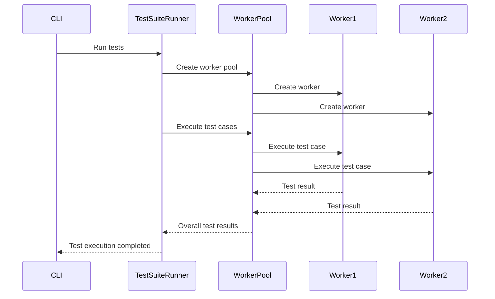

<details>
<summary>Relevant source files</summary>

The following files were used as context for generating this wiki page:

- [packages/magnitude-test/src/cli.ts](https://github.com/aanickode/magnitude/blob/main/packages/magnitude-test/src/cli.ts)
- [packages/magnitude-test/src/runner/testSuiteRunner.ts](https://github.com/aanickode/magnitude/blob/main/packages/magnitude-test/src/runner/testSuiteRunner.ts)
- [docs/testing/running-tests.mdx](https://github.com/aanickode/magnitude/blob/main/docs/testing/running-tests.mdx)
- [packages/magnitude-test/src/worker/readTest.ts](https://github.com/aanickode/magnitude/blob/main/packages/magnitude-test/src/worker/readTest.ts)
- [packages/magnitude-test/src/term-app/index.ts](https://github.com/aanickode/magnitude/blob/main/packages/magnitude-test/src/term-app/index.ts)

</details>

# Test Runner and Automation

## Introduction

The "Test Runner and Automation" feature in the Magnitude project is responsible for executing test cases and managing the overall test suite lifecycle. It provides a command-line interface (CLI) for running tests, supports parallel execution, and offers various configuration options for customizing the testing environment.

The key components involved in this feature include:

- **CLI**: The entry point for running tests, providing options for filtering test files, configuring parallelism, and enabling debug or plain output modes.
- **Test Suite Runner**: Orchestrates the execution of test cases, manages worker threads, and coordinates with the test renderer.
- **Test Renderer**: Responsible for displaying test results and progress in the terminal or other user interfaces.
- **Worker Threads**: Separate threads used to execute individual test cases in parallel.

## CLI

The CLI is the primary interface for running Magnitude tests. It is implemented in the [`cli.ts`](https://github.com/aanickode/magnitude/blob/main/packages/magnitude-test/src/cli.ts) file and provides several options for configuring the test execution.

### Command-Line Options

The CLI supports the following command-line options:

- `[filter]`: An optional glob pattern for filtering test files.
- `-w, --workers <number>`: Specifies the number of parallel workers for test execution (default: 1).
- `-p, --plain`: Disables pretty output and prints lines instead.
- `-d, --debug`: Enables debug logs.
- `--no-fail-fast`: Continues running tests even if some fail.

### Project Initialization

The CLI also provides an `init` command for initializing a new Magnitude project. This command creates the necessary directory structure and generates a default configuration file (`magnitude.config.ts`) and an example test file (`example.mag.ts`).

```
npx magnitude init
```

The `init` command supports the following options:

- `-f, --force`: Forces initialization even if no `package.json` is found.
- `--dir, --destination <path>`: Specifies the destination directory for Magnitude tests (default: `tests/magnitude`).

Sources: [packages/magnitude-test/src/cli.ts](https://github.com/aanickode/magnitude/blob/main/packages/magnitude-test/src/cli.ts)

## Test Suite Runner

The `TestSuiteRunner` class, defined in [`testSuiteRunner.ts`](https://github.com/aanickode/magnitude/blob/main/packages/magnitude-test/src/runner/testSuiteRunner.ts), is responsible for orchestrating the execution of test cases. It manages the loading of test files, creates worker threads for parallel execution, and coordinates with the test renderer to display test results.

### Key Responsibilities

- **Loading Test Files**: The `loadTestFile` method loads test cases from a given file path and registers them with the runner.
- **Running Tests**: The `runTests` method executes the registered test cases in parallel using worker threads.
- **Test Execution**: The `runTest` method is responsible for executing an individual test case within a worker thread.
- **Test Renderer Integration**: The `TestSuiteRunner` collaborates with a `TestRenderer` instance to display test results and progress.

### Parallel Execution

The `TestSuiteRunner` supports parallel execution of test cases using worker threads. The number of parallel workers is configurable through the `workerCount` option in the `TestSuiteRunnerConfig`.

The `WorkerPool` class is used to manage the worker threads and distribute test case execution across them.

Sources: [packages/magnitude-test/src/runner/testSuiteRunner.ts](https://github.com/aanickode/magnitude/blob/main/packages/magnitude-test/src/runner/testSuiteRunner.ts)

## Test Renderer

The `TestRenderer` interface, defined in [`renderer.ts`](https://github.com/aanickode/magnitude/blob/main/packages/magnitude-test/src/renderer.ts), provides a contract for rendering test results and progress. The `TestSuiteRunner` collaborates with a `TestRenderer` instance to display test information.

The `TermAppRenderer` class, implemented in [`term-app/index.ts`](https://github.com/aanickode/magnitude/blob/main/packages/magnitude-test/src/term-app/index.ts), is a concrete implementation of the `TestRenderer` interface that renders test results and progress in the terminal.

Sources: [packages/magnitude-test/src/renderer.ts](https://github.com/aanickode/magnitude/blob/main/packages/magnitude-test/src/renderer.ts), [packages/magnitude-test/src/term-app/index.ts](https://github.com/aanickode/magnitude/blob/main/packages/magnitude-test/src/term-app/index.ts)

## Worker Threads

The `TestSuiteRunner` uses worker threads to execute individual test cases in parallel. The worker threads are created and managed by the `WorkerPool` class, which distributes test case execution across the available workers.

The worker threads are responsible for loading and executing test cases from the provided test files. The `readTest.ts` file contains the logic for loading and executing test cases within a worker thread.



The worker threads communicate with the `TestSuiteRunner` using messages to report test registration, state changes, and results.

Sources: [packages/magnitude-test/src/runner/testSuiteRunner.ts](https://github.com/aanickode/magnitude/blob/main/packages/magnitude-test/src/runner/testSuiteRunner.ts), [packages/magnitude-test/src/worker/readTest.ts](https://github.com/aanickode/magnitude/blob/main/packages/magnitude-test/src/worker/readTest.ts)

## Configuration

The `TestSuiteRunner` and the overall test execution process are configured using the `MagnitudeConfig` interface, defined in [`discovery/types.ts`](https://github.com/aanickode/magnitude/blob/main/packages/magnitude-test/src/discovery/types.ts). The configuration can be provided through a `magnitude.config.ts` file or environment variables.

The `MagnitudeConfig` interface includes options for configuring the testing environment, such as the URL of the application under test, browser options, and settings for the language model and grounding.

Sources: [packages/magnitude-test/src/discovery/types.ts](https://github.com/aanickode/magnitude/blob/main/packages/magnitude-test/src/discovery/types.ts)

## Conclusion

The "Test Runner and Automation" feature in the Magnitude project provides a comprehensive solution for executing test cases and managing the test suite lifecycle. It offers a command-line interface for running tests, supports parallel execution, and provides various configuration options for customizing the testing environment. The `TestSuiteRunner` class orchestrates the execution of test cases, collaborating with worker threads and a test renderer to display test results and progress.