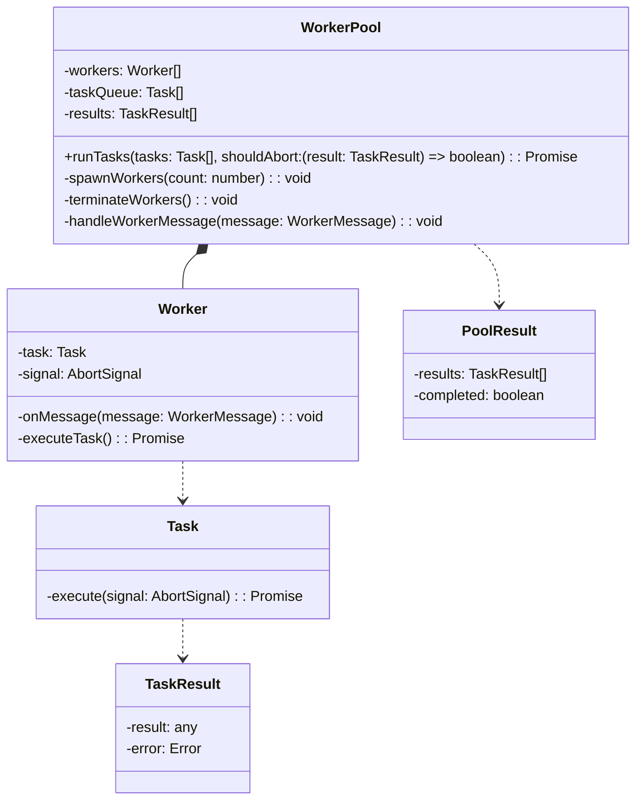
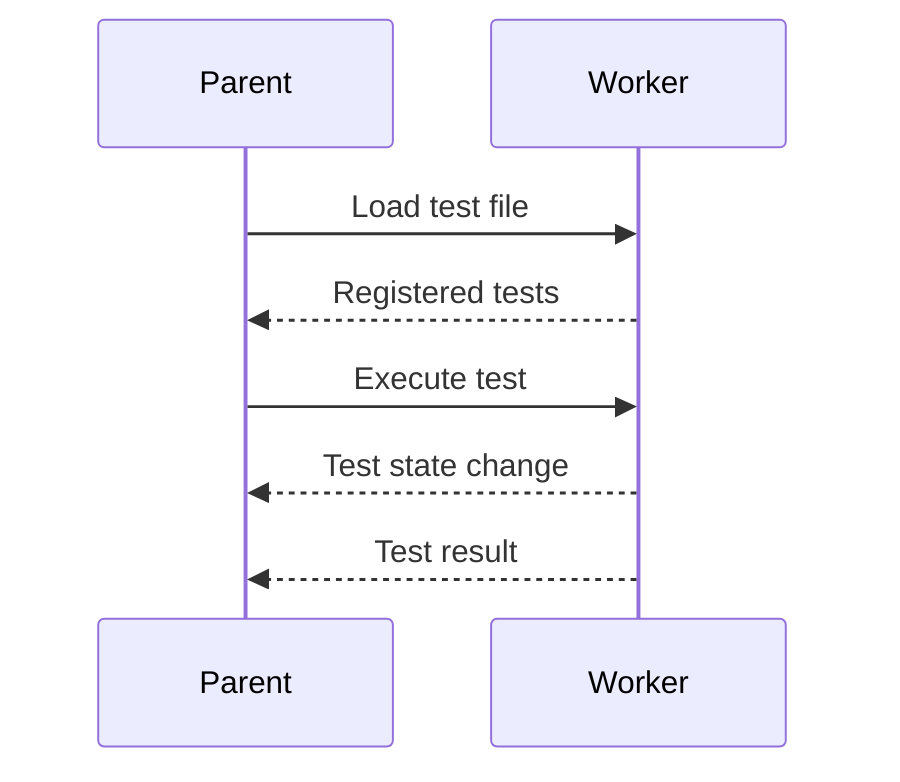
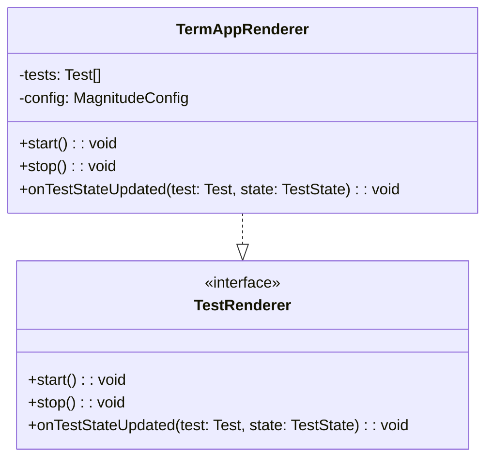
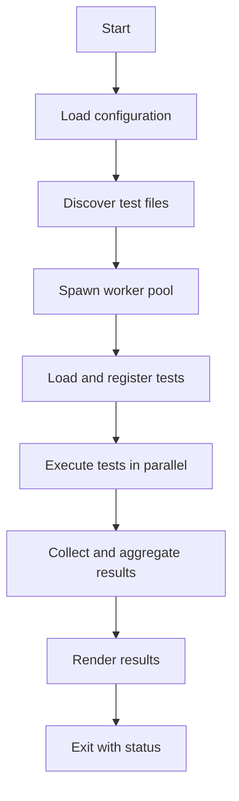

Relevant source files

The following files were used as context for generating this wiki page:

- [packages/magnitude-test/src/cli.ts](https://github.com/aanickode/magnitude/blob/main/packages/magnitude-test/src/cli.ts)
- [packages/magnitude-test/src/runner/testSuiteRunner.ts](https://github.com/aanickode/magnitude/blob/main/packages/magnitude-test/src/runner/testSuiteRunner.ts)
- [packages/magnitude-test/src/runner/workerPool.ts](https://github.com/aanickode/magnitude/blob/main/packages/magnitude-test/src/runner/workerPool.ts)
- [packages/magnitude-test/src/worker/readTest.ts](https://github.com/aanickode/magnitude/blob/main/packages/magnitude-test/src/worker/readTest.ts)
- [packages/magnitude-test/src/worker/executeTest.ts](https://github.com/aanickode/magnitude/blob/main/packages/magnitude-test/src/worker/executeTest.ts)

# Test Runner

## Introduction

The Test Runner is a core component of the Magnitude testing framework, responsible for executing test cases and managing the overall test suite execution process. It provides a command-line interface (CLI) for running tests, supports parallel test execution with configurable worker counts, and integrates with a rendering system to display test results in a user-friendly manner.

The Test Runner is designed to be highly configurable, allowing users to customize various aspects of the testing process, such as the browser environment, language model integration, and telemetry settings. It also supports loading test cases from multiple files and directories, making it easy to organize and manage large test suites.

Sources: [packages/magnitude-test/src/cli.ts](https://github.com/aanickode/magnitude/blob/main/packages/magnitude-test/src/cli.ts), [packages/magnitude-test/src/runner/testSuiteRunner.ts](https://github.com/aanickode/magnitude/blob/main/packages/magnitude-test/src/runner/testSuiteRunner.ts)

## Architecture

The Test Runner consists of several key components that work together to execute test cases and manage the overall testing process. Here's an overview of the main components:

### TestSuiteRunner

The `TestSuiteRunner` class is the central orchestrator of the test execution process. It is responsible for:

1. Loading test files and registering individual test cases.
2. Creating and configuring the test renderer.
3. Spawning worker threads or processes to execute tests in parallel.
4. Coordinating the execution of test cases across multiple workers.
5. Collecting and aggregating test results.
6. Handling test failure scenarios (e.g., fail-fast mode).

Sources: [packages/magnitude-test/src/runner/testSuiteRunner.ts](https://github.com/aanickode/magnitude/blob/main/packages/magnitude-test/src/runner/testSuiteRunner.ts)

### Worker Pool

The `WorkerPool` class manages a pool of worker threads or processes, which are used to execute test cases in parallel. It provides a mechanism for efficiently distributing tasks (test case executions) across the available workers and handling task results.

In the context of the Test Runner, each `Task` represents the execution of a single test case, and the `TaskResult` contains the test result (pass/fail) and any associated error or failure information.

Sources: [packages/magnitude-test/src/runner/workerPool.ts](https://github.com/aanickode/magnitude/blob/main/packages/magnitude-test/src/runner/workerPool.ts)

### Test Worker

The Test Runner uses worker threads or processes to execute individual test cases in isolation. These workers are responsible for:

1. Loading and parsing the test file.
2. Registering the test cases defined in the file.
3. Executing a specific test case when instructed by the `TestSuiteRunner`.
4. Reporting test state changes and results back to the `TestSuiteRunner`.

The worker implementation is split into two parts:

- `readTest.ts`: Responsible for loading and parsing the test file, registering test cases, and setting up the communication channel with the parent process.
- `executeTest.ts`: Responsible for executing a specific test case when instructed by the parent process, and reporting test state changes and results.

Sources: [packages/magnitude-test/src/worker/readTest.ts](https://github.com/aanickode/magnitude/blob/main/packages/magnitude-test/src/worker/readTest.ts), [packages/magnitude-test/src/worker/executeTest.ts](https://github.com/aanickode/magnitude/blob/main/packages/magnitude-test/src/worker/executeTest.ts)

### Test Renderer

The Test Runner integrates with a rendering system to display test results and progress in a user-friendly manner. The `TestRenderer` interface defines the contract for rendering components, allowing for different implementations (e.g., terminal-based, web-based) to be used.

The `TermAppRenderer` is a concrete implementation of the `TestRenderer` interface, providing a terminal-based user interface for displaying test results and progress.

Sources: [packages/magnitude-test/src/term-app/renderer.ts](https://github.com/aanickode/magnitude/blob/main/packages/magnitude-test/src/term-app/renderer.ts)

## Test Execution Flow

The overall test execution flow in the Test Runner can be summarized as follows:

1. The Test Runner starts by loading the configuration from the `magnitude.config.ts` file or environment variables.
2. It discovers test files based on the provided patterns or default patterns.
3. A worker pool is spawned with the configured number of workers.
4. Each worker loads and registers the test cases defined in its assigned test file.
5. The `TestSuiteRunner` coordinates the execution of registered test cases across the worker pool in parallel.
6. Test results and state changes are collected and aggregated by the `TestSuiteRunner`.
7. The configured test renderer (e.g., `TermAppRenderer`) is used to display test results and progress.
8. The Test Runner exits with an appropriate status code based on the overall test results.

Sources: [packages/magnitude-test/src/cli.ts](https://github.com/aanickode/magnitude/blob/main/packages/magnitude-test/src/cli.ts), [packages/magnitude-test/src/runner/testSuiteRunner.ts](https://github.com/aanickode/magnitude/blob/main/packages/magnitude-test/src/runner/testSuiteRunner.ts)

## Key Features

- **Parallel Test Execution**: The Test Runner supports executing tests in parallel across multiple worker threads or processes, allowing for faster test suite execution.
- **Configurable Worker Count**: Users can configure the number of workers to be used for parallel test execution, allowing them to balance resource utilization and execution speed.
- **Fail-Fast Mode**: The Test Runner can be configured to stop executing tests as soon as the first failure is encountered, providing a faster feedback loop during development.
- **Test Filtering**: Users can specify a glob pattern to filter and run only a subset of test files, making it easier to focus on specific parts of the test suite.
- **Rendering System**: The Test Runner integrates with a rendering system to display test results and progress in a user-friendly manner. The `TermAppRenderer` provides a terminal-based user interface, but other rendering implementations can be used as well.
- **Configuration Management**: The Test Runner supports loading configuration from a `magnitude.config.ts` file or environment variables, allowing for easy customization of various aspects of the testing process.
- **Web Server Integration**: The Test Runner can start and stop web servers defined in the configuration, enabling testing of applications that require a running server.

Sources: [packages/magnitude-test/src/cli.ts](https://github.com/aanickode/magnitude/blob/main/packages/magnitude-test/src/cli.ts), [packages/magnitude-test/src/runner/testSuiteRunner.ts](https://github.com/aanickode/magnitude/blob/main/packages/magnitude-test/src/runner/testSuiteRunner.ts)

## Conclusion

The Test Runner is a crucial component of the Magnitude testing framework, providing a robust and flexible solution for executing test cases and managing the overall testing process. With its support for parallel execution, configurable worker counts, fail-fast mode, test filtering, and rendering system integration, the Test Runner empowers developers to efficiently run and manage their test suites, ensuring high-quality and reliable software.