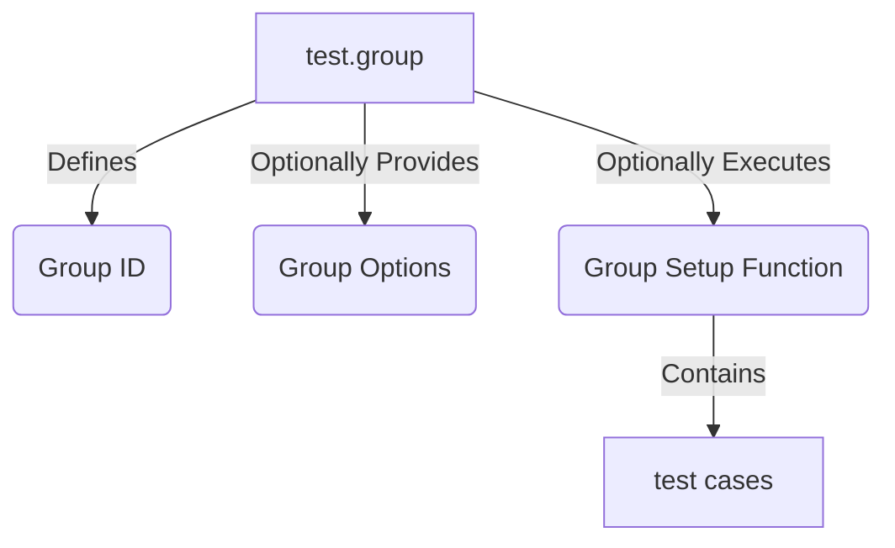
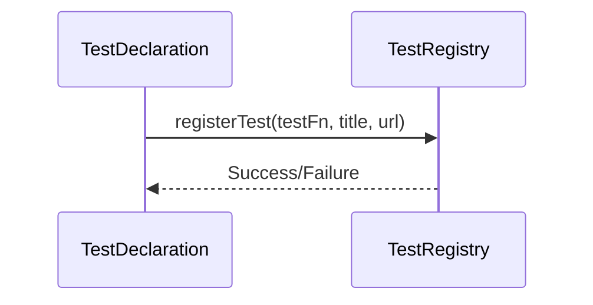
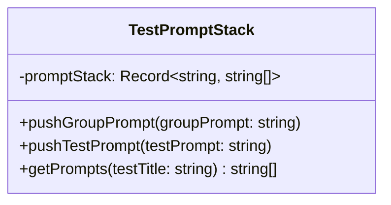
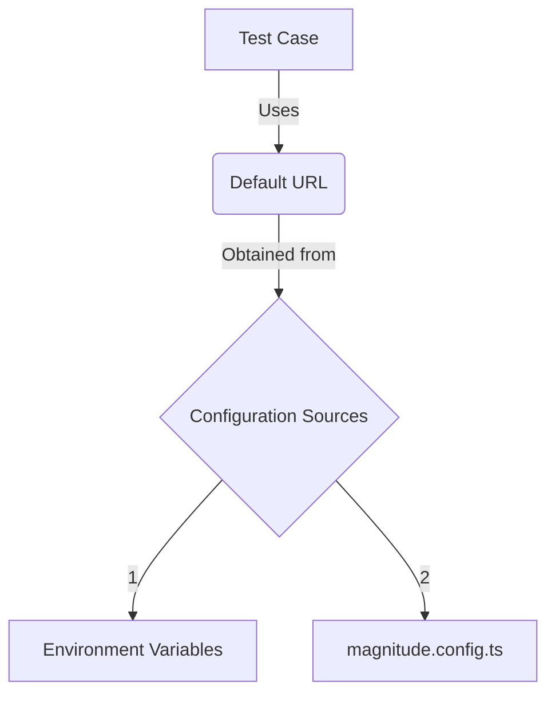

<details>
<summary>Relevant source files</summary>

The following files were used as context for generating this wiki page:

- [packages/magnitude-test/src/worker/testDeclaration.ts](https://github.com/aanickode/magnitude/blob/main/packages/magnitude-test/src/worker/testDeclaration.ts)
- [docs/testing/building-test-cases.mdx](https://github.com/aanickode/magnitude/blob/main/docs/testing/building-test-cases.mdx)

</details>

# Writing Tests

## Introduction

In the Magnitude project, "Writing Tests" refers to the process of creating and configuring test cases that validate the behavior and functionality of web applications. These tests are designed to simulate user interactions and verify expected outcomes, ensuring the application works as intended.

The provided source files outline the core concepts and mechanisms for defining and structuring test cases within the Magnitude framework. The `testDeclaration.ts` file contains the implementation of the `test` function, which serves as the entry point for creating new test cases. The `building-test-cases.mdx` file provides documentation and examples on how to construct and configure test cases effectively.

## Test Case Definition

The `test` function is the primary way to define a new test case in Magnitude. It accepts a title (a string describing the test case), an optional set of options, and a test function that encapsulates the test steps and assertions.

```typescript
test('can add and remove todos', async (agent) => {
    await agent.act('Add a todo');
    await agent.act('Remove the todo');
});
```

Sources: [packages/magnitude-test/src/worker/testDeclaration.ts:15-43](), [docs/testing/building-test-cases.mdx:7-12]()

### Test Options

Test cases can be configured with various options, such as the starting URL for the test, custom prompts for the language model, and other settings. These options can be provided as an object when defining the test case.

```typescript
test('can add and remove todos', { url: "https://mytodoapp.com" }, async (agent) => {
    await agent.act('Add a todo');
    await agent.act('Remove the todo');
});
```

Sources: [docs/testing/building-test-cases.mdx:17-21]()

## Test Steps and Checks

Within a test case, the `agent.act` function is used to define individual test steps, which represent user interactions or actions performed on the web application. Each step is accompanied by a natural language description that explains the intended action.

```typescript
await agent.act('Log in');
```

Sources: [docs/testing/building-test-cases.mdx:27-29]()

Magnitude also supports **checks**, which are natural language visual assertions that verify the expected state or behavior of the application after a specific step. Checks are defined using the `agent.check` function.

```typescript
await agent.act('Log in');
await agent.check('Dashboard is visible');
```

Sources: [docs/testing/building-test-cases.mdx:33-37]()

### Test Data

Test cases can include additional data relevant to specific steps, such as input values or configurations. This data can be provided as an object or a freeform string when calling the `agent.act` function.

```typescript
await agent.act('Log in', { data: { email: "foo@bar.com", password: "foo" } });
await agent.act('Add 3 todos', { data: 'Use "Take out trash" for the first todo and make up the other 2' });
```

Sources: [docs/testing/building-test-cases.mdx:41-51]()

### Custom LLM Prompting

Magnitude allows for custom instructions or prompts to be provided to the language model used for understanding and executing test steps. These prompts can be specified at the test case level, the group level, or even for individual steps.

```typescript
test('example', async (agent) => {
    await agent.act('create 3 todos', { prompt: 'all todos must be animal-related' });
});

test.group('todo list', { prompt: 'Each todo should be exactly 5 words'}, () => {
    test('can add todos', { url: 'https://magnitodo.com', prompt: 'All todos should be animal related' }, async (agent) => {
        await agent.act('create 3 todos', { prompt: 'the first and last word on the todo must start with the same letter'});
    });
});
```

Sources: [docs/testing/building-test-cases.mdx:55-68]()

## Test Groups

Magnitude supports grouping related test cases together using the `test.group` function. This function allows you to define a group identifier and optionally provide group-level options or a group setup function.



Sources: [packages/magnitude-test/src/worker/testDeclaration.ts:44-67]()

## Test Registration and Execution

The `testDeclaration.ts` file contains the implementation details for registering and executing test cases within the Magnitude framework. The `registerTest` function is responsible for adding a new test case to the test registry, associating it with the provided test function, title, and URL.



Sources: [packages/magnitude-test/src/worker/testDeclaration.ts:15-43]()

The execution of test cases is likely handled by other components of the Magnitude framework, which are not covered in the provided source files.

## Test Prompt Stack

Magnitude maintains a `testPromptStack` data structure to keep track of custom prompts specified at the group and test case levels. This stack is used to ensure that the appropriate prompts are applied when executing test steps within a particular group or test case.



Sources: [packages/magnitude-test/src/worker/testDeclaration.ts:6-7, 19-22, 27-28]()

## Configuration and Environment Variables

The `testDeclaration.ts` file references the use of environment variables and configuration options for setting the default URL and other global settings for test cases. However, the implementation details for handling these configurations are not provided in the given source files.



Sources: [packages/magnitude-test/src/worker/testDeclaration.ts:15-43]()

## Example: Migrating a Playwright Test Case

The `building-test-cases.mdx` file provides an example of how a test case written using the Playwright testing framework can be migrated to the Magnitude framework.

**Playwright Test Case:**

```typescript
test('should allow me to add todo items', async ({ page }) => {
    const newTodo = page.getByPlaceholder('What needs to be done?');

    await newTodo.fill(TODO_ITEMS[0]);
    await newTodo.press('Enter');

    await expect(page.getByTestId('todo-title')).toHaveText([
        TODO_ITEMS[0]
    ]);

    await newTodo.fill(TODO_ITEMS[1]);
    await newTodo.press('Enter');

    await expect(page.getByTestId('todo-title')).toHaveText([
        TODO_ITEMS[0],
        TODO_ITEMS[1]
    ]);
});
```

**Magnitude Test Case:**

```typescript
test('should allow me to add todo items', async (agent) => {
    await agent.act('Create todo', { data: TODO_ITEMS[0] });
    await agent.check('First todo appears in list');
    await agent.act('Create another todo', { data: TODO_ITEMS[1] });
    await agent.check('List has two todos');
});
```

Sources: [docs/testing/building-test-cases.mdx:72-89]()

This example illustrates how the Magnitude test case uses natural language descriptions for test steps (`agent.act`) and checks (`agent.check`), along with providing test data as needed. The Magnitude approach aims to make test cases more readable and easier to maintain compared to traditional testing frameworks.